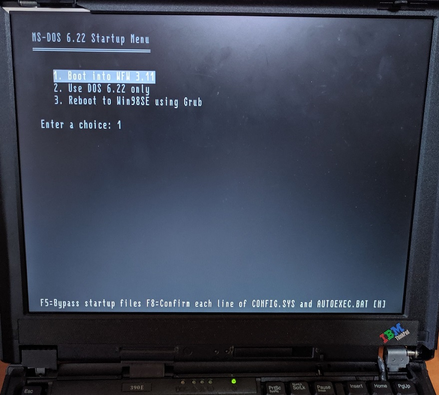

# retro-configs
Collection of my DOS configurations and drivers of my retro machines. Decided to open source my configurations in case it might help you.

I currently only have the configuration of my Thinkpad T42 and 390e but more coming up soon!

Common drivers and software not specific to a particular system are located in the [common](common) folder.

# 1. Thinkpad T42

The machine is configured to dual-boot to DOS 6.22/Windows for Workgroups (WFW) 3.11 and Windows 98SE.

In Win98SE

Boot menu options

# 2. Thinkpad 390E

The machine is configured to dual-boot to DOS 6.22/Windows for Workgroups (WFW) 3.11 and Windows 98SE.

In the BIOS

Boot menu options

# 3. Tweener PC

My "Tweener PC" is affectionately called that as it contains a healthy mix of new and old technologies. From ISA, floppy drives to modern Ethernet and USB.

The machine is configured for single-boot Windows 98SE with a bootup option to enter pure DOS configuration only.

## Sources

1.  [Toshiba generic CD driver CDROMDRV](https://www.legroom.net/howto/msdos)
2.  [Cutemouse](http://cutemouse.sourceforge.net/)
3.  [Enhanced DOSKEY 2.8](http://paulhoule.com/doskey/)
4.  [MTCP TCP/IP stack Jan 2020](http://www.brutman.com/mTCP/)
5.  [ODI to Packet Driver v3.1](http://wiki.freedos.org/wiki/index.php/Networking_FreeDOS_-_ODI_driver_installation)
6.  [SHSUCDX 3.03F](http://optimizr.dyndns.org/dos/shsucdx.html)
7.  [SHSUCDX 3.06](http://adoxa.altervista.org/shsucdx/index.html)
8.  [GRUBFORDOS](https://sourceforge.net/projects/grub4dos/files/GRUB4DOS/)
9.  [svgaptch for VESA compliance](https://download.wcnews.com/files/other/wcpc/)
10. [nusb33 Win 98 Universal USB drivers](https://www.philscomputerlab.com/windows-98-usb-storage-driver.html)
11. [DOSIDLE 2.51](https://www.vogons.org/viewtopic.php?p=438763#p438763)
12. [MS-DOS 6.22 install disks](https://winworldpc.com/product/ms-dos/622)
13. [Windows for Workgroups 3.11 install disks](https://winworldpc.com/product/windows-3/wfw-311)
