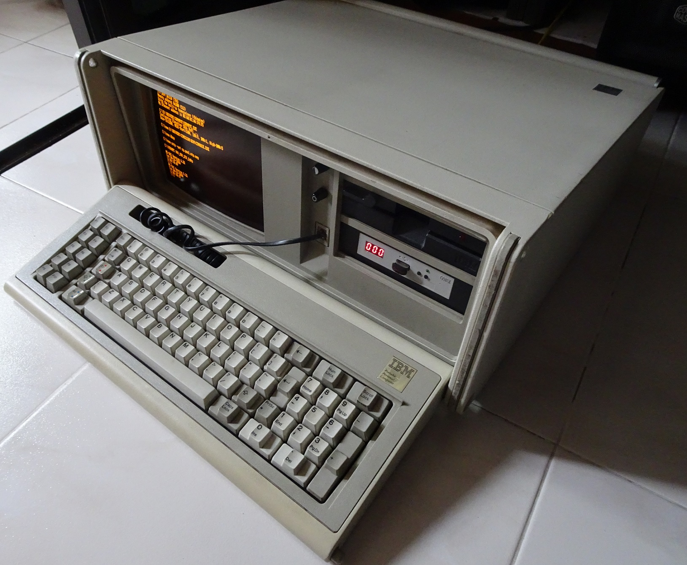
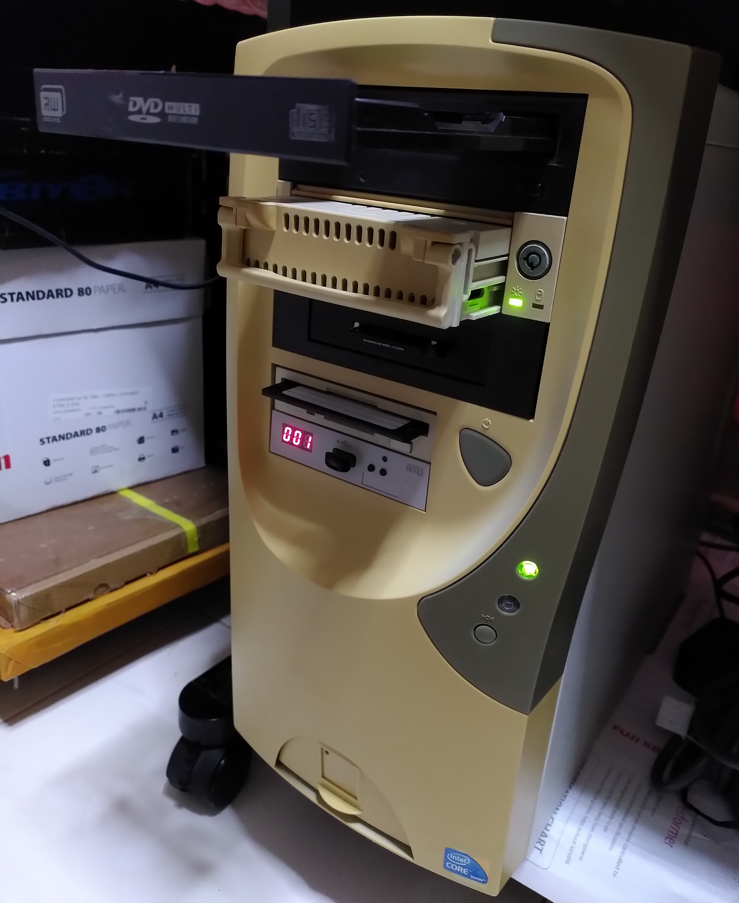
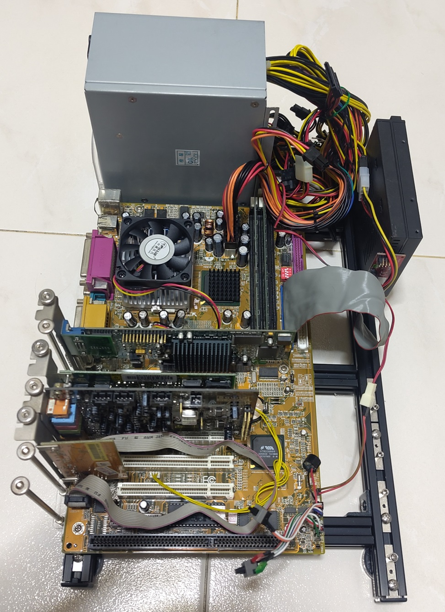

# retro-configs
Collection of my DOS configurations and drivers of my retro machines. Decided to open source my configurations in case it might help you.

Common drivers and software not specific to a particular system are located in the [common-drivers](common-drivers) or [common-software](common-software) folders.

Each of the title links will bring you to subpages with more detailed information.

# Desktops

## 1. [IBM 5155](desktops/ibm-5155) (1984)

The IBM 5155 Portable is a PC released in 1984. It is based on the IBM XT released in 1983 but in a "portable" form with internal amber monochrome CRT monitor.

Front of the PC with 5.25" 360K floppy and Gotek Floppy emulator with HxC firmware.

Using up almost all the ISA slots.

## 2. [Generic 486 PC](desktops/generic-486-pc) (circa early 1990s)

This 486 PC will boot to DOS 6.22 and WFW 3.11. It's for my generic retro testing purposes.

## 3. [Tweener PC](desktops/tweener-pc) (2001)

My "Tweener PC" based on Pentium III is affectionately called that as it contains a healthy mix of new and old technologies. From ISA, 3.5" and 5.25" floppy drives to modern Ethernet and USB.

The machine is configured for single-boot Windows 98SE with a bootup option to enter pure DOS configuration only.

## 3. [Open Frame PC](desktops/open-frame-pc) (1999)

This is an Open Frame PC I use as a testbench based on a Pentium 3. The machine is configured to dual-boot to DOS 6.22/Windows for Workgroups (WFW) 3.11 and Windows 98SE. 

# Laptops

## 1. [Thinkpad 390E](laptops/thinkpad-390e) (1999)

The Pentium II machine is configured to dual-boot to DOS 6.22/Windows for Workgroups (WFW) 3.11 and Windows 98SE.

In the BIOS

In WFW 3.11

In Win 98SE

## 2. [Thinkpad T42](laptops/thinkpad-t42) (2004)

The Pentium M machine is configured to dual-boot to DOS 6.22/Windows for Workgroups (WFW) 3.11 and Windows 98SE.

In Win 98SE

In WFW 3.11

## 3. [Dell Latitude LM M166ST](laptops/latitude-lm) (1996)

A barebones Pentium MMX laptop configured to dual-boot to DOS 6.22/Windows for Workgroups (WFW) 3.11 and Windows 98SE.

In Windows for Workgroups 3.11

In Windows 98SE

## 4. [Toshiba Satellite 315CDT](laptops/satellite-315cdt) (1996)

The Toshiba laptop is configured to dual-boot to DOS 6.22/Windows for Workgroups (WFW) 3.11 and Windows 98SE. This machine's interesting feature is that it comes with an original Yamaha OPL3 for FM synthesis which is uncommon for a laptop.

In Win 98SE

In WFW 3.11

## 5. [Hand386](laptops/hand386) (2023)

This is a new 386-based palmtop released in 2023. It runs on DOS 6.22 and Windows for Workgroups (WFW) 3.11.

Here the system is running Descent on lowest quality setting.

## 6. [Book8088v2](laptops/book8088) (2023)

This is a new 8088-based subnotebook released in 2023. I have set it up to run DOS 6.22, Win 1.03 and Win 2.03.

Here it is shown running CGA Compatibility tester.

## 7. [Thinkpad X61](laptops/thinkpad-x61) (2007)

The Thinkpad X61 is a laptop released in 2007 by IBM. The machine is configured to multi-boot to DOS 6.22, Windows 10 32-bit and Xubuntu.

# Virtual Machines

Not exactly retro PCs but I just wanted to store the settings I use for my virtual playgrounds. This is typically for me to do quick and dirty testing without powering up my actual retro-PCs.

## 1. [Virtualbox (DOS 6.22)](vms/vbox-dos622)

## 2. [VMware Workstation (Win 98SE)](vms/vmware-win98)

## 2. [VMware Workstation (Win 95 OSR 2.5 Plus)](vms/vmware-win95)

# Deprecated

This systems are no longer working or have been sold off by me. These information is kept for historical and reference purposes.

## 1. [NuXT v2.0 PC](deprecated/nuxt-pc-v2.0) (2020)

My NuXt v2.0 PC is based on a modern 8088-based XT motherboard in a uATX form factor.

Front of the PC with IDE HDD caddy, HxC Gotek Floppy emulator, 3.5" 1.44 MB HDD.

Old-New motherboard

Post DOS 6.22 bootup

## 2. [NuXT v1.2 PC](deprecated/nuxt-pc-v1.2) (2019)

My NuXt v1.2 PC is based on a modern 8088-based XT motherboard in a uATX form factor. This v1.2 motherboard was [released in 2019](https://www.vogonswiki.com/index.php/NuXT) by Monotech PCs.

# 3. [Thinkpad R50e](deprecated/thinkpad-r50e) (2005)

The Pentium M machine is configured to boot to Win XP and Debian only. This machine is solely for experimental purposes.

BIOS

Win XP

Debian

# 4. [Poqet PC Plus](deprecated/poqet-pc-plus) (Early 1990s)

The Poqet PC Plus is a small IBM PC/XT compatible released by Fujitsu in the early 1990s.

This PC failed before I could take a photo of it in a running state.

# 5. [NEC Versa 40EC](deprecated/versa-v40) (1994)

The NEC Versa 40EC laptop is only configured for DOS 6.22.

# Common drivers sources

1.  [Toshiba generic CD driver CDROMDRV](https://www.legroom.net/howto/msdos)
2.  [Cutemouse](http://cutemouse.sourceforge.net/)
3.  [MTCP TCP/IP stack](http://www.brutman.com/mTCP/)
4.  [ODI to Packet Driver v3.1](http://wiki.freedos.org/wiki/index.php/Networking_FreeDOS_-_ODI_driver_installation)
5.  [SHSUCDX 3.03F](http://optimizr.dyndns.org/dos/shsucdx.html)
6.  [SHSUCDX 3.06](http://adoxa.altervista.org/shsucdx/index.html)
7.  [GRUBFORDOS](https://sourceforge.net/projects/grub4dos/files/GRUB4DOS/)
8.  [svgaptch for VESA compliance](https://download.wcnews.com/files/other/wcpc/)
9. [Crynwr](https://www.ibiblio.org/pub/micro/pc-stuff/freedos/files/distributions/1.2/repos/pkg-html/crynwr.html)
10. [Unisound](https://www.vogons.org/viewtopic.php?f=62&t=72553)
11. [Microsoft Mouse 8.20](https://winworldpc.com/product/microsoft-mouse/8x)
12. [Microsoft Mouse 9.01](https://winworldpc.com/product/microsoft-mouse/9x)
13. [Xircom PE3-10BT drivers](https://www.vogonsdrivers.com/getfile.php?fileid=1347)
14. [3c589 Packet driver](http://download.caltech.se/download/fluke/DAQ/NetDAQ/disk2/packet/)
15. [3C589N DOS and Windows drivers](http://files.mpoli.fi/hardware/NET/3COM/3C589N.ZIP)
16. [PFE500c drivers](https://www.driverguide.com/driver/amp/detail.php?driverid=114194)
17. [Cardsoft 3.1](https://archive.org/details/simpletechnology_pcmcia21cardsocket_systemsoftcardsoftv31_cardview)
18. [JEMM](https://github.com/Baron-von-Riedesel/Jemm)
19. [RTC_micro8088](https://github.com/wilco2009/RTC_micro8088)
20. [Freddy V ch375v022](https://www.vogonsdrivers.com/getfile.php?fileid=1991&menustate=0)
21. [3C509B-nestor driver for 8088](https://github.com/hackerb9/3C509B-nestor)
22. [DOS Ethernet drivers taken from T400 website](https://support.lenovo.com/mn/en/downloads/ds001865)
23. [3C905 drivers](https://lost-contact.mit.edu/afs/sur5r.net/service/drivers+doc/3com/3c905/support.3com.com/infodeli/tools/nic/3c905.htm)
24. [SC55 Soundfont](https://github.com/trevor0402/SC55Soundfont)
25. [Via 4in1 drivers](https://theretroweb.com/chipsets/670)

# Common software sources

1. [Enhanced DOSKEY 2.8](http://paulhoule.com/doskey/)
2. [nusb33 Win 98 Universal USB drivers](https://www.philscomputerlab.com/windows-98-usb-storage-driver.html)
3. [DOSIDLE 2.51](https://www.vogons.org/viewtopic.php?p=438763#p438763)
4. [CheckIt System Info tool](https://winworldpc.com/product/checkit/30)
5. [MS-DOS 3.30 install disks](https://winworldpc.com/product/ms-dos/3x)
6. [Windows 1.04 install disks](https://winworldpc.com/product/windows-10/104)
7. [Win95 OSR2 boot disk](https://winworldpc.com/product/microsoft-windows-boot-disk/95-osr2x)
8. [Win 98 SE boot disk](https://www.bootdisk.com/bootdisk.htm)
9. [PLIP v11.2](http://macall.net/)
10. [Mount VHD images easily on Windows](https://www.howtogeek.com/51174/mount-and-unmount-a-vhd-file-in-windows-explorer-via-a-right-click/)
11. [MS-DOS 6.22 install disks](https://winworldpc.com/product/ms-dos/622)
12. [Windows for Workgroups 3.11 install disks](https://winworldpc.com/product/windows-3/wfw-311)
13. [CPU Identification Utility - CHKCPU](http://www.steunebrink.info/chkcpu.htm)

