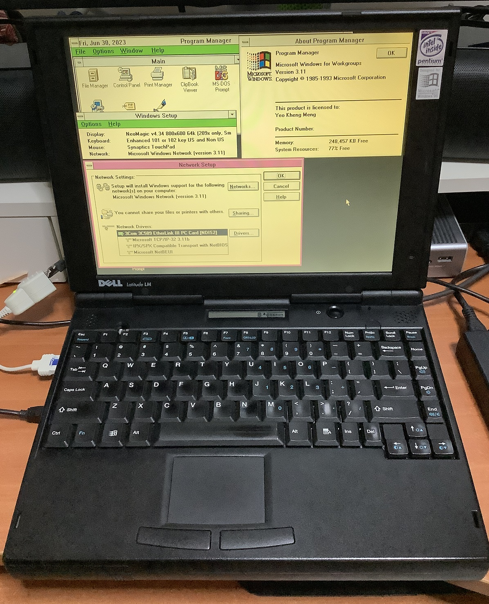
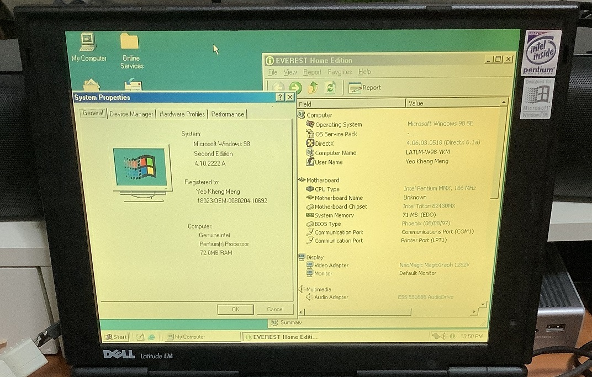
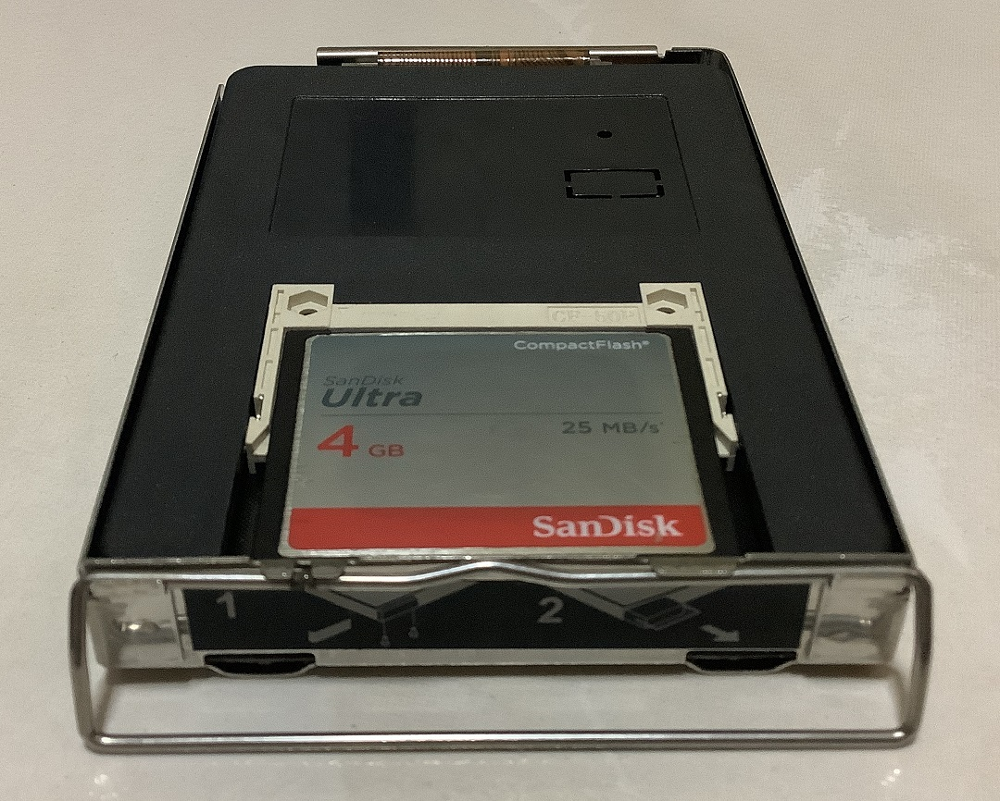
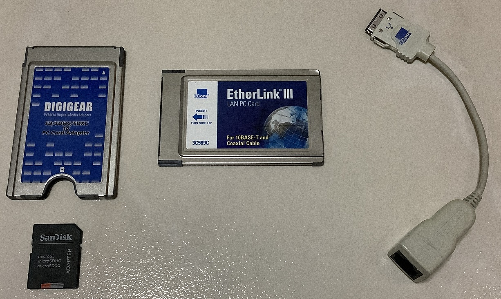
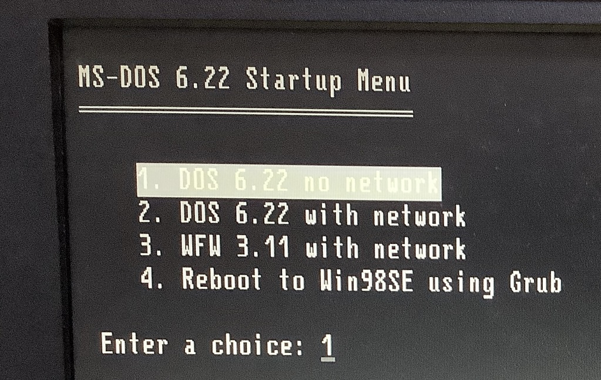

# Dell Latitude LM M166ST

The Dell Latitude LM is a model that was released in 1996. The machine I have has an internal CD-ROM drive but does not come with a floppy disk drive.

The machine is configured to dual-boot to DOS 6.22/Windows for Workgroups (WFW) 3.11 and Windows 98SE. The OS configuration of this machine closely mirrors that of my [Thinkpad T42](../thinkpad-t42)

With Windows for Workgroups 3.11

With Windows 98SE

## Specifications

* Intel Pentium MMX 166 Mhz
* Intel 430MX PCIset
* Neomagic NM2093 MagicGraph 128ZV 1MB
* 72MB (8+32+32) EDO RAM
* ESS1688 Audio controller
* 11" TFT display with 800x600 resolution
* 4GB Sandisk Compactflash card with IDE adapter
* Torisan 10x CDR_N110

I initially tried with an 8GB CF card and while the BIOS initially appears to recognise it, the system can't seem to boot from it. Hence I use a 4GB CF card. 

### Connectivity

* Serial
* Parallel
* VGA
* Combo PS/2 for mouse and keyboard
* 2x PC card slots
* Headphone jack
* Microphone
* IrDA

### PC card

As the system lacks connectivity and USB, I add these 2 PC cards for network and removable storage.

* 3Com 3C589C 10Mbps NIC
* Digigear SD adapter

## Install process

The CD drive of this machine is faulty hence this presented an additional challenge in setting up this machine with Windows 98 as it has no means to boot up from an external medium.

To get around this issue, I first had to prepare the internal disk (CF card) to be bootable.

This is done by putting the CF card into another DOS machine, partitioning the disk and installing DOS. Then moving the CF card back to this machine to continue the installation process.

## PCMCIA Socket services

To utilise the 3Com network card in DOS 6.22 and WFW 3.11, their native Packet and NDIS drivers have to be loaded respectfully.

Those drivers require Cardsoft PCMCIA socket services to be loaded in `CONFIG.SYS` beforehand in order to function properly. If not weird memory errors and system misbehaviours will appear.

These socket services requires a significant chunk of conventional memory so I created a DOS menu option to not load them if they are not needed.

# Sources

* [Original drivers from Dell](https://www.dell.com/support/home/en-sg/product-support/product/latitude-lm/drivers)
