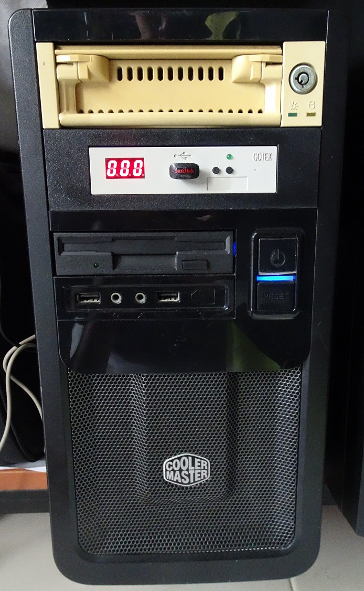
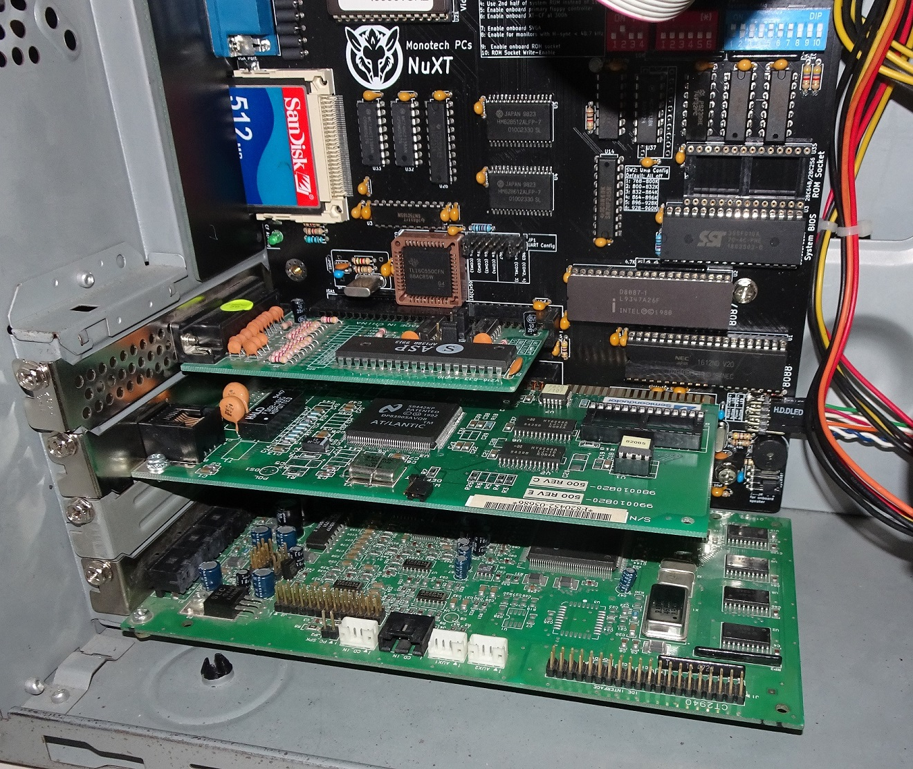
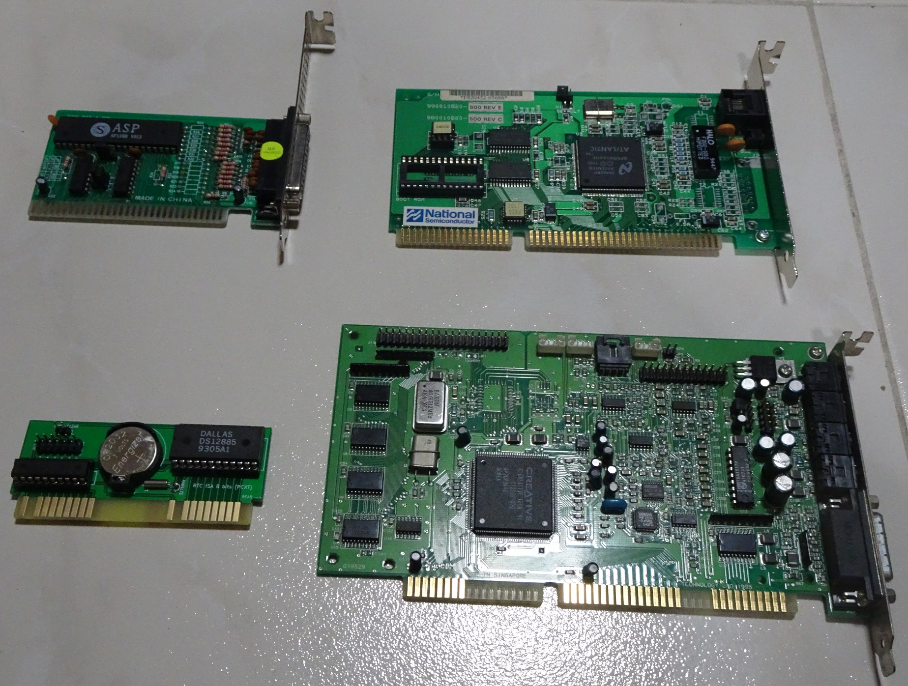
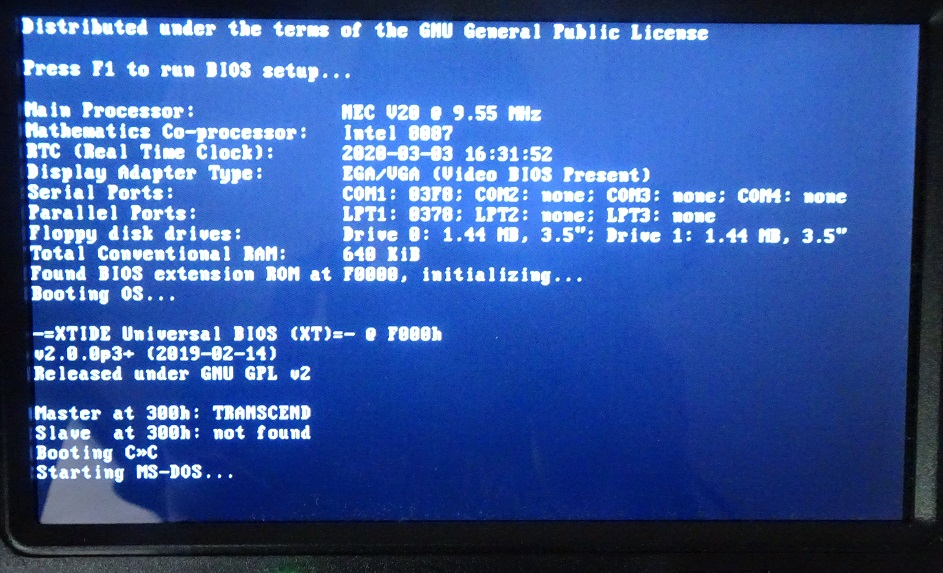
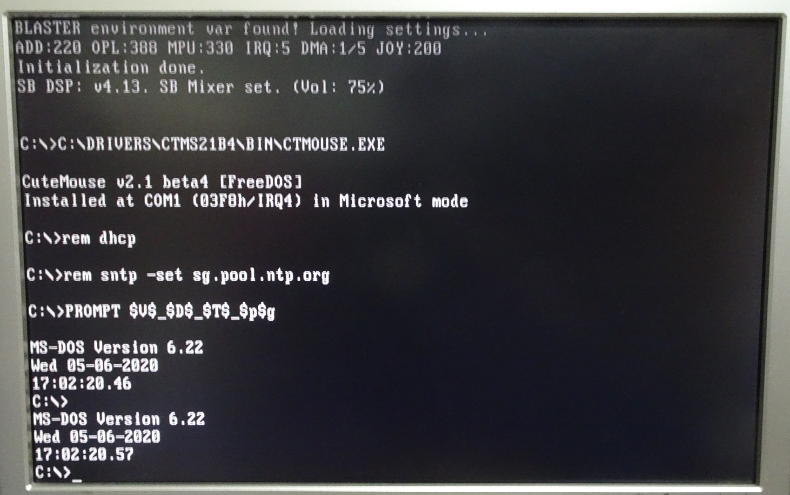

# NuXT PC

My NuXt PC is based on a modern 8088-based XT motherboard in a uATX form factor. This v1.2 motherboard was [released in 2019](https://www.vogonswiki.com/index.php/NuXT) by Monotech PCs.

Front of the PC with IDE HDD caddy (just a filler), Gotek Floppy emulator with HxC firmware, 3.5" 1.44 MB FDD.

## Specifications

* NEC V20 overclocked to 9.55Mhz via BIOS setting
* Intel 8087 FPU
* NuXT v1.2 motherboard
* 640KiB conventional RAM
* 512MB Sandisk Compactflash card
* 1.44MB 3.5" Floppy

Expansion cards from top left

* National Semiconductor NE2000plus+
* EPP Parallel Port 
* Creative Sound Blaster 16 CT2940 OPL3
* RTC ISA 8 bits (Very Low Profile)

## DOS Boot Configuration

The machine is configured for single-boot DOS 6.22. The BIOS is a modified version to support the RTC card. Only one primary partition is created to use the full 512MB CF card.

* NE2000 modified 8-bit driver
* MTCP environment variables
* Cutemouse
* SBPNPXT to configure Sound Blaster ISA PnP

Finished the boot process

Loading MTCP to prove packet drivers work.

## Sources
1. [Modified BIOS with RTC feature](https://github.com/spark2k06/micro_8088/tree/master/BIOS)
2. [NE2000 8-bit driver](https://github.com/yeokm1/ne2000plus-collection)
3. [RTC SPLD Binaries](https://github.com/spark2k06/hardware/tree/master/RTC8088/SPLD)