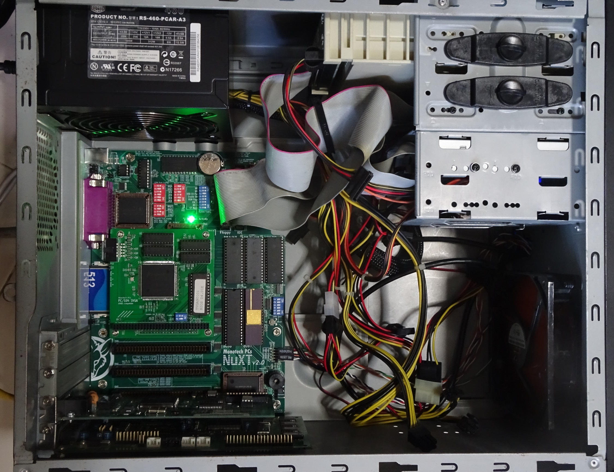

# NuXT v2.0 PC

My NuXT PC is based on a modern 8088-based XT motherboard in a uATX form factor. This v2.0 motherboard was [released in 2020](https://www.vogonswiki.com/index.php/NuXT) by Monotech PCs. [Purchase link](https://monotech.fwscart.com/NuXT_v20_-_MicroATX_Turbo_XT_-_10MHz_832K_XT-IDE_Multi-IO_SVGA/p6083514_19777986.aspx).

Front of the PC with IDE HDD caddy (just a filler), Gotek Floppy emulator with HxC firmware, 3.5" 1.44 MB FDD.

With everything connected

My ISA cards

## Specifications

* NEC V20 overclocked to 9.55Mhz via BIOS setting
* Intel 8087 FPU
* NuXT v2.0 motherboard
* 640KiB conventional RAM
* 512MB Sandisk Compactflash card
* 1.44MB 3.5" Floppy

Expansion cards from top left

* National Semiconductor NE2000plus+
* Creative Sound Blaster 16 CT2940 OPL3

## DOS Boot Configuration

Doing the POST check

The machine is configured for single-boot DOS 6.22. The BIOS is a modified version to support the RTC card. Only one primary partition is created to use the full 512MB CF card.

* NE2000 modified 8-bit driver
* MTCP environment variables
* Cutemouse
* Unisound to configure Sound Blaster ISA PnP

Finished the boot process

Syncing time with NTP to prove that the network works.

# Resources

* PS/2 mouse on COM2: IRQ3, Port 0x2F8
* NE2000: IRQ2, Port 0x340
* SB16: IRQ5, Port 0x220

## Sources
1. [NE2000 8-bit driver](https://github.com/yeokm1/ne2000plus-collection)
