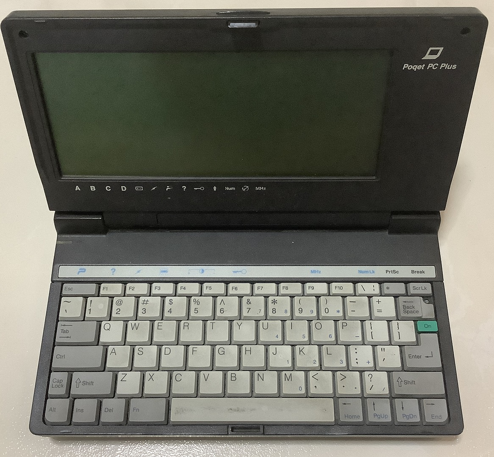

# Poqet PC Plus

The Poqet PC Plus is a small IBM PC/XT compatible released by Fujitsu in the early 1990s.



This PC failed before I could take a photo of it in a running state.

## Specifications

* NEC V30 16 MHz (clone of Intel 8086)
* 2MB (640KB conventional, 1.3MB EMS)
* 2x Type II PCMCIA slots (limited support for Flash cards and modems)
* Built in MS-DOS 5.0 in ROM

## Serial Connectivity

* 1 × TTL serial port
* 1 × TTL/RS-232 serial port (configurable)


The serial interface uses a proprietary connector. Pinouts of this serial connector can be found in this [link](https://www.qsl.net/wb3gck/serial.htm) which has also been cached in this manuals directory.


The model I have comes equiped with an DB9-female connector.


Internals of the adapter top.


Internals of the adapter bottom.

## PC card

For larger customisable storage, I use PCMCIA cards.


2 slots on the side.


The PC seems to only be able to recognise the SRAM card without drivers. 

Since 512K is too small for meaningful use. I use an additional 32MB CF card. I used a modified PC Card driver to use the CF card but I tested capacities above 32MB and they don't seem to work.

The PC cannot boot from the CF card.


Remember to replace the CR2325 battery of the SRAM card if it is too weak.

### Battery Port


The battery port of this device has corroded.


Battery terminals for reference


NiCD Battery pack for reference

## Configuration

The PC can be set to boot from the SRAM card however the BIOS (accessible via Fn+Esc) settings will we wiped if the system loses power. 

The 512K SRAM card is also too small to hold significant data. So most of it the non-boot related data is placed on the 32MB CF card.

The BIOS by default will look at the drive A (first PCMCIA slot) for `config.sys` and `autoexec.bat` to run if their available. We can use this feature to place our files there to intercept the boot process.

### File Locations

* 512K SRAM card as Drive A: Config.sys, Autoexec.bat, Poquet PC card tools
* 32MB CF card as Drive B: Drivers, Programs, TEMP director and other stuff

### Config.sys

This will launch Poquet PC card services. A patched Poqet Card Configuration Utility (PQCCU) is used so we can use the 32MB CF card.

### Autoexec.bat

All other launch configurations like Path, environment variables and startup programs.

## Reading SRAM card Windows 9x

To read the SRAM card on Win 9x, the following lines should be added to `config.sys`.

```text
device=c:\<windows>\system\csmapper.sys
device=c:\<windows>\system\carddrv.exe /slot=<x>
```
`<x>` refers to how many slots are there in the system.

After bootup, `<x>` drive letters will be reserved for the slots. (The slots can still be used for other purposes.) Insert the SRAM card into the PCMCIA card and the card will be assigned to one of the drive letters.

Windows it seems cannot format the cards.

## Sources and References

1. [Bmason Documentation and utilities](https://www.bmason.com/PoqetPC/)
2. [Eskimo Review ](https://eskimo.com/~webguy/service/poqet.html)