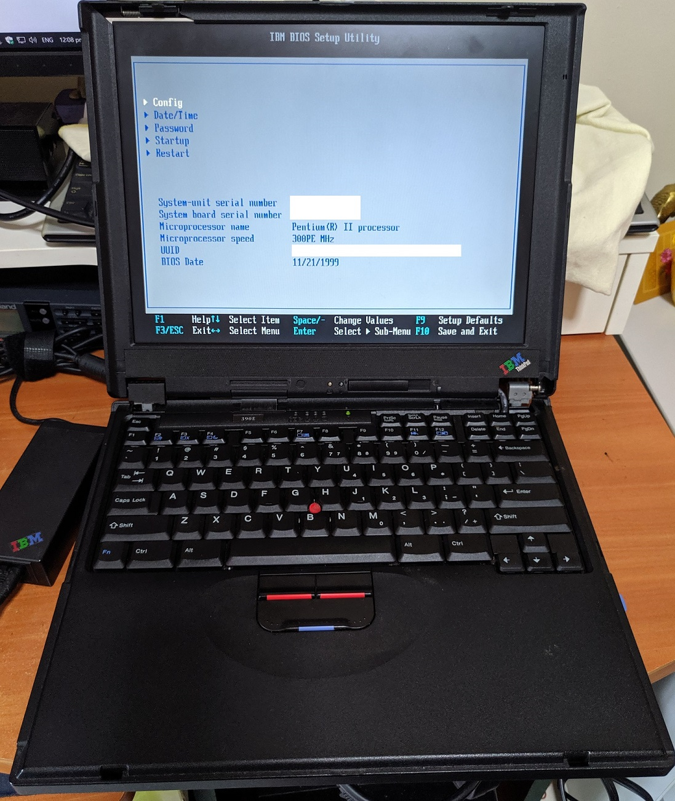
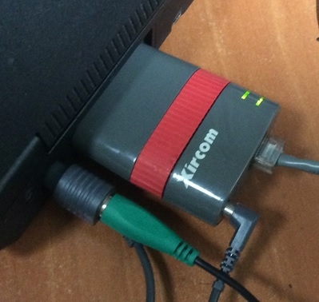
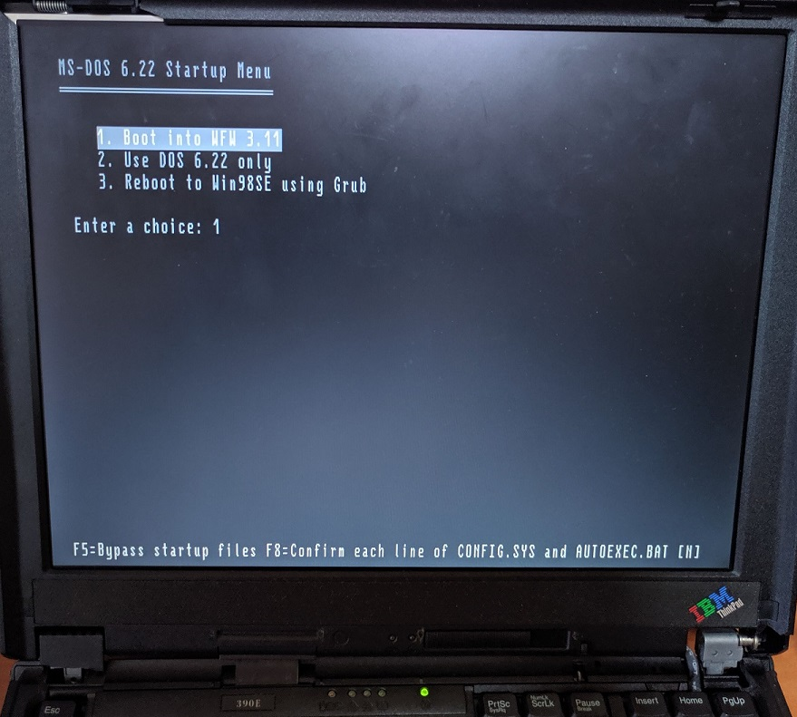
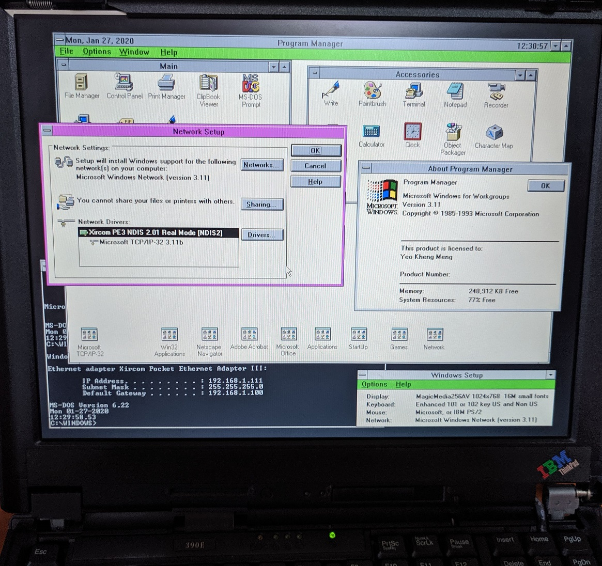
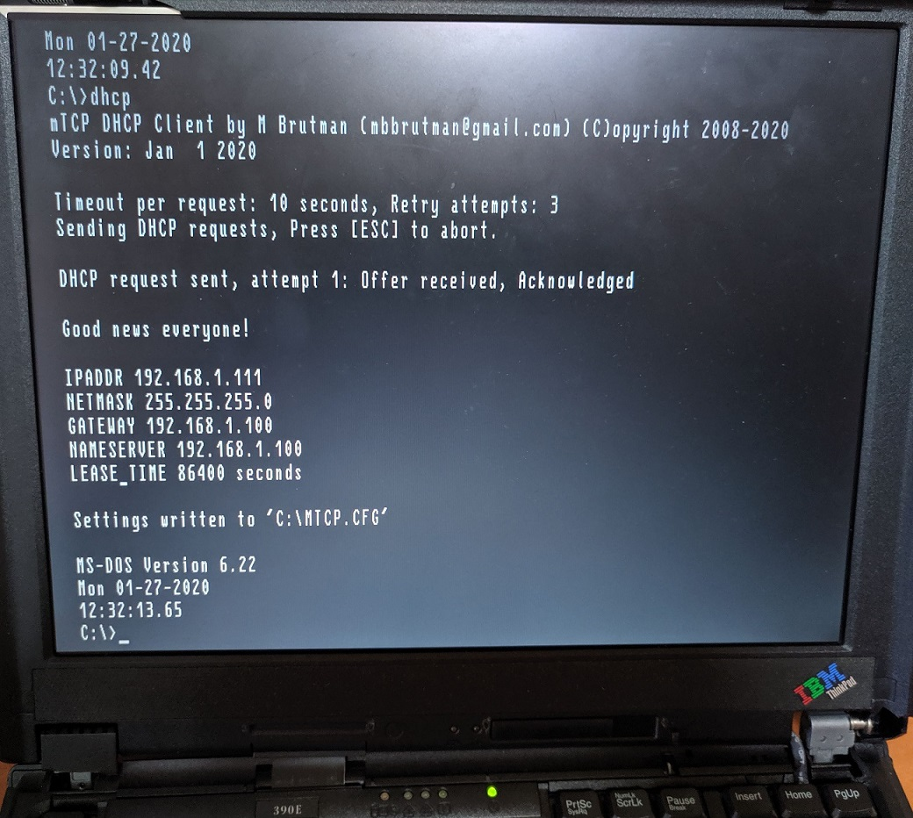
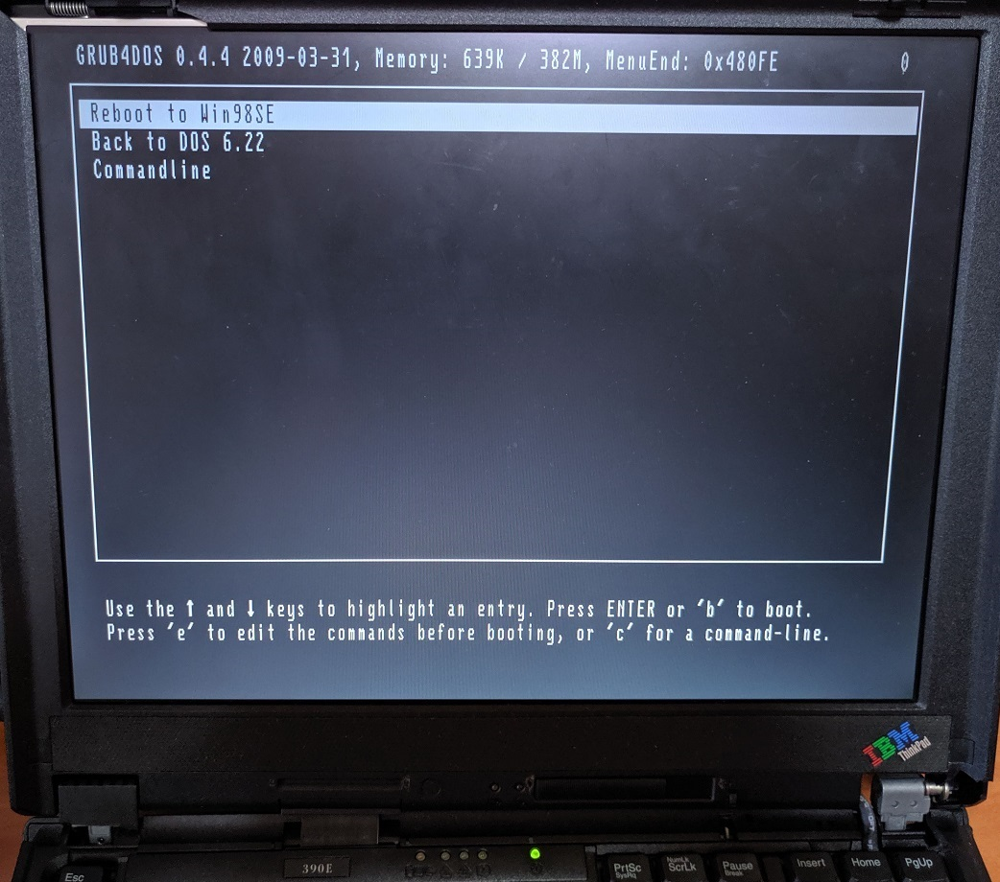
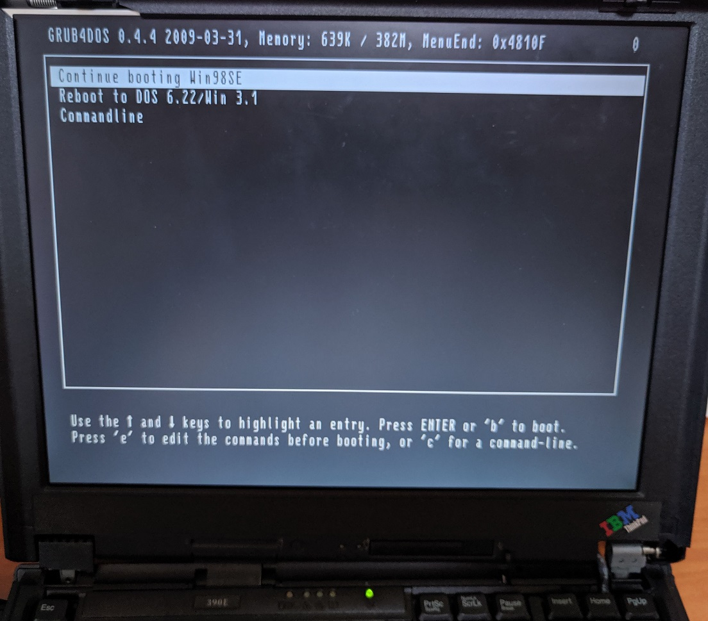

# Thinkpad 390E

The Thinkpad 390E-2626 is a laptop released in Mar 1999 by IBM. It is among the final Thinkpads with Windows 3.1 support.

The machine is configured to dual-boot to DOS 6.22/Windows for Workgroups (WFW) 3.11 and Windows 98SE. The OS configuration of this machine closely mirrors that of my [Thinkpad T42](../thinkpad-t42)

## Specifications

These are the specifications specific to the Thinkpad I have:

* Intel Mobile Pentium II 300
* Neomagic MagicMedia256AV with 2.5MB
* 384MB PC-66 SDRAM
* ESS1946 Audio controller with SB Pro Emulation
* 14.1" TFT display with 1024x768 resolution (XGA)
* 32GB Sandisk Compactflash card
* LG CD-ROM CRN-8241B
* 2x Type II Cardbus slots
* Infrared Communication

### Accessories

* Xircom PE3-10BT Parallel Port Ethernet
* Xircom Realport2 10/100 Cardbus Ethernet

## Boot Configuration

The machine is configured to dual-boot into the primary partitions containing DOS 6.22/WFW 3.11 or Windows 98SE using the GRUB4DOS bootloader. Within DOS6.22/WFW 3.11, I have separate boot configurations for either DOS 6.22 or WFW 3.11 configured in `CONFIG.SYS` and `AUTOEXEC.BAT`. This is to facilitate clean separation of configuration and software between the 2 OSes.

The installation procedure for this configuration can be found on the T42 page [Thinkpad T42](../thinkpad-t42).

### Partition 1 (DOS 6.22 and WFW 3.11)

#### WFW 3.11

* Windows 32-bit file system manager
* Start WFW network

#### DOS 6.22

* EMM386 NOEMS configuration to enable `devicehigh` and `loadhigh`
* Xircom PE3-10BT Packet drivers
* MTCP environment variables
* Cutemouse

#### GRUB options

Starts Grub to enable rebooting into Windows 98

### Partition 2 (Win 98SE)

#### Grub options on partition start

* Boot Menu
* No logo

## Sources
1. [Official 390E drivers](https://thinkpads.com/support/Thinkpad-Drivers/download.lenovo.com/lenovo/content/ddfm/390e.html)
2. [Xircom Realport2 drivers](https://onlytrustedfiles.wordpress.com/2012/11/29/direct-download-xbe312-1-exe/)
3. Dualbooting DOS and Win95: [Just setting active](http://retropcbuilder.blogspot.com/2016/11/dual-booting-dos-and-windows-95-follow.html) and [Hiding partitions](http://retropcbuilder.blogspot.com/2016/11/dual-booting-ms-dos-622windows-31-and.html).
