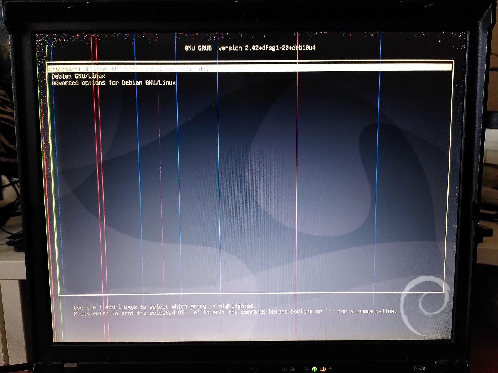
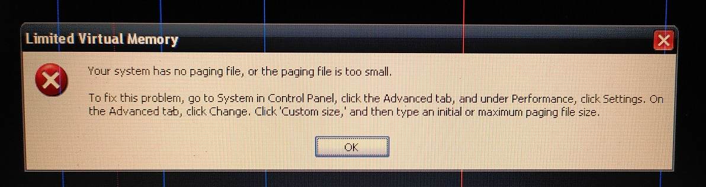

# Thinkpad R50e

The Thinkpad R50E-1834 is a laptop released in 2005 by IBM. 


The machine is configured to boot Windows XP Pro and Debian.

## Specifications

These are the specifications specific to the Thinkpad I have:

* 1.5 Ghz Pentium M 735 CPU
* Intel Extreme Graphics 2 (64MB shared)
* 2x1024MB DDR PC2700 RAM
* Intel AC'97 Audio with a SoundMax AD1981B codec
* 14.1" TFT display with 1024x768 resolution (XGA)
* 32GB Sandisk Compactflash card
* Intel Fast Ethernet
* Intel PRO/Wireless LAN 2100 3B Mini PCI (I disabled in BIOS)
* 1x ECP capable parallel port
* DVD/CD-RW Ultrabay Slim
* 2x Type II Cardbus slots
* Infrared Communication

## OS

## Grub



Grub bootloader selects Win XP or Debian to start on bootup

## Windows XP Pro

To minimise the updates I have to do, I opted to use [Zone 94 Win XP Pro x86 - Integral edition](https://www.zone94.com/downloads/software/operating-systems/123-windows-xp-professional-sp3-x86-integral-edition). At time of writing, this was version 2021.5.15.


Theme is based on [Royale Noir](https://www.istartedsomething.com/20061029/royale-noir/).

## Paging issue



Win XP detects the CF card as a removable drive. Hence, it only allows one partition on it as well as no paging. This means I can only solely rely on the 2GB of RAM which is actually reasonably plentiful on XP.

## Debian

I installed Debian 10 using the [i386 netinst CD](https://www.debian.org/CD/netinst/). 


## Wifi

By default, the Intel Wifi firmware package is not included. To use this package, I followed this instruction frome [here](https://wiki.debian.org/ipw2200).

```bash
sudo nano /etc/apt/sources.list

#Add non-free to the deb line like as follows
deb http://mirrorurl/debian/ buster main non-free

apt update
apt install firmware-ipw2x00 wireless-tools

# modprobe not required
# modprobe -r ipw2200 ; modprobe ipw2200

sudo /sbin/reboot
```

# References
1. [Official R50e drivers](https://thinkpads.com/support/Thinkpad-Drivers/download.lenovo.com/lenovo/content/ddfm/R50e.html) 