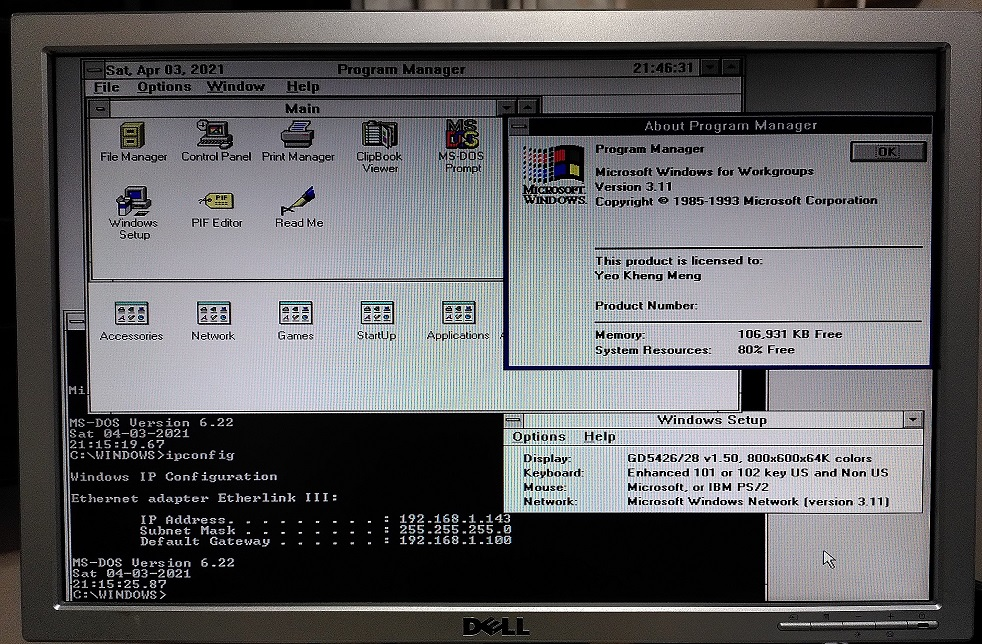
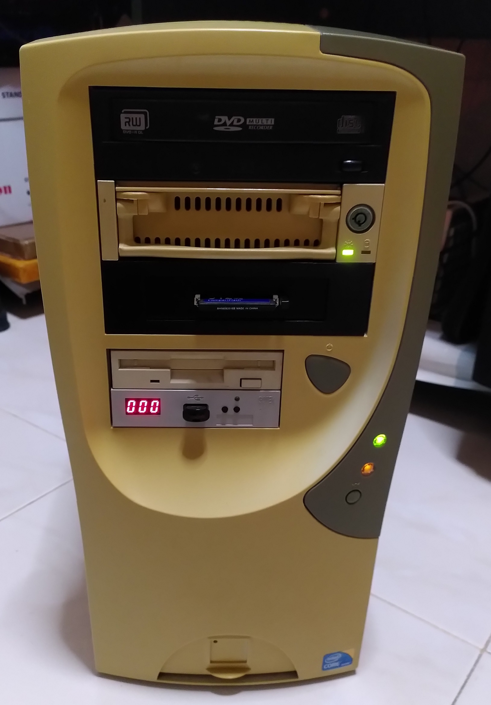
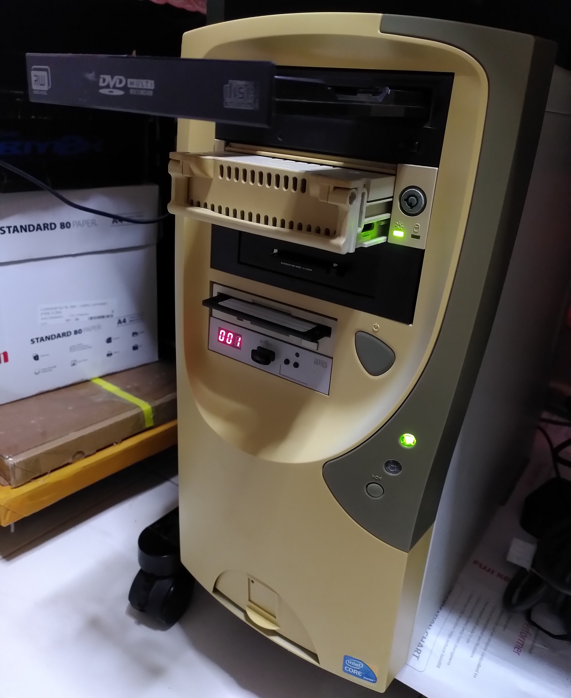
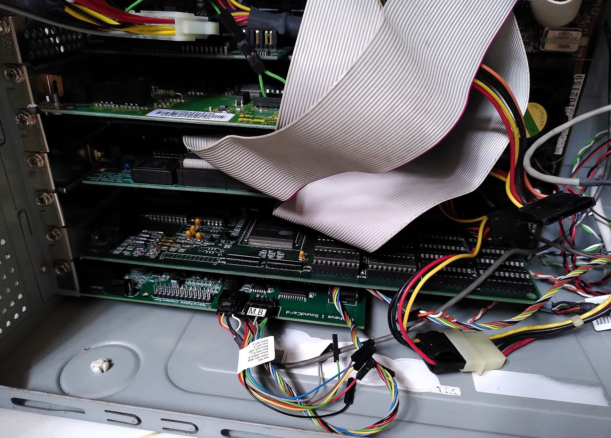
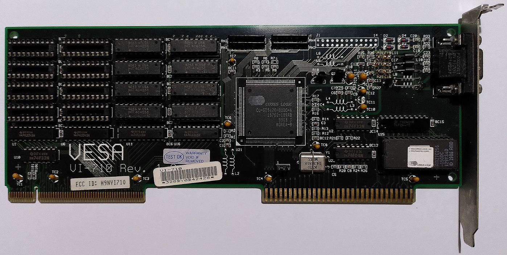
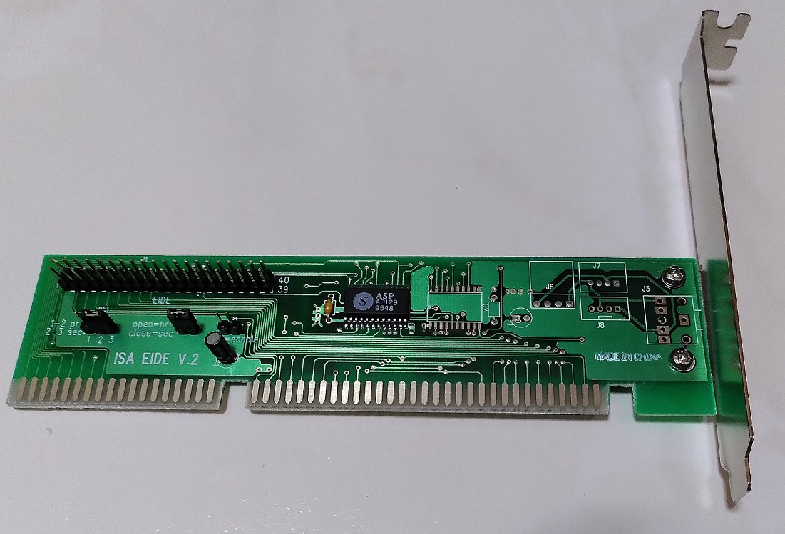
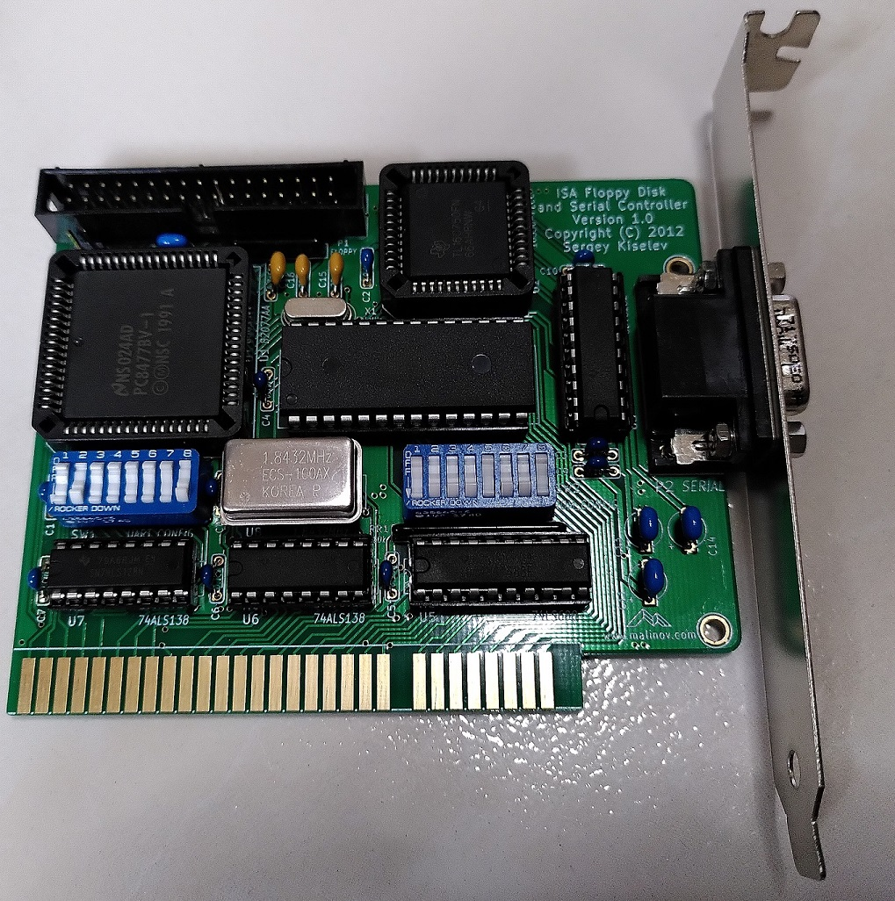
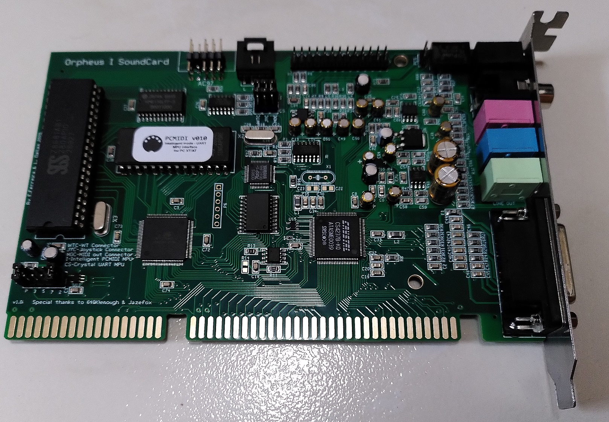
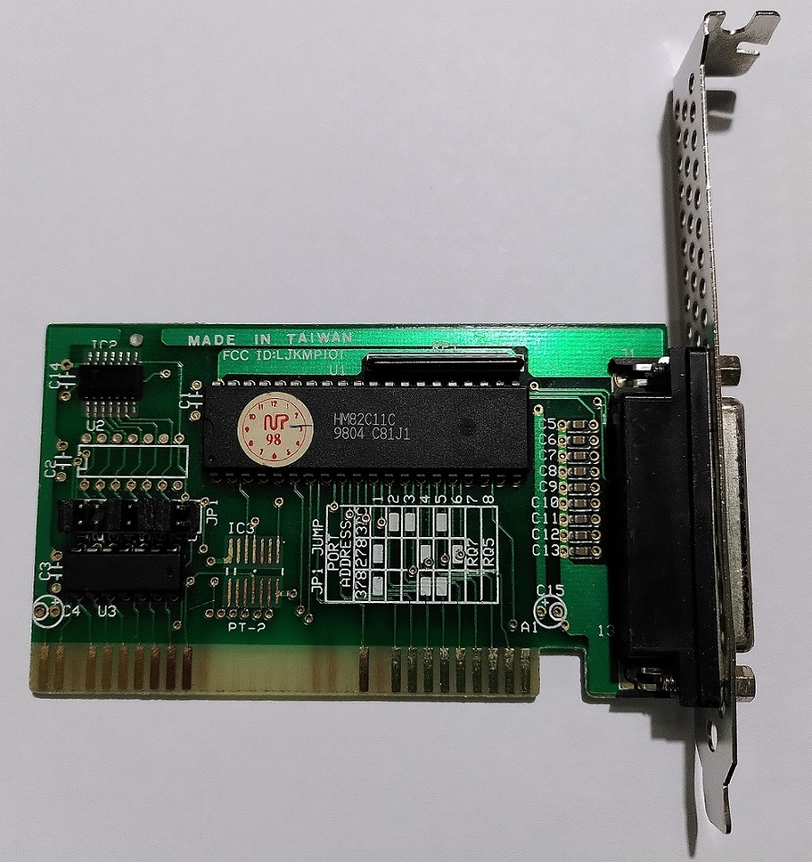
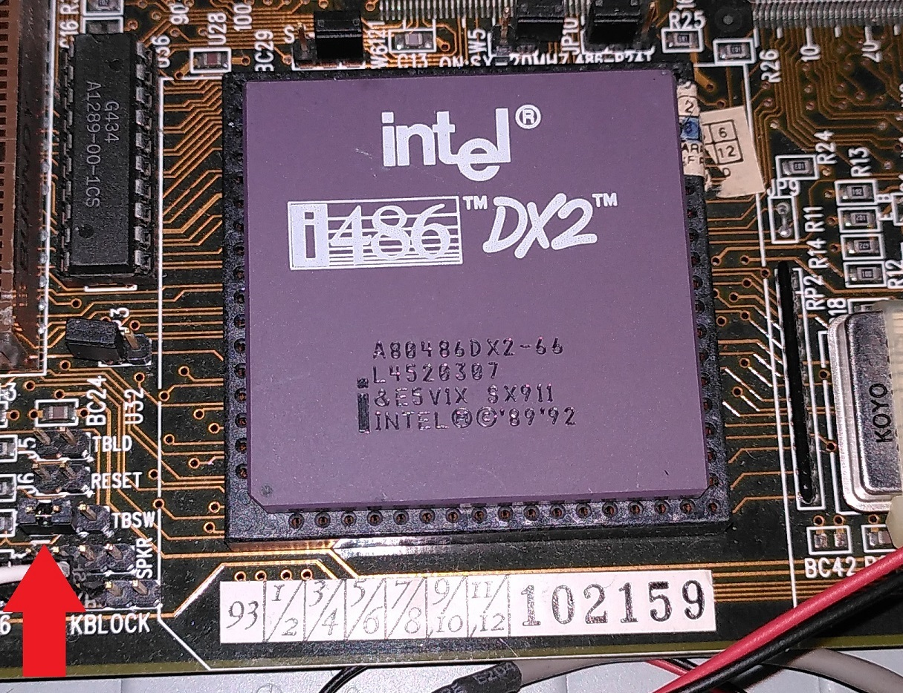

# Generic 486 PC

My retro PC made for generic retro-x86 purposes. 

It runs on DOS 6.22 and Windows for Workgroups (WFW) 3.11

Ignore the I5 label!

## Specifications

* Intel 486 DX-2 66Mhz
* Gigabyte GA486-VT motherboard with 256K L2 cache
* 8x4MB SIMM30 EDO DRAM
* 512MB Compactflash card
* DVD-RW IDE
* IDE HDD caddy
* Gotek Floppy Emulator with HxC firmware
* 1.44MB 3.5" Floppy

Old computers usually very cluttered due to the less integrated nature of the components.

Lots of necessary expansion cards.

Cirrus Logic CL-GD5426 1MB VLB card

2x EIDE controllers are used in this system.

ISA Floppy Disk and Serial Controller design obtained from [here](http://www.malinov.com/Home/sergeys-projects/isa-fdc-and-uart).

[Orpheus sound card](http://orpheus-soundcard.eu/)

3Com Etherlink III 3C905B-C 10Mbps

Parallel Port card

## Beware the Turbo Button

The TBSW pin header on the left of the CPU socket has to be populated with an external switch or jumper in order to disable Turbo Mode. Otherwise your system will run very slowly!

## DOS Mode

* EMM386 NOEMS configuration to enable `devicehigh` and `loadhigh`
* 3Com Packet drivers
* MTCP environment variables
* Cutemouse
* [Universal PnP Sound card enabler by Jazefox](https://www.vogons.org/viewtopic.php?f=62&t=72553)

## References
1. [Motherboard manual](https://stason.org/TULARC/pc/motherboards/G/GIGA-BYTE-TECHNOLOGY-CO-LTD-486-GA-486VT.html)
2. [CL GD5426 drivers](http://vogonsdrivers.com/getfile.php?fileid=1095&menustate=0)
3. [Orpheus 1 Win 3.1 I5 non-PnP drivers](http://orpheus-soundcard.eu/)
4. [Creative PnP Configuration Manager for reference](https://support.creative.com/Products/ProductDetails.aspx?prodID=1842&prodName=Sound%20Blaster%2016)
