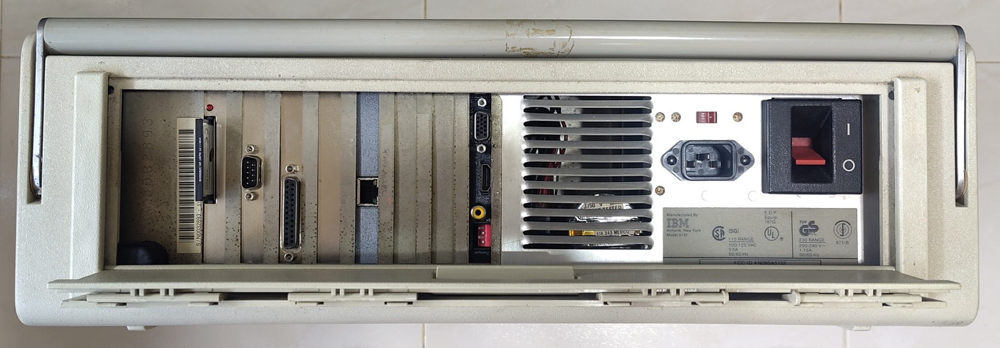

# IBM 5155 Portable PC

The IBM 5155 Portable is a PC released in 1984. It is based on the IBM XT released in 1983 but in a "portable" form with internal amber monochrome CRT monitor.

Don't let the name fool you, at 13.6kg, it is heavier than many modern desktop PCs.

Front of the PC with 5.25" 360K floppy and Gotek Floppy emulator with HxC firmware.

Using up many ISA slots.

All the rear IO ports.

An XT-IDE card is used which has a boot loader to boot from selected disks.

Connecting to the network is possible.

## Hardware

* Intel 8088 4.77Mhz
* Intel 8087 FPU
* Motherboard has 640KB upgrade kit installed (See next section)

Motherboards from early IBM PCs are bare with most of the external functionality provided by ISA cards.

### Expansion cards

This [Graphics Gremlin](https://github.com/schlae/graphics-gremlin) open-source FPGA clone of the IBM CGA Graphics card.

The one I inserted into the system does not have the external composite and RGBI connector populated so as to use an [off-the-shelf Keystone 9200-1 VGA backplate](https://www.mouser.sg/ProductDetail/534-9200-1).

Realtek RTL8019 NE2000-compatible 8-bit ISA Ethernet adapter. Purchase [here](https://www.tindie.com/products/weird/isa-8-bit-ethernet-controller/).

The card has been configured to be jumperless with the utility used to set the resources.

[Aitor Gómez's RTC ISA 8 Bits XT](https://hackaday.io/project/168972-rtc-isa-8-bits-pcxt)

[Sergey Kiselev Floppy Disk and Serial Controller](http://www.malinov.com/Home/sergeys-projects/isa-fdc-and-uart)

[Glitchwrks XT-IDE rev 4](https://users.glitchwrks.com/~glitch/2017/11/23/xt-ide-rev4) disk controller with a IDE-CF card adapter for easy external access for the 512MB CF card.

AP138B Parallel Port card

### Comparison with original CGA card

One can see that the [Graphics Gremlin](https://github.com/schlae/graphics-gremlin) is so much smaller the original IBM CGA card.

With a modern VGA connector!

### 640K upgrade

I used the [RAM upgrade kit from Monotech PCs](https://monotech.fwscart.com/640K_RAM_Upgrade_for_IBM_5160/p6083514_20677547.aspx) to boost the default 256KB conventional memory to the maximum of 640KB. Therefore saving an ISA slot for another function which would have otherwise gone to a separate RAM card.

Replacing Bank 0 and Bank 1 with the 18x 256K-bit chips from the kit.

Adding the 74LS158 multiplexer/decoder chip to empty socket U84.

The terminals 1 and 8 of the IBM Programmable Array Logic (PAL) chip at U44 are required to be shorted.

As the IBM5155 uses the older version of an XT motherboard, it does not have a jumper terminal to do the shorting easily. A wire has to be wrapped around the chip legs to do the shorting.

More information for this upgrade can be found [here](http://minuszerodegrees.net/5160/motherboard/5160_upgrading_256k_motherboard_to_640k.pdf).

## DOS Boot Configuration

The machine is configured for single-boot DOS 6.22 and very similar to my NuXT PC's configuration.

* MTCP environment variables
* [Modified NE2000 packet driver](https://github.com/skiselev/isa8_eth/tree/main/software/driver)
* Get time from RTC

## RTC

I was experimenting in getting an Real-time clock to work with this system with little success.

Many thanks to Aitor Gómez's [RTC ISA 8 Bits XT](https://hackaday.io/project/168972-rtc-isa-8-bits-pcxt) and his help. I managed to reprogram his board to use the `240h` address and get it to work.

1. [RTC SPLD Binaries](https://github.com/spark2k06/RTC8088)
2. [RTC Program from dieymir](https://forum.vcfed.org/index.php?threads/rtc-isa-8-bits-very-low-profile.73126/post-909159)

### Unused RTC programs for reference
1. [DS1216E RTC program](https://www.brutman.com/PCjr/DS1216E.html)
2. [David_M generic clock program](http://minuszerodegrees.net/rtc/rtc.htm)

## Rescue Floppy

The `DSKA0001_dos6boot.img` is a 1.44MB floppy image containing a minimal DOS environment and a subset of MTCP's tools. 

This is used for initial boot/install in case there is a problem with the disk drive.

After booting from the floppy image, I start an FTP server and then copy the rest of the files to it.

## Manuals

1. [Technical Reference](http://www.minuszerodegrees.net/manuals/IBM_5155_5160_Technical_Reference_6280089_MAR86.pdf)
2. [Operations Manual](http://classiccomputers.info/down/IBM/IBM_PC_Portable_5155/IBM_5155_Guide_to_Operations_6936571_JAN84.pdf)
3. [PSU Review by Hugo Holden](http://worldphaco.com/uploads/The_IBM_5155_POWER_SUPPLY.pdf)
4. [IBM5160 and IBM5155 motherboard versions](http://minuszerodegrees.net/5160/motherboard/5160_motherboard_revisions.htm)
5. [SBPNPXT by dca2](https://www.vogons.org/viewtopic.php?p=479466#p479466)
