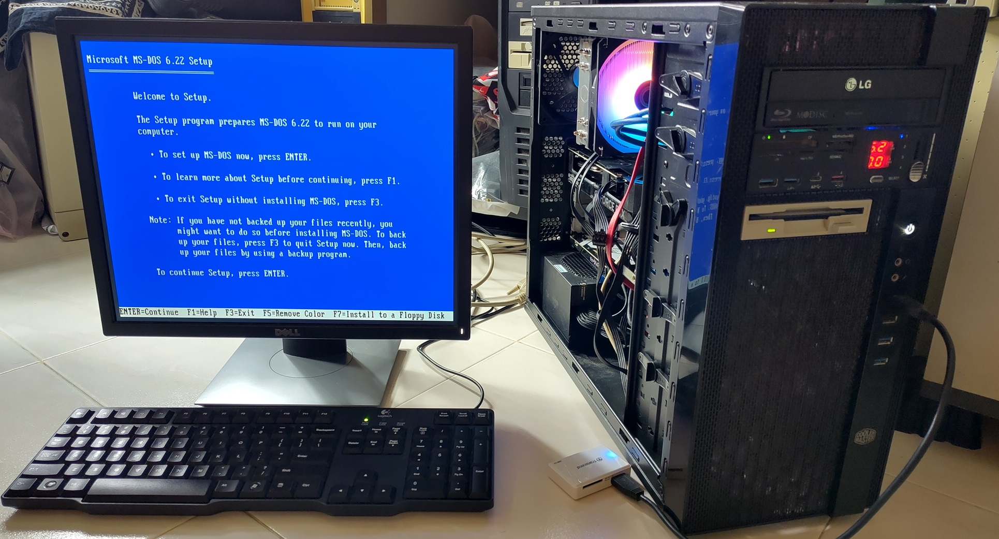
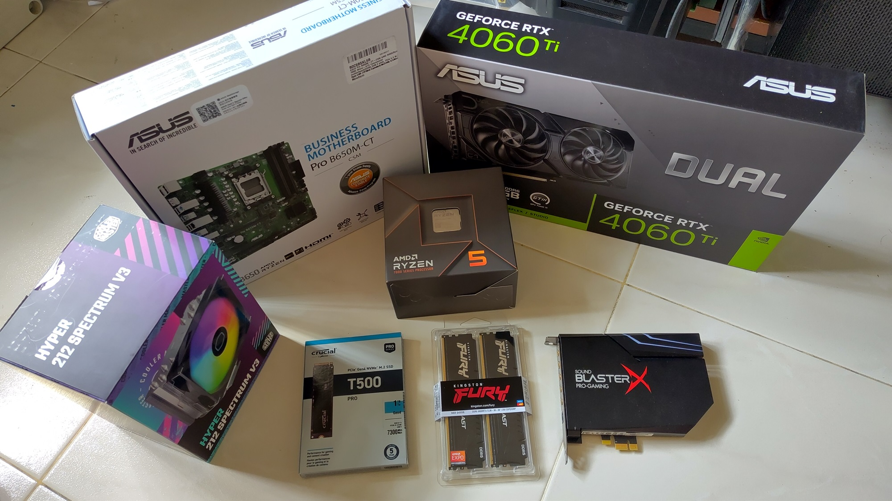
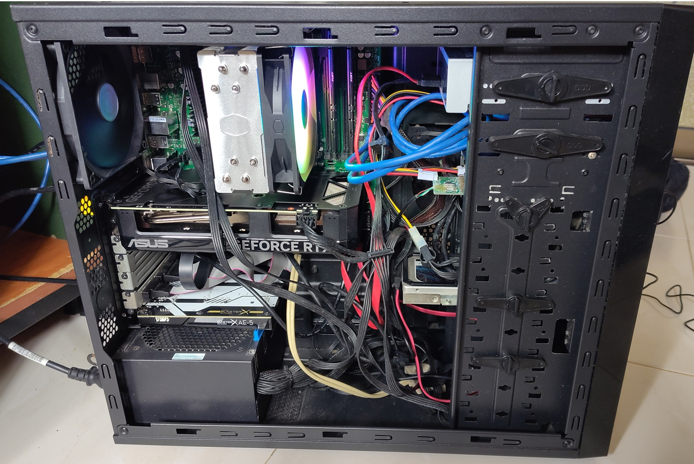
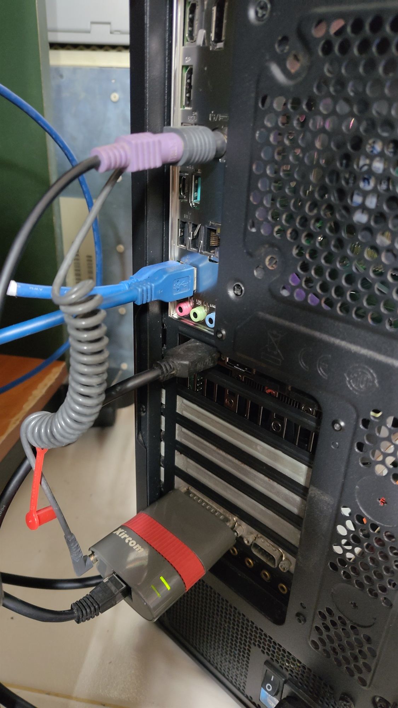
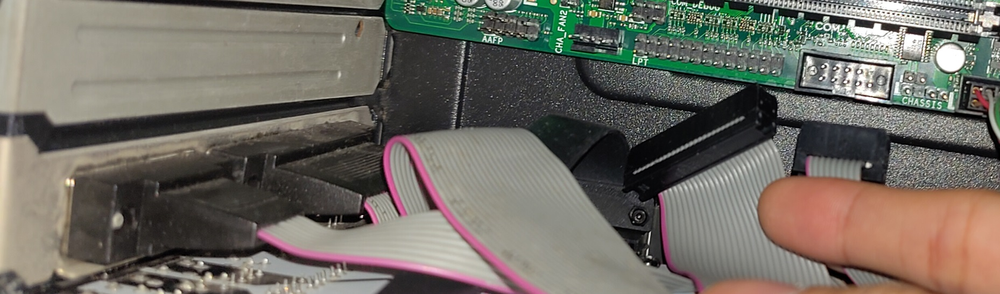
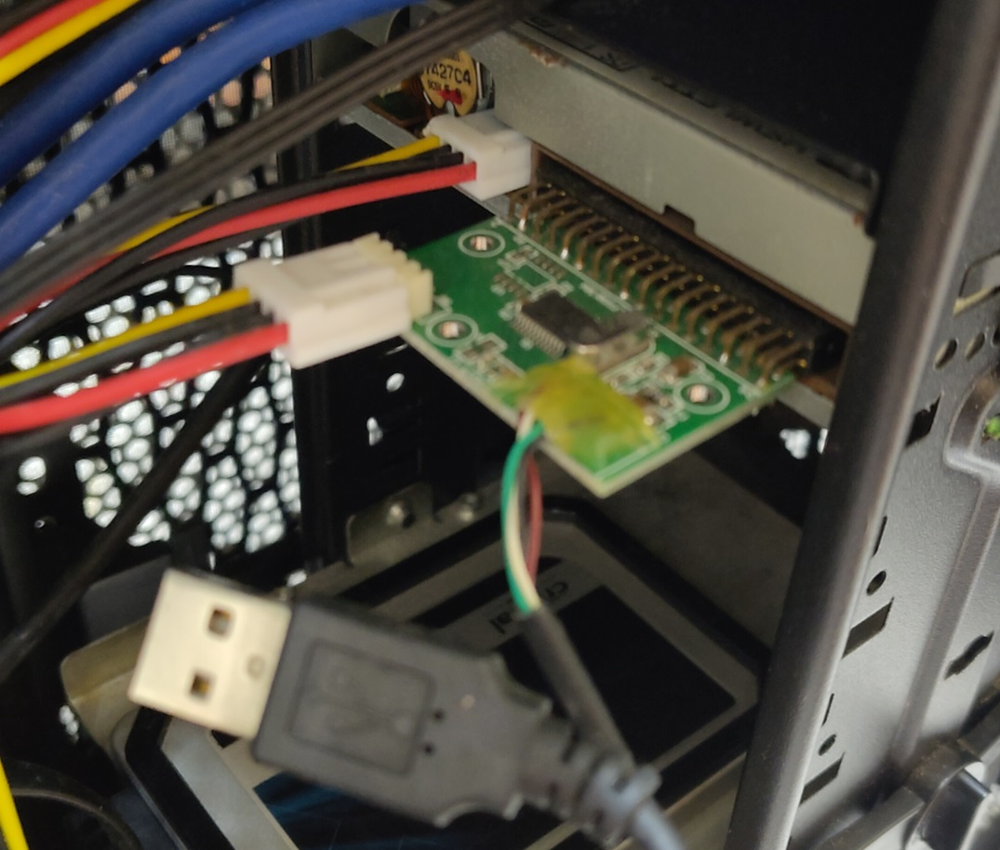
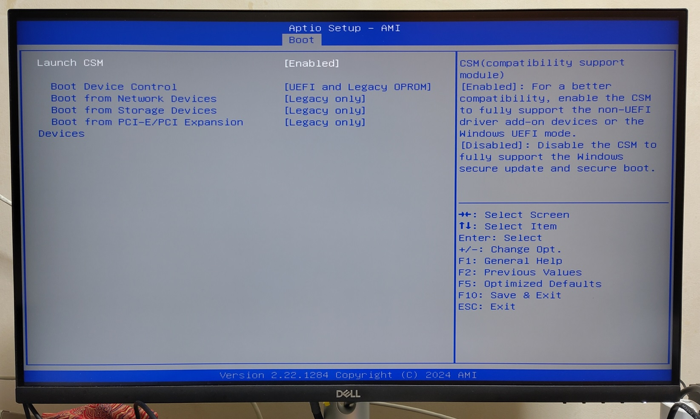
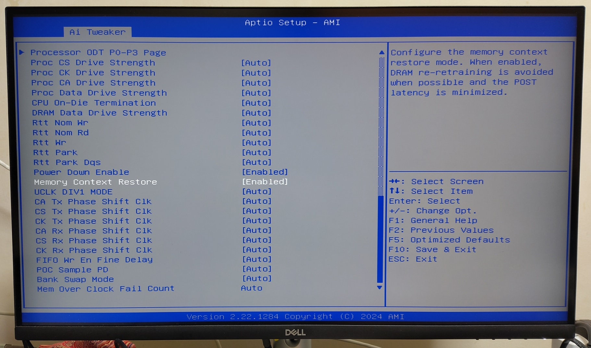
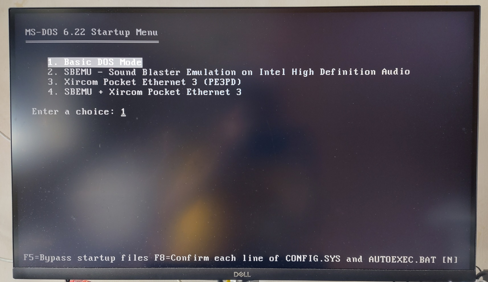
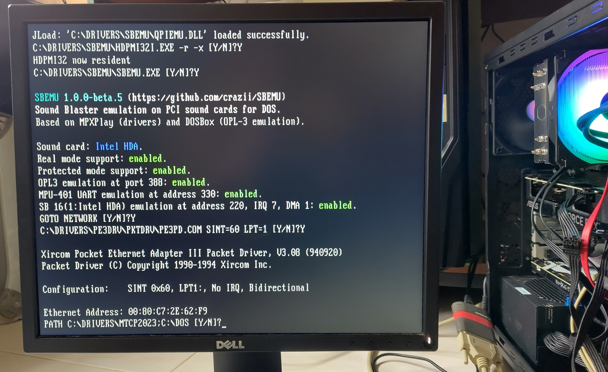

# Modern Ryzen Desktop

This is my modern desktop rig built in 2024 but I configured it to run MS-DOS 6.22 as an experiment.

The machine is configured to boot to DOS 6.22 from an external USB drive.

Demo video of Doom, Planet X3, ChatGPT and CPUID. Descent runs too fast to be playable.

Background of this project can be read from my [blog post](https://yeokhengmeng.com/2024/10/modern-pc-vintage-twist/).

## Specifications

These are the specifications of this modern machine.

* AMD Ryzen 5 7600 3.8Ghz AM5 socket
* Asus Dual GeForce RTX 4060 Ti EVO OC 16GB
* ASUS Pro B650M-CT-CSM motherboard
* 2x32GB DDR5-5600 CL36 Kingston Fury
* Coolermaster Hyper 212 Spectrum V3 CPU cooler
* 1TB NVME Crucial T500
* From previous build
    * Seasonic S12II 520W PSU
    * Coolermaster N400 midtower ATX case
    * Sound BlasterX AE-5
    * 512GB NVME Samsung 870 Evo Plus
    * 1TB SATA Crucial MX300
    * 3.5" floppy Drive with internal USB adapter
    * LG Blu-ray Rewriter
    * 5.25" USB 3.0 ports and card reader
* Xircom Pocket Ethernet 3 (PE3) 10Mbps Parallel Port Network adapter

All the items in their original boxes. Sound Blaster AE-5 and other stuff like case was from my previous build.

How everything is connected.

Xircom PE3 connected to a native parallel port.

Motherboard provides native serial and parallel port. A native parallel port is almost unheard of for a desktop motherboard that is this modern

Physical 3.5" floppy drive connected by a USB adapter.

## BIOS setup

UEFI-CSM legacy boot enabled.

Enable both "Power Down Enable" and "Memory Context Restore" to avoid lengthy DDR5 training during POST.

## DOS Configuration

The `config.sys` and `autoexec.bat` configuration has been customised by me to load the appropriate menu option depending on my needs.

* JEMMEX combined XMS and EMS driver that is required for SBEMU
* * HIMEM.SYS does not work
* MTCP environment variables
* Xircom PE3 Packet driver

The first option is `Basic DOS Mode` to not load memory, sound and network drivers for a relatively clean start. The other options load a combination of sound and network drivers.

## Audio and network configuration

Sound Blaster and OPL3 support is provided by the [SBEMU](https://github.com/crazii/SBEMU) driver which can utilise modern sound hardware like Intel HD Audio standard.

Xircom PE3 packet driver is also loaded. No IRQ as that setting does not seem to work.

I did try to load the NDIS2 driver for the onboard RTL8168 network chip on the motherboard but that did not seem to work properly.
