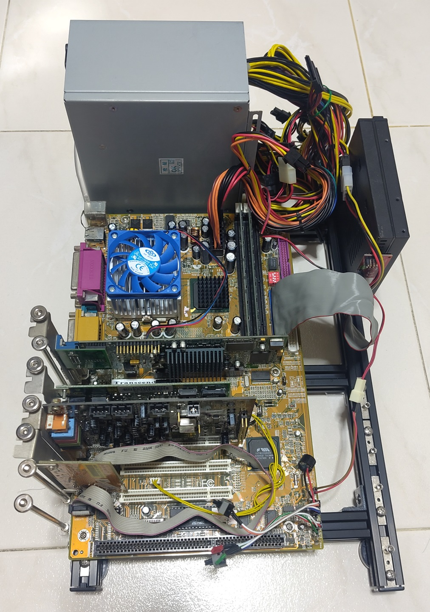
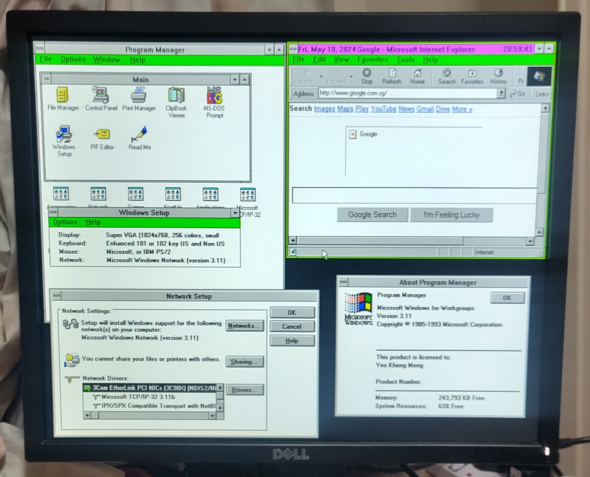
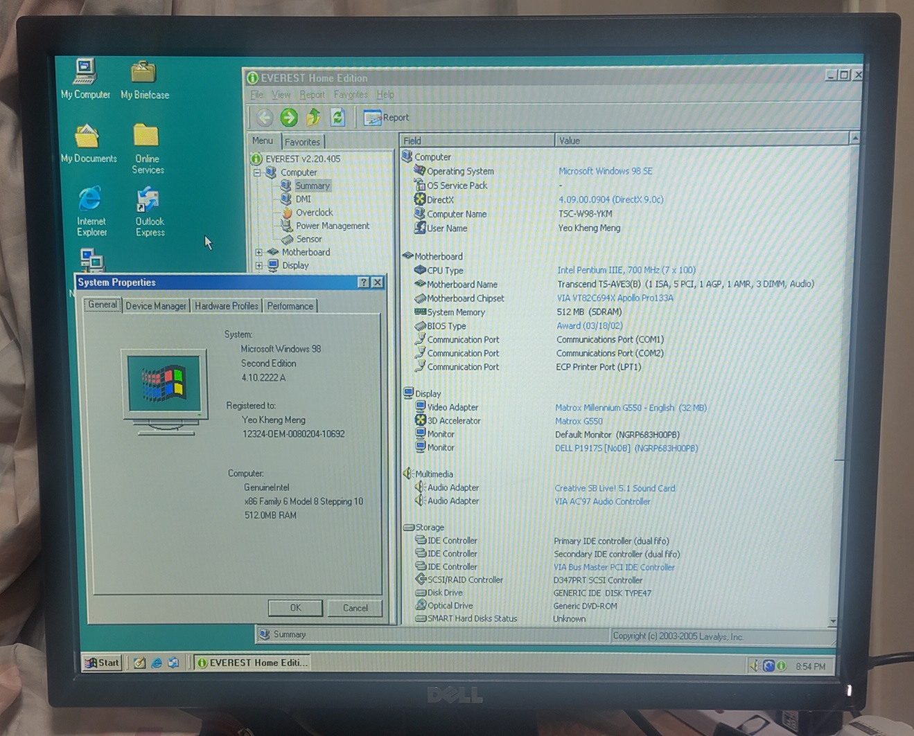
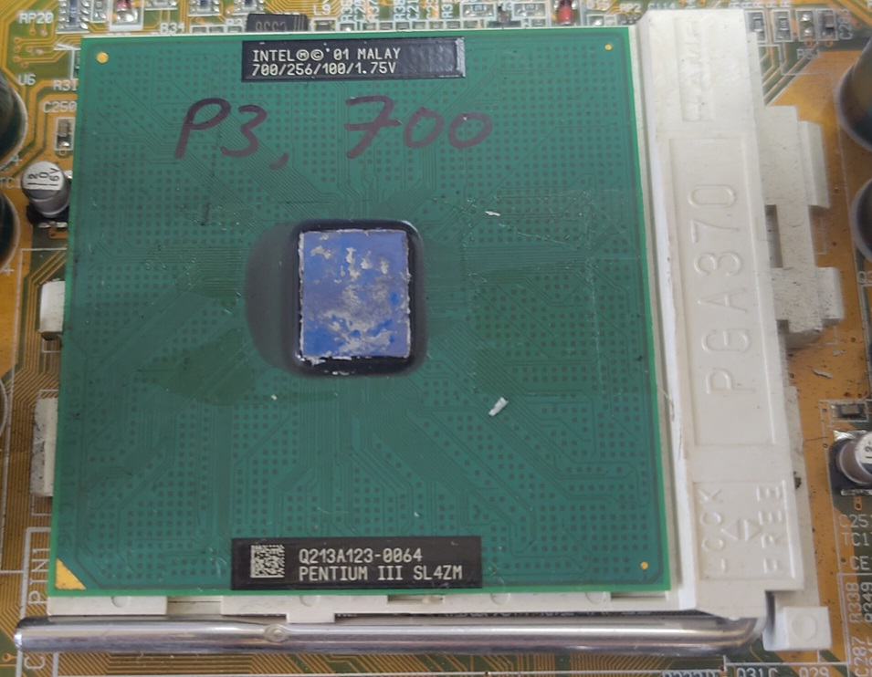
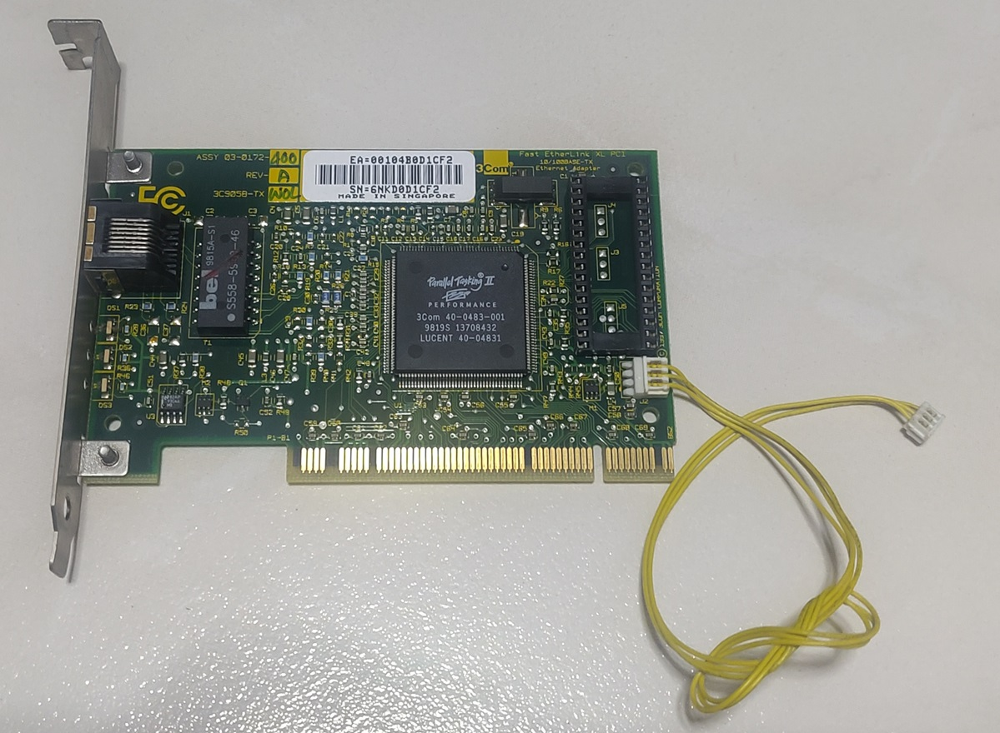
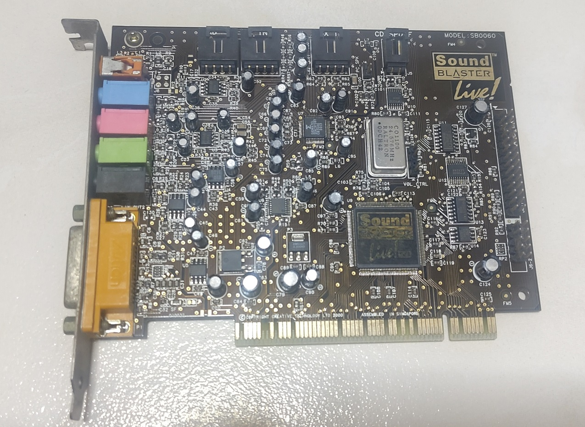
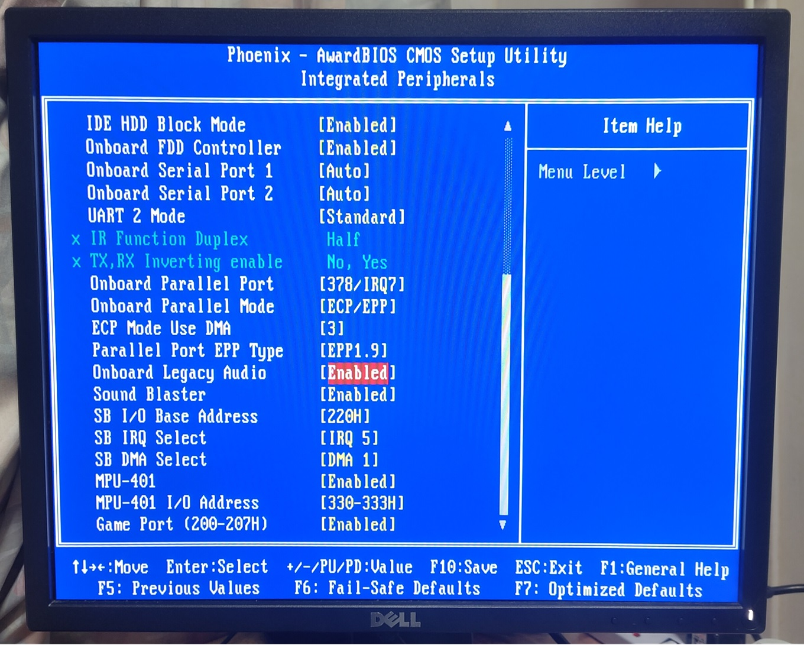
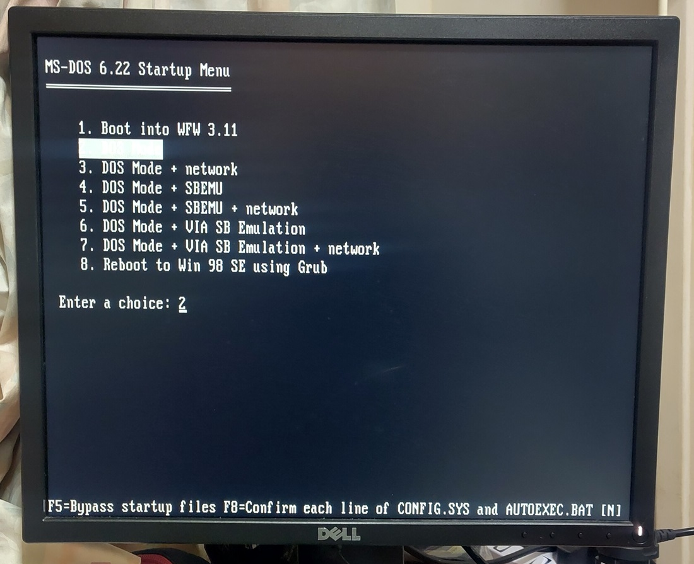
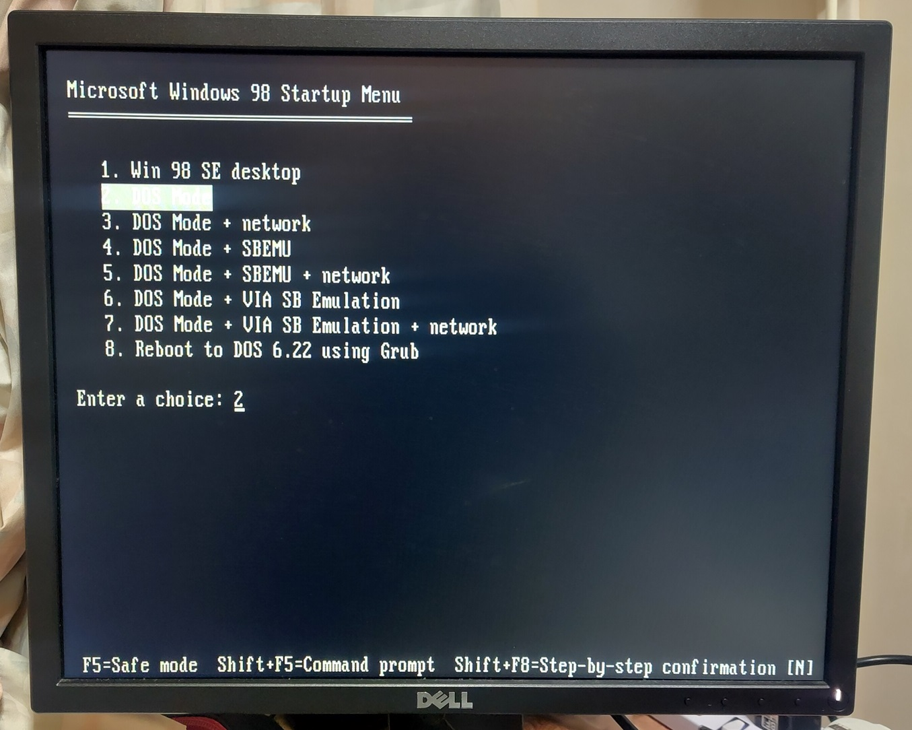

# Open Frame PC

This is an Open Frame PC I use as a testbench based on a Pentium 3.



The machine is configured to dual-boot to DOS 6.22/Windows for Workgroups (WFW) 3.11 and Windows 98SE. The OS configuration of this machine closely mirrors that of my [Thinkpad T42](../../laptops/thinkpad-t42).



With Windows for Workgroups 3.11



With Windows 98SE

## Specifications



* Intel Pentium III 700Mhz 100Mhz FSB 
* * Socket 370 (FC-PGA)
* Transcend TS-AVE3/B motherboard
* * VIA VT82C694X (Apollo Pro 133A) chipset
* * USB 1 ports
* * 1x ECP/EPP Parallel port
* * 2x RS232 ports
* * PS/2 keyboard and mouse ports
* * UltraDMA/100 IDE controller
* 2x256MB PC133 SDRAM
* Storage
* * Goldenfir 64GB SATA SSD 
* * Icydock 2.5" Dock Trayless Hot-Swap SATA
* * Startech IDE-SATA converter


The VIA chipset used in this motherboard has a known incompatibility with SB Live PCI cards. Some trial and error may need to be done to find the best PCI slot to use avoid this problem. More details of this issue can be found [here](https://www.vogons.org/viewtopic.php?p=1081307#p1081307)

### Expansion cards


Matrox G550 AGP graphics card



3Com 3C905 PCI 100 Mbps network card



Creative Sound Blaster Live 5.1

## BIOS Configuration



The BIOS supports Sound Blaster Pro emulation at the typical Sound Blaster ports together with a VIA TSR.

The BIOS is version 1.30 that I have read directly from the BIOS chip and stored in this repo.

```
Award 1998
PCI/PNP 686
273458227
```

## Boot Configuration

The boot menus for both DOS 6 and Windows 98 are generally identical.




Options available are the GUI, DOS mode and with optional sound and network packet drivers.

If the option to use the network and sound driver, the network driver is always loaded before the sound. I notice that doing the reverse usually causes issue with loading the network driver.

SBEMU on SBLive cards works better for OPL3 FM however the SB digital emulation tends to be of a higher pitch. VIADOS on AC97 renders SB digital emulation better however its OPL3 tends to have random crackles.

## Windows 98 Driver installation steps

The drivers have to be installed in this specific steps. Restart whenever prompted by the installer.

1. Remove AC97 related stuff from Device Manager, Sound, Video and game controllers
2. Follow SB step here: https://www.vogons.org/viewtopic.php?f=62&t=74361. I'm using modified SB drivers version 3.1 at time of writing. Replace Step 3.2 with DX 9.0c. I skipped step 6 (DOS driver) and 7 (Soundfont).
3. Via 4 in 1 chipset driver
4. Install Matrox graphics drivers
5. Other drivers like Network and USB.

Do not install Vinyl AC97 WDM driver. That will override Creative VxD driver used by DirectSound. No sound from DirectSound even if the Vinyl drivers are later uninstalled.

# Sources

1. [VIADOS drivers](https://sites.google.com/site/cocktailcabinet/downloads)
2. [Matrox drivers](https://www.philscomputerlab.com/drivers-for-matrox.html)
