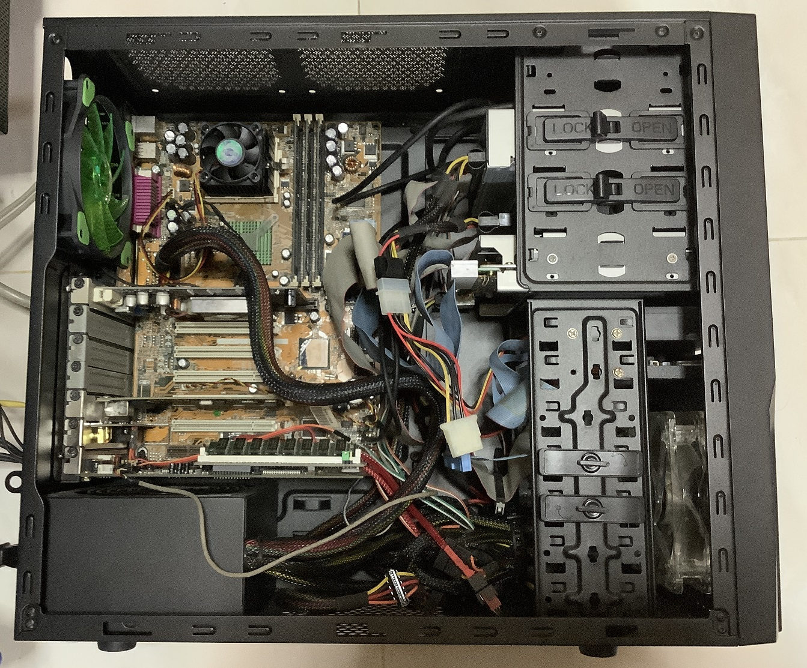
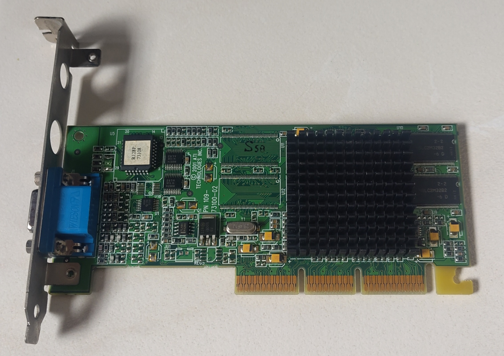
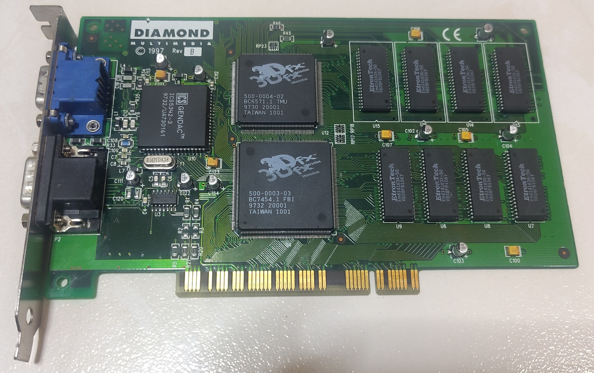
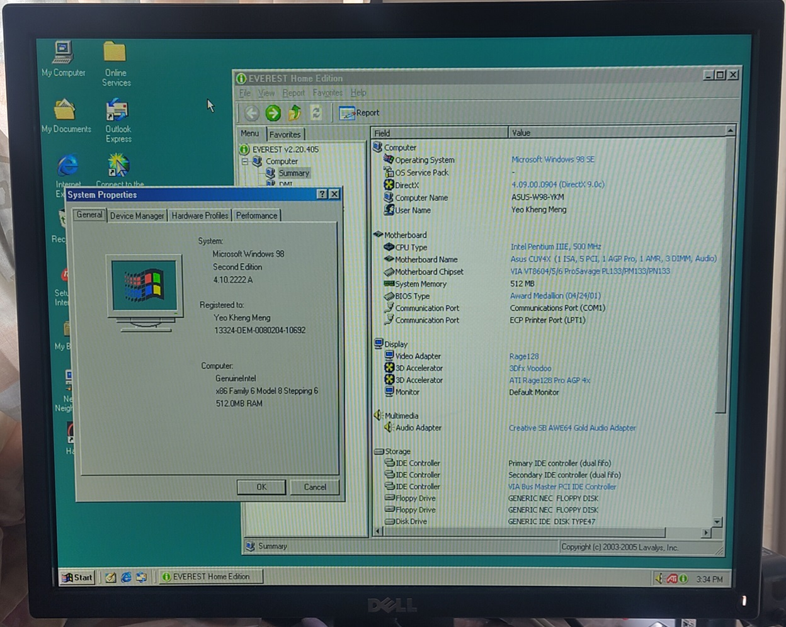

# Tweener PC

My "Tweener PC" is affectionately called that as it contains a healthy mix of new and old technologies. From ISA, 3.5" and 5.25" floppy drives to modern Ethernet and USB.

The machine is configured for single-boot Windows 98SE with a bootup option to enter pure DOS configuration only.

Front of the PC with DVD-RW, ZIP-750, 1.2MB 5.25", 1.44MB Floppy, CompactFlash as hard disk.

With all trays open.

CD-In and Wake-on-LAN cables are used.

Video of bootup sequence: https://www.youtube.com/watch?v=SrTD2QFwS8w

I recently switched the floppy drive to a Gotek flashed with FlashFloppy firmware.

A piezo is added virtual motor sounds. Jumpers are placed on JC and S1 to select for IBM PC compatible according to this [documentation](https://github.com/keirf/flashfloppy/wiki/Initial-Setup).

## Specifications

* Intel Pentium III 1300Mhz 133Mhz FSB 
* * Socket 370 (FC-PGA)
* * **500 Mhz actual** as BIOS does not recognise multiplier higher than 5.0x and bus speed capped at 100Mhz for Voodoo compatibility.
* Asus CUV4X motherboard
* * VIA VT82C694Z chipset
* * 2x USB 1 
* * 1x ECP/EPP Parallel port
* * 1x external RS232 port
* * UltraDMA/66 IDE controller
* 512MB PC133 SDRAM
* 32GB Sandisk Compactflash card
* Sony AW-G170A DVD-RW IDE
* ZIP-750 IDE
* 1.2MB 5.25" Floppy
* 1.44MB 3.5" Floppy

### Expansion cards

ATI Rage 128 Ultra AGP. The drivers for this particular board needs 4.13.01.8006 (Beta) as the official ATI drivers do not seem to support it.

Diamond 3Dfx Voodoo 1 Graphics

3Com 3C905 PCI 10/100 Mbps

Creative Sound Blaster AWE64 Gold ISA with SIMMConn

The [SIMMConn Revival](http://simmconn.tripod.com/) allows typical SIMM-72 RAM to store large Soundbanks. I have 32MB installed.

## BIOS ISA configuration

Some system resources have to be allocated to the ISA bus for use by the sound card.

Interrupt 5 and DMA 1 have to be enabled in the BIOS.

## Boot Configuration

The machine is configured for single-boot Windows 98SE with a bootup option to enter pure DOS configuration only. I have separate boot configurations for DOS and Windows configured in `CONFIG.SYS` and `AUTOEXEC.BAT`. The Windows version will not load the DOS specific drivers.

### Windows Mode

Only the ATI, 3Com drivers are needed. Win 98SE already has the latest AWE64 drivers.

#### Windows Sound Drivers

One can opt to not to install any sound drivers as Win 98 SE already supports the AWE64 gold by default.

However, if you need the utilities like `AWE Control` and Midi player, you have to install the AWE64 Gold CD which will come with updated drivers.

The problem with these drivers is that it will overwrite the `BLASTER` variable in `autoexec.bat` on shutdown to something you may not want.

To overcome this, we have to set the Windows sound card resources to match the DOS settings so it will overwrite the same thing back.

#### Windows Midi

Since this AWE64 Gold has extra memory thanks to SIMMCONN, I can load extra soundfonts to it.

One good Soundfont to consider is the [Roland SC-55 SoundFont](https://github.com/trevor0402/SC55Soundfont/releases) by [Trevor0402](https://github.com/trevor0402).

To use in DOS games, simply point the DOS game to use General Midi at the appropriate port usually 330.

Do note that loading a large sound font will take many seconds and has to be done on every bootup thus delaying system start. One may want to select a smaller sound font before shutdown to prevent this issue.

### DOS Mode

* EMM386 NOEMS configuration to enable `devicehigh` and `loadhigh`
* 3Com Packet drivers
* MTCP environment variables
* Cutemouse
* [Universal PnP Sound card enabler by Jazefox](https://www.vogons.org/viewtopic.php?f=62&t=72553)
* CDROM drivers

#### DOS Sound

Using Jazefox's Universal PnP Sound card enabler to configure the PnP settings much faster than Creative's own tool under DOS.

I still keep Creative's DIAGNOSE tool to test the DRAM.

#### Network

After loading 3c905 packet drivers.

Loading MTCP to prove packet drivers work.

## CUV4X BIOS

I flashed the latest stable BIOS Version 1009 dated
2001/08/09. 

## Sources
1. [AWE64 Gold CD](https://www.philscomputerlab.com/drivers-for-awe64-gold.html)
2. [LSI 53C1010 x86 drivers](ftp://ftp.tyan.com/SCSI/LSI1010/111700/LSI1010.exe)
3. [LSI 53C1010 x64 drivers](http://www.edugeek.net/forums/windows-7/96515-windows-7-x64-drivers-lsi-20160-scsi-adaptor.html)
4. [BIOS sources](https://www.asus.com/supportonly/CUV4X/HelpDesk_BIOS/)
5. [ATI Rage 128 beta drivers](https://soggi.org/drivers/ati.htm)
6. [Voodoo Graphics Iceman drivers](https://www.philscomputerlab.com/drivers-for-voodoo.html)
7. [3dfx MiniGL drivers](http://falconfly.3dfx.pl/minigl.htm)