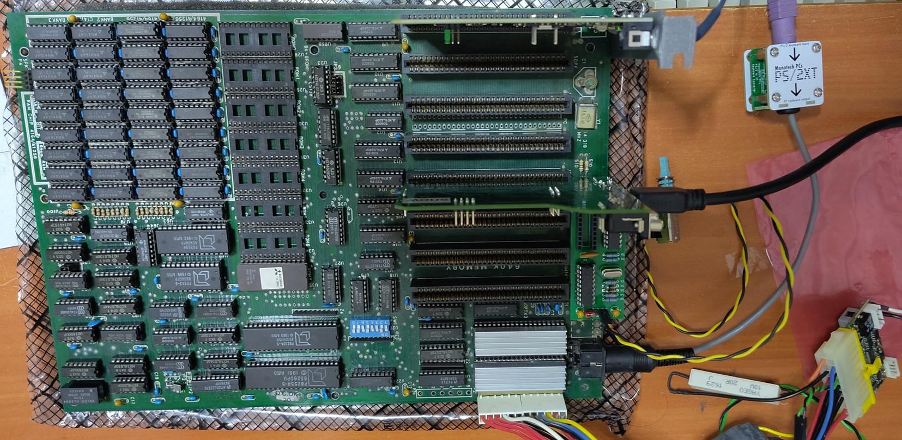

# XT Test Bench (1985)

This is a clone XT motherboard that was given to me with no documentation. Based on XT clone motherboards on [theretroweb](https://theretroweb.com/motherboards/s/amax-engineering-amax-2000xt), I suspect this motherboard to be [AMAX 2000XT](https://theretroweb.com/motherboards/s/amax-engineering-amax-2000xt) or similar.

I have set it up to run DOS 6.22.

## Hardware Specifications

* AMD/Intel 8088-1 (10 Mhz capable)
* Intel 8087-1
* 640KB RAM
* [Monotech PS/2 to XT Converter](https://monotech.fwscart.com/product/ps-2-to-xt-keyboard-converter)

50x14x7mm heatsinks are applied to 8088 and 8087 to vent off the heat to preserve chip lifespan. [Aliexpress purchase links](https://www.aliexpress.com/item/1005004923109486.html)

I fabricated the [PC Sprint](https://github.com/reeshub/pc-sprint) to use on this motherboard as a quick way to overclock the system. A 22Mhz crystal was used.

## Expansion Cards:

[Graphics Gremlin HDMI](https://github.com/yeokm1/graphics-gremlin-hdmi) CGA graphics card.

[Picomem Audio Edition](https://www.serdashop.com/PicoMEM) acting as HDD emulator, Wireless NE2000 emulator and Expanded Memory.

## Configuration

Initial POST message

### PicoMem BIOS Configuration

Wifi, EMS and HDD emulation. Provided PMEMM EMS driver is loaded to initialise the EMS memory.

4MB of EMS memory.

### Landmark System Speed Test

* Left: PC Sprint in default clock speed
* Right: PC Sprint overclocking CPU

# Reference
1. [Manual](https://theretroweb.com/motherboards/s/amax-engineering-amax-2000xt)
