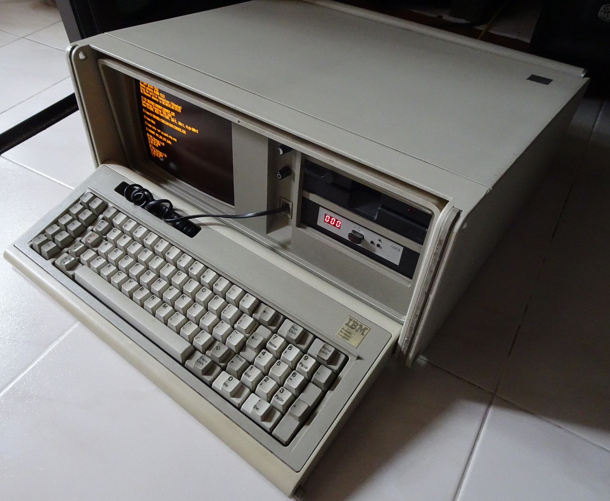
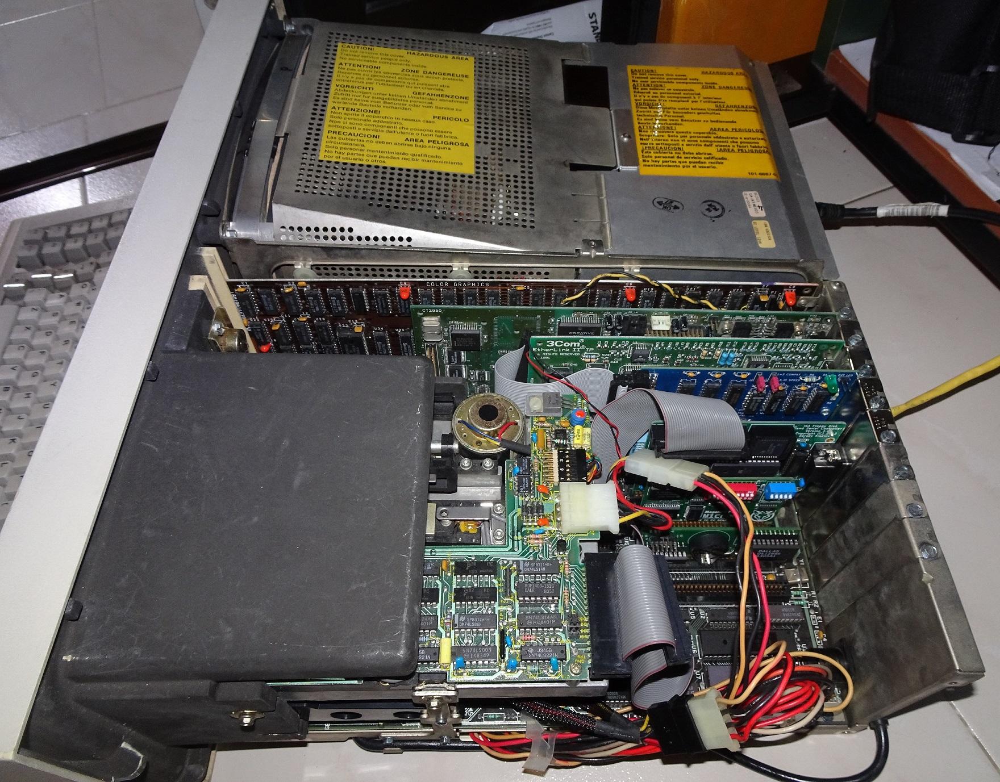
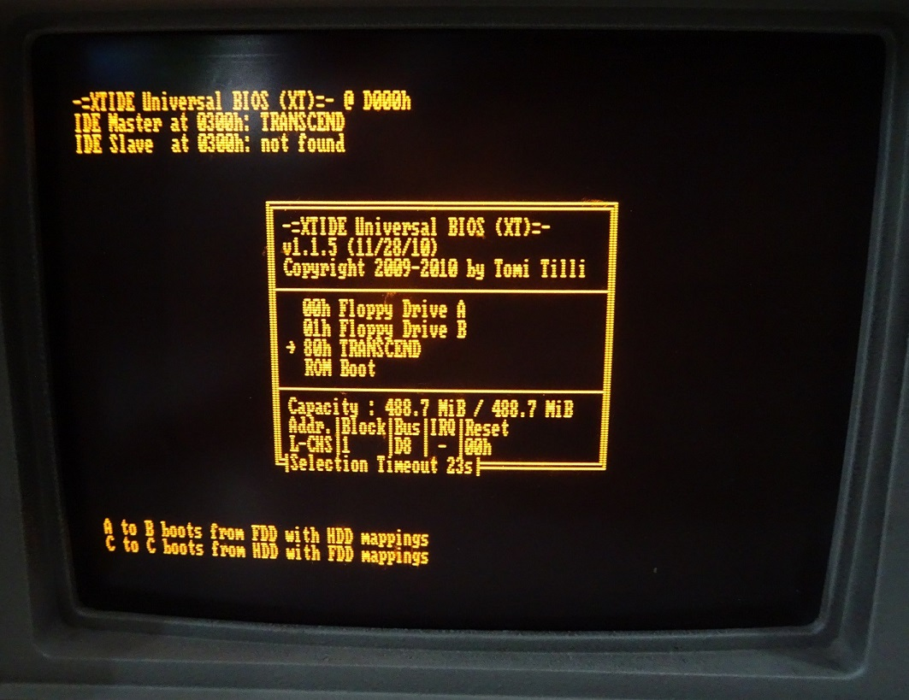
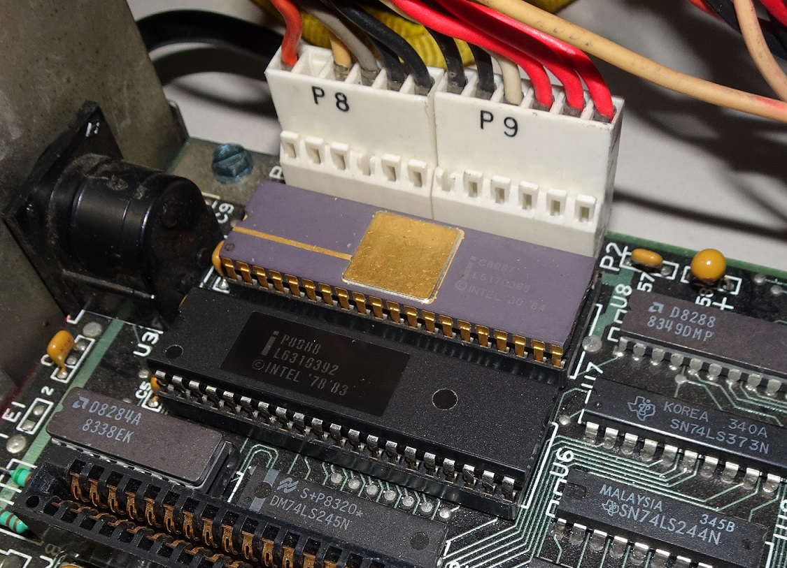
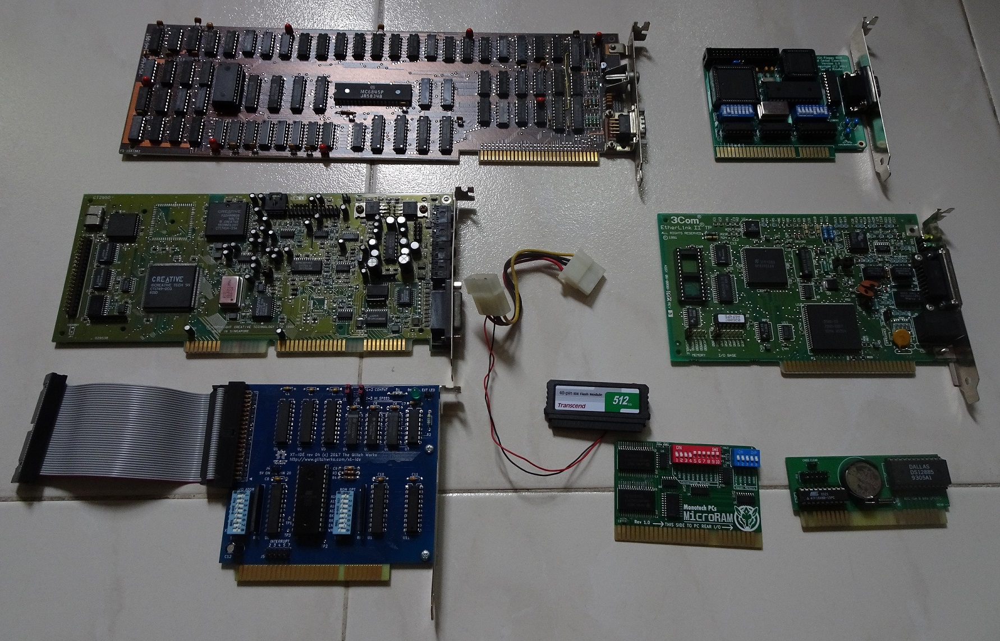
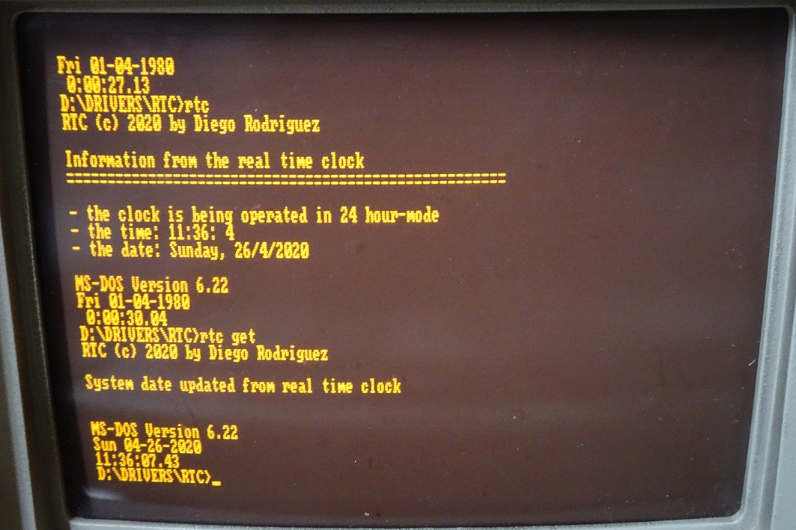

# IBM 5155 Portable PC

The IBM 5155 Portable is a PC released in 1984. It is based on the IBM XT released in 1983 but in a "portable" form with internal amber monochrome CRT monitor.

Don't let the name fool you, at 13.6kg, it is heavier than many modern desktop PCs.

Front of the PC with 5.25" 360K floppy and Gotek Floppy emulator with HxC firmware.

Using up almost all the ISA slots.

An XT-IDE card is used which has a boot loader to boot from selected disks.

## Specifications

* Intel 8088 4.77Mhz
* Intel 8087 FPU
* Motherboard only has 256K onboard

Motherboards from early IBM PCs are bare with most of the external functionality provided by ISA cards.

Expansion cards from top left

* IBM CGA Graphics Adapter
* [Sergey Kiselev Floppy Disk and Serial Controller](http://www.malinov.com/Home/sergeys-projects/isa-fdc-and-uart)
* Creative Sound Blaster 16 CT2950 CQM
* 3Com Etherlink II TP 3C503 10Mbps Ethernet
* [Glitch Works XT-IDE Rev 4](https://www.glitchwrks.com/2017/11/23/xt-ide-rev4)
* Transcend 40-pin IDE Flash Module
* [Monotech MicroRAM - 640K + UMB RAM](https://monotech.fwscart.com/MicroRAM_640K_UMB_RAM_8bit_ISA/p6083514_19914752.aspx)
* [Aitor Gómez's RTC ISA 8 Bits XT](https://hackaday.io/project/168972-rtc-isa-8-bits-pcxt)

The IDE flash module is used as the system seems to run more stable with it than from CompactFlash cards.

## DOS Boot Configuration

The machine is configured for single-boot DOS 6.22 and very similar to my NuXT PC's configuration.

* MTCP environment variables
* Crynwr 3C503 packet driver
* Get time from RTC
* SBPNPXT to configure Sound Blaster ISA PnP

## RTC

I was experimenting in getting an Real-time clock to work with this system with little success.

Many thanks to Aitor Gómez's [RTC ISA 8 Bits XT](https://hackaday.io/project/168972-rtc-isa-8-bits-pcxt) and his help. I managed to reprogram his board to use the `240h` address and get it work.

1. [RTC SPLD Binaries](https://github.com/spark2k06/hardware/tree/master/RTC8088/SPLD)
2. [RTC Program from dieymir](http://www.vcfed.org/forum/showthread.php?71958-RTC-ISA-8-bits-(Very-Low-Profile)&p=606650#post606650)

### Unused RTC programs for reference
1. [DS1216E RTC program](https://www.brutman.com/PCjr/DS1216E.html)
2. [David_M generic clock program](http://minuszerodegrees.net/rtc/rtc.htm)

## Rescue Floppy

The `DSKA0001_dos6boot.img` is a 1.44MB floppy image containing a minimal DOS environment and a subset of MTCP's tools. 

This is used for initial boot/install as the Transcend Flash Module's IDE connector is using a female connector which is hard to connect to a USB-IDE adapter. Thus I can't easily copy files to it.

After booting from the floppy image, I start an FTP server and then copy the rest of the files to it.

## Manuals

1. [Technical Reference](http://www.minuszerodegrees.net/manuals/IBM_5155_5160_Technical_Reference_6280089_MAR86.pdf)
2. [Operations Manual](http://classiccomputers.info/down/IBM/IBM_PC_Portable_5155/IBM_5155_Guide_to_Operations_6936571_JAN84.pdf)
3. [PSU Review by Hugo Holden](http://worldphaco.com/uploads/The_IBM_5155_POWER_SUPPLY.pdf)
