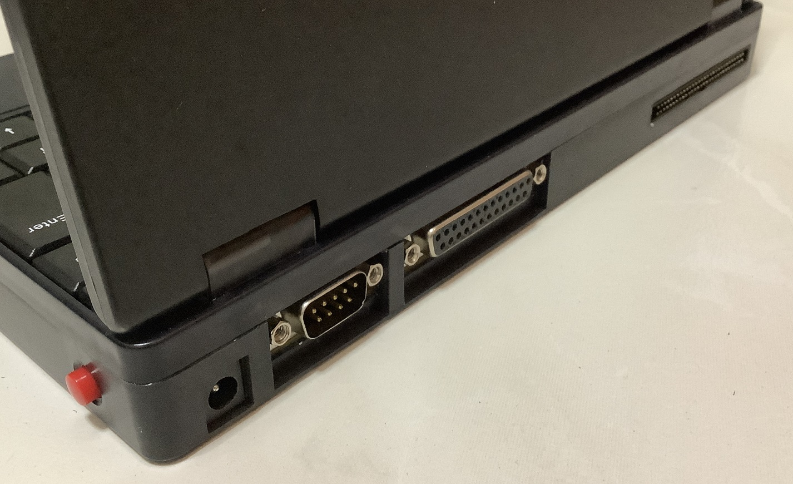
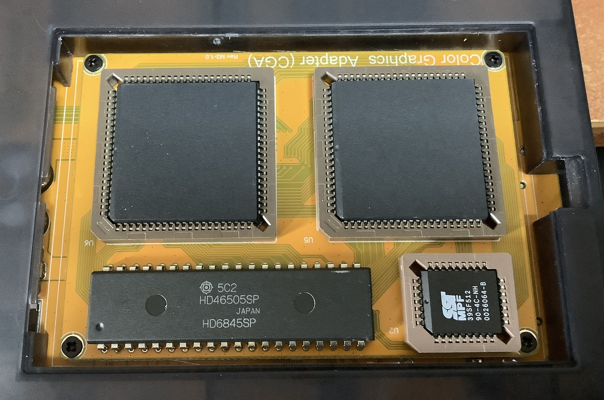
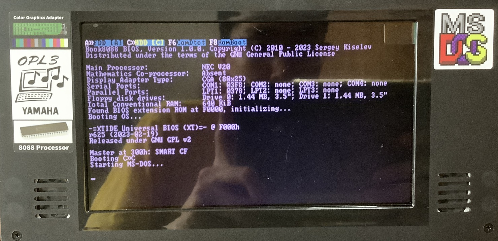
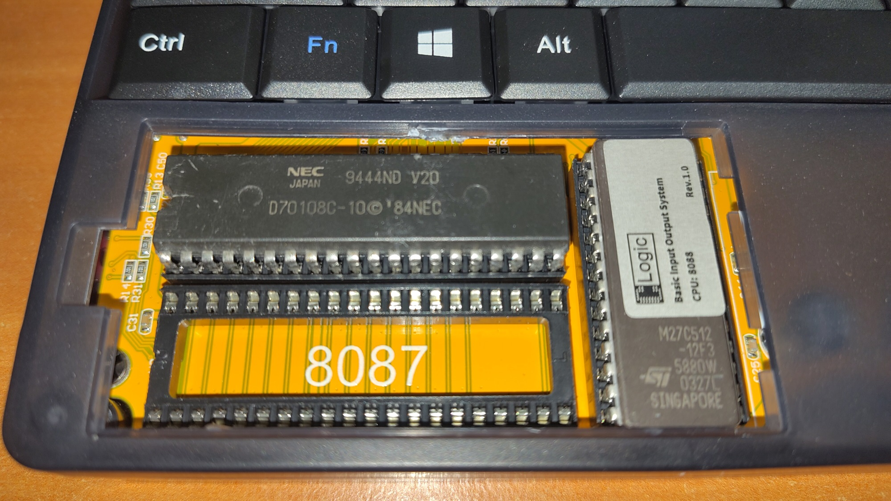
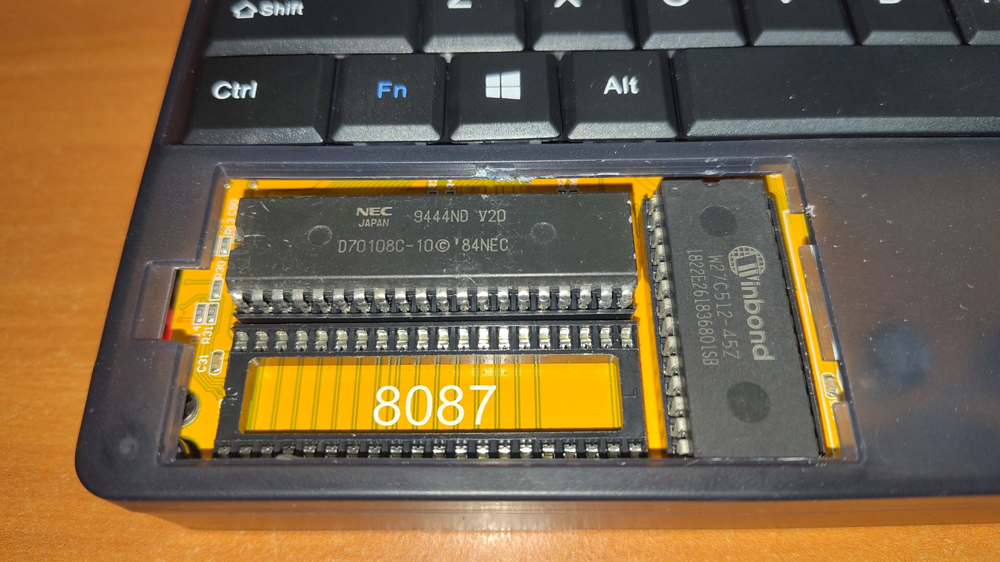
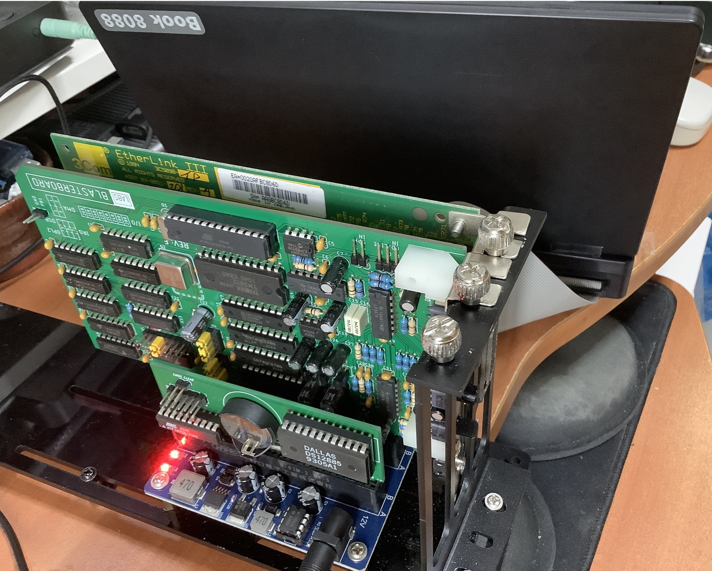
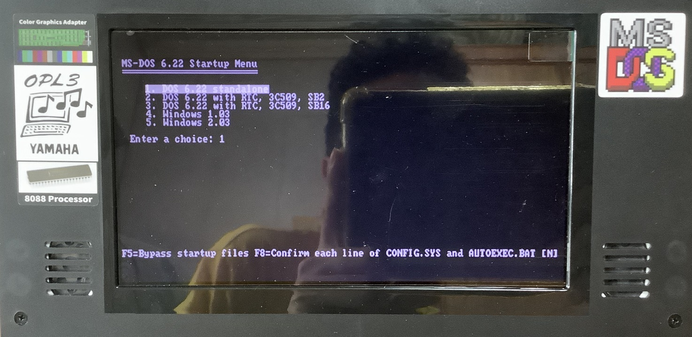
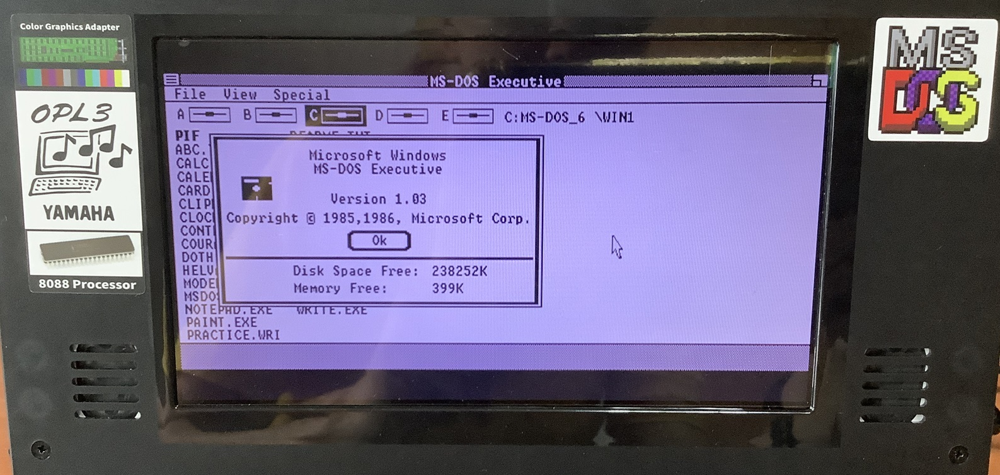
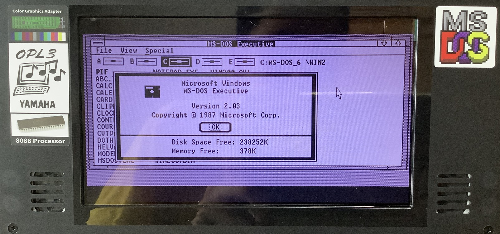

# Book8088v2 (2023)

This is a new 8088-based subnotebook released in 2023. I have set it up to run DOS 6.22, Win 1.03 and Win 2.03.

This photo shows it running [CGA Compatibility tester](https://github.com/MobyGamer/CGACompatibilityTester). Brown (7th column) is displayed incorrectly as dark yellow.

## Specifications

* NEC V20 4.77 MHz or 8Mhz (turbo)
* CGA Graphics
* 640KB RAM
* YMF262-M OPL3 with YAC512 DAC
* OPL3-driven speakers
* PC-speaker
* 4000 mAh battery
* Ports
  * CF card slot
  * Serial Port
  * Parallel Port
  * USB port for flash drives
  * Connector for 8-bit ISA bus extender
  * Headphone jack

These are the items that are delivered together with it

* 512 CF card
* 3-slot 8-bit ISA extender
* 2x30 pin 2.00mm pitch IDC ribbon cable
* 12V charger

## V2.0 features

This v2.0 model comes with serial and parallel port as well as modular graphics module.

This CGA module uses the same 6845 chip Cathode Ray Tube Controller as in the IBM CGA graphics card.

## BIOS

Due to copyright concerns, I have replaced the provided BIOS with the [original version by Sergey Kiselev](https://github.com/skiselev/8088_bios).

Shows the correct copyright information now.

Provided BIOS chip

I flashed Sergey's version to my own Winbond W27C512 chip.

## ISA Docking station

3 cards are populated:

* 3Com 3C905B-TPO NIC
* Blasterboard (Sound Blaster 2.0 clone)
* RTC

The cards and ISA backplane are placed on a vertical bracket riser that was initially meant for external PCIe GPUs. Thanks to awesome PC backward compatibility, even ISA cards can fit there as well.

I use this together with my Hand386.

### 3C905

The 16-bit ISA 3C905B-TPO card can operate in 8-bit mode.

It requires an initial configuration of the address and interrupt settings. I used the 8088-compatible tool from [here](https://github.com/hackerb9/3C509B-nestor) to do that.

Be careful to select an IO address that is not 300h as that is used by XT-IDE.

### RTC

There is no RTC in the system. To workaround this issue, I opted to use a dedicated [RTC ISA 8 bits (Very Low Profile)](https://www.tindie.com/products/spark2k06/rtc-isa-8-bits-very-low-profile-2/).

This is the [RTC Program](https://github.com/wilco2009/RTC_micro8088) used to work with the RTC board.

## Configuration

### OS Installation

Since the device does not natively have a floppy controller, one will either have to add a floppy controller to the bus extender or install the OS with another system first.

I opted with the latter approach. I installed DOS 6.22, Win 1.03 and Win 2.03 on the CF card using another system. 

DOS 6.22 startup menu to select between the differect configurations.

Win 1.03 is used instead of the newer Win 1.04 as the latter is meant for the IBM PS/2 line which used EGA graphics which is not supported on this system.

Steps to setup:

1. Install DOS 6.22
2. Install Win 1.03 then run `setver WIN100.BIN 3.30` once to avoid boot errors. 
3. Install Win 2.03 then run `setver WIN200.BIN 3.30` once to avoid boot errors.

