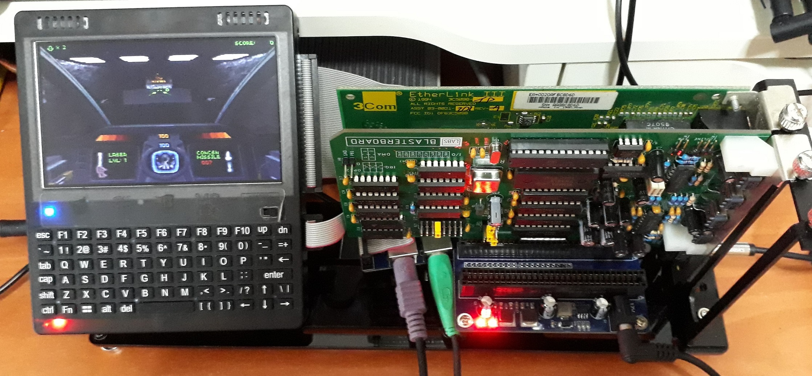
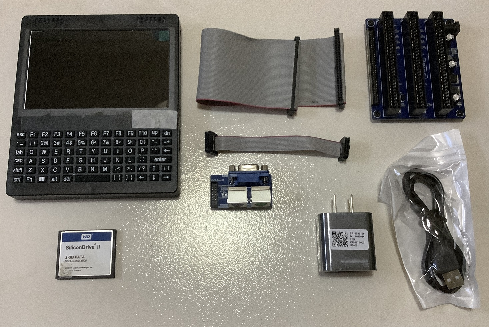
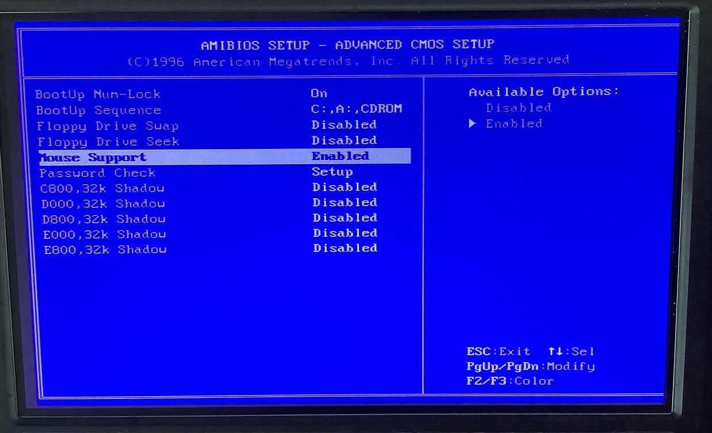

# Hand386 (2023)

This is a new 386-based palmtop released in 2023. It runs on DOS 6.22 and Windows for Workgroups (WFW) 3.11.

Here the system is running Descent on lowest quality setting.

Windows 95 which came preinstalled in the system is not recommended.

Demo video of the Hand386 running some games and applications.

## Specifications

* Ali M6117 with chipset (386SX-40)
* Chips and Tech F65535
* YMF262-M OPL3 with YAC512 DAC
* OPL3-driven speakers
* PC-speaker
* 8MiB RAM
* 2500 mAh battery
* 128 x 150 x 16mm (measured dimensions)
* Ports
  * CF card slot
  * USB port for flash drives
  * Connector for VGA output, PS/2 mouse and keyboard
  * Connector for 8-bit ISA bus extender
  * Headphone jack

These are the items that are delivered

* 2GB CF card
* 3-slot 8-bit ISA extender
* 2x30 pin 2.00mm pitch IDC ribbon cable
* VGA, PS/2 mouse and keyboard breakout board
* 2x6 pin 2.00mm pitch IDC ribbon cable
* 2A USB charger
* USB to barrel jack charge cable

## Configuration

### OS Installation

Since the device does not natively have a floppy controller, one will either have to add a floppy controller to the bus extender or install the OS with another system first.

I opted with the latter approach. I installed DOS 6.22 and WFW 3.11 on the CF card using another system. Then moved the card back to the Hand386 to continue installing other programs.

This technique can work on Windows 95 as well. You will want to do that as it will take about 2-3 hours for the native installation to complete due to the slow CPU speed. When you move the CF card, start the Add hardware wizard for Windows 95 to detect the changed hardware to install the drivers.

### CH375

I faced some issues with using the default `CH375DOS.sys` as it can't mount some of my flash drivers properly. 

I have better luck with `ch375286.sys` obtained from a [Youtuber's THE PHINTAGE COLLECTOR github](https://github.com/gpdm/TPC-CH375-testsuite) when he did some some [evaluation on several drivers](https://www.youtube.com/watch?v=4WvHR_Cy2ME).

### Adlib on WFW 3.11

The Adlib (OPL) Midi driver is provided by WFW 3.11 by default so simply install it in the Drivers panel.

A third-party driver that uses the OPL chip to generate PCM sounds can be found [here](https://archive.org/details/ADLIBW_ZIP).

Note that there is no known means to disable the onboard OPL chip. If you install an OPL-capable card on the bus extender like a Sound Blaster, both will generate the FM output.

### 3C905

This is for my external 16-bit ISA 3C905B-TPO card which can operate in 8-bit mode.

It requires an initial configuration of the address and interrupt settings. I used the 8088-compatible tool from [here](https://github.com/hackerb9/3C509B-nestor) to do that.

### BIOS

Not much configuration is required. However if the BIOS is reset accidentally or otherwise, the PS/2 mouse port will be disabled by default which needs to re-enabled manually.

To enter the BIOS, press and hold the `del` key while turning on the power.

Go to `Advanced CMOS setup` -> `Mouse Support` and enable it.

Mouse enabled

## References

1. Manuals: Provided by the store
2. [C&T F65535 datasheet](http://old.vgamuseum.info/images/stories/doc/chips/f65535.pdf)
3. [Ali M6117D datasheet](https://www.dmp.com.tw/app/webcamera/pdf/m6117d.pdf)
4. [AMIC A420616AS-50F datasheet](https://www.alldatasheet.com/view.jsp?Searchword=A420616AS-50F)
5. [39SF512_SS datasheetT](https://www.mouser.com/datasheet/2/268/40284-287606.pdf)