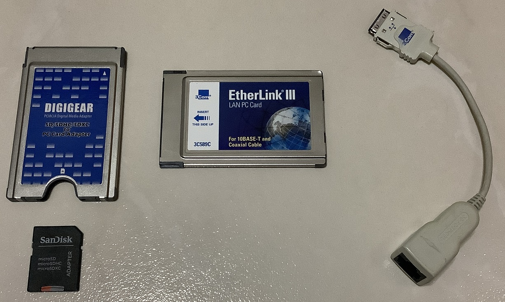
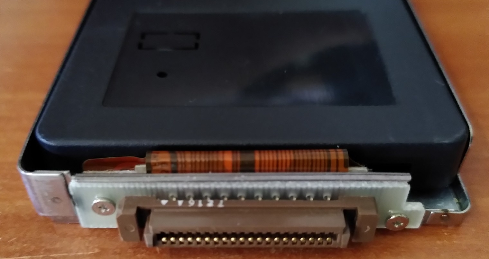

# Dell Latitude LM M166ST

The Dell Latitude LM is a model that was released in 1996. The machine I have does not come with an internal floppy disk drive.

## Specificatinons

* Intel Pentium MMX 166 Mhz
* Intel 430MX PCIset
* Neomagic NM2093 MagicGraph 128ZV 1MB
* 72MB (8+32+32) EDO RAM
* ESS1688 Audio controller
* 11" TFT display with 800x600 resolution
* 2GB Verbatim Compactflash card with IDE adapter
* Torisan 10x CDR_N110 (faulty)

### Connectivity

* Serial
* Parallel
* VGA
* Combo PS/2 for mouse and keyboard
* 2x PC card slots
* Headphone jack
* Microphone
* IrDA

### PC card

As the system lacks connectivity options, I add these 2 PC cards for network and removable storage.

## Install process

The CD drive of this machine is faulty hence this presented an additional challenge in setting up this machine with Windows 98 as it has no means to boot up from an external medium.

To get around this issue, I first had to prepare the internal disk (CF card) to be bootable.

### Preparing the disk

I first put the CF card into my tweener PC.

I boot my Tweener PC using a Windows 98 floppy with `fdisk`. I create 2 partitions using `fdisk`. First partition for Windows and second one for data.

I format both partitions. The first partition is formated with the `/s` option so the disk is bootable to the Win 98 command prompt.

I put the CF card into a USB-CF adapter on my modern PC. I copy contents of the Windows 98SE install CD into the data partition.

### Installing Windows 98

The CF card is placed back into the machine with an adapter.

The system will boot to the Win 98 command prompt. I then execute the Win 98 installer from there.

Proceed to install Win 98 normally.

# Sources

* [Original drivers from Dell](https://www.dell.com/support/home/en-sg/product-support/product/latitude-lm/drivers)
* [PFE500c drivers](https://www.driverguide.com/driver/amp/detail.php?driverid=114194)
