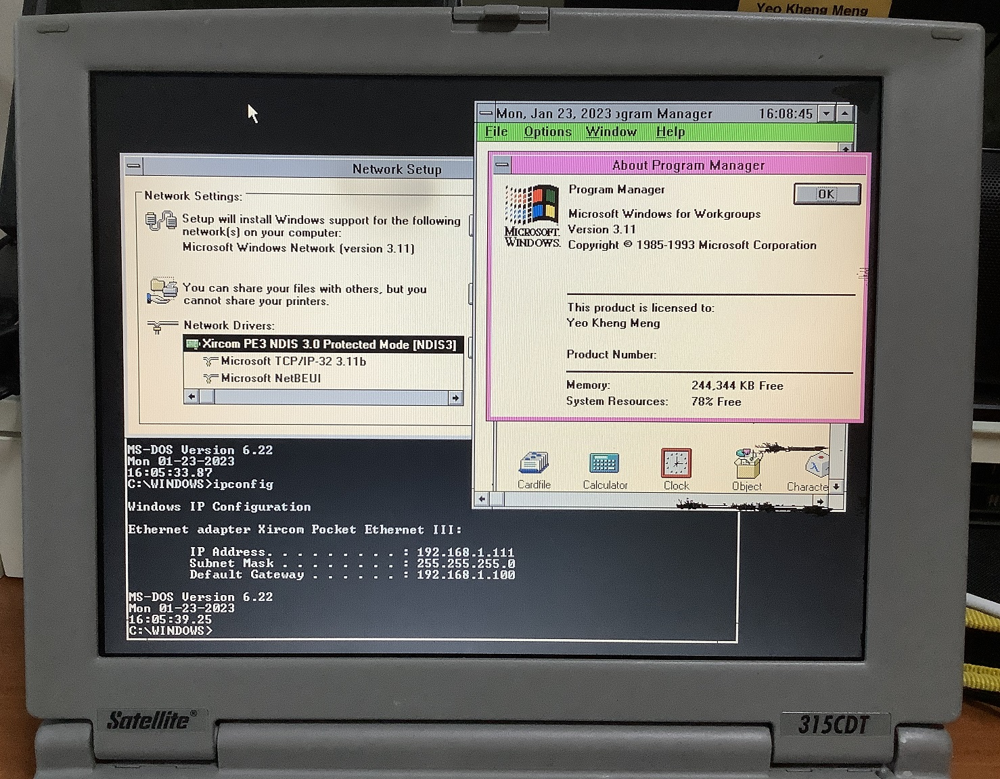

# Toshiba Satellite 315CDT

This Toshiba laptop was released in 1996. This machine's interesting feature is that it comes with an original Yamaha OPL3 for FM synthesis which is uncommon for a laptop.

This machine has a missing battery cover and slight defects on the screen.

The machine is configured to dual-boot to DOS 6.22/Windows for Workgroups (WFW) 3.11 and Windows 98SE. The OS configuration of this machine closely mirrors that of my [Thinkpad T42](../thinkpad-t42)

## Specifications

* Intel Pentium MMX 200 Mhz
* Toshiba AIS601 chipset
* Chips and Technologies 65555 PCI 2MB video adapter
* 96MB RAM
* Yamaha OPL3-SA3 (SBPro and WSS3.0 compatible)
* 12.1" TFT display with 800x600 resolution
* 32GB Sandisk Compactflash card with IDE adapter
* TEAC CD-220EA 20x CD-ROM
* 3.5" Floppy disk

### Connectivity

* Serial
* Parallel
* VGA
* Combo PS/2 for mouse and keyboard
* 2x PC card slots
* Headphone jack
* Microphone jack
* Line-in jack
* 1 USB 1.1 port

### Network connectivity

2 network adapters are setup in this system depending on the use case.

### 3Com 3C589C

This is a 16-bit PC card.

No PCMCIA\Cardbus services are required for both DOS 6.22 and WFW 3.11. The native NDIS2 drivers and Packet Drivers can use a hardware PCMCIA hardware enabler to initialise the slot.

Windows 98 has native drivers for this card.

#### Xircom PE3-10BT

The parallel port card is inverted hence the adapter is inverted as well.

## Storage

This machine initially came with a faulty conventional 2.5" IDE hard drive.

I replaced it with a Compactflash card and its IDE adapter. A thick piece of paper was used as a spacer between the adapter and the drive cage.

## CMOS battery

The system uses NiMH cells to hold BIOS and hibernation settings. These cells have long deteriorated and leaking hence need to be replaced unless you don't mind not retaining BIOS settings and/or hibernation.

### Original batteries

* P71007004049: Hibernation Battery
* P71035000119: BIOS battery

Batteries installed in their original position.

### New batteries

I ordered new batteries from Ebay and installed them inside.

## Audio settings

I found that the default audio resource configuration does not work properly for me.

The sound resources are set in the BIOS and no PnP utility is required. So I adjusted to the  above in my BIOS settings. 

# Sources

* [Toshiba support page](https://support.dynabook.com/support/modelHome?freeText=1073769714)
