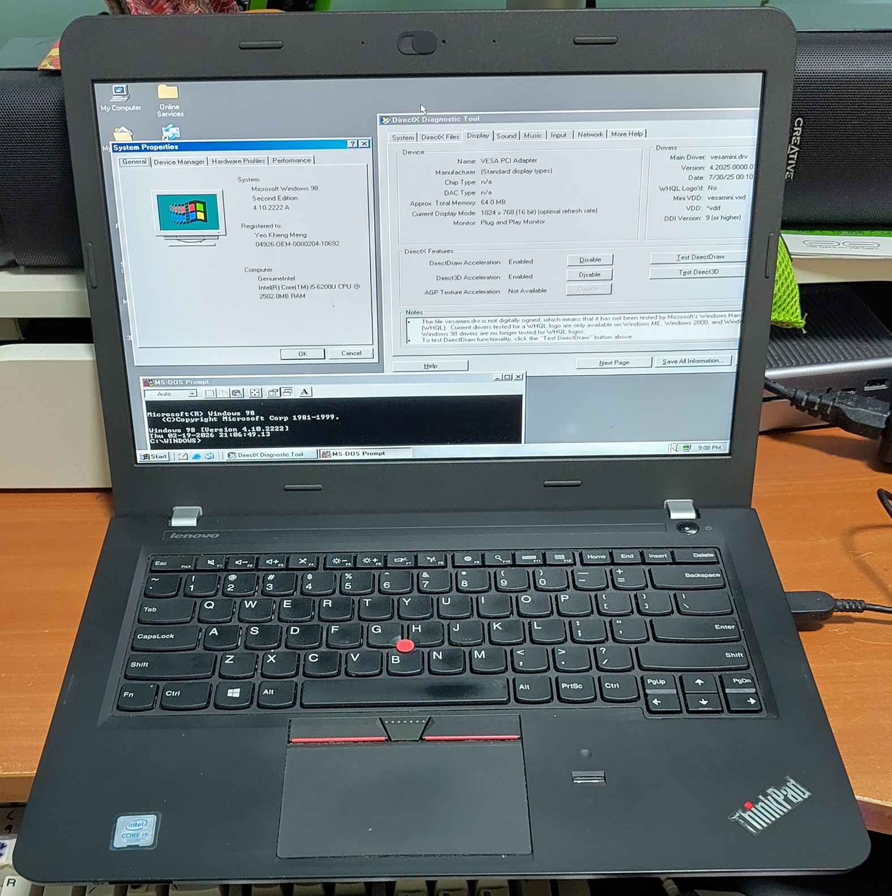
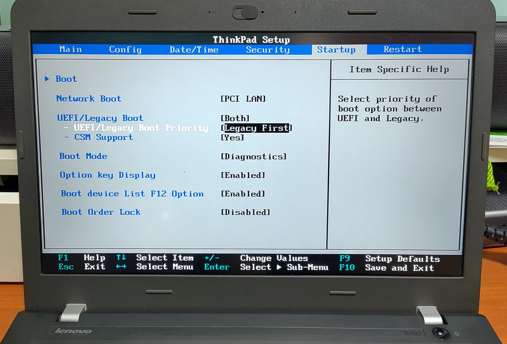

# Thinkpad E460 (Intel)

The Thinkpad E460 is a budget-friendly machine released in 2015.

This machine's setup is similar to the [Thinkpad P14s Gen 1](../thinkpad-p14sg1/) I previously worked on with a similar triple-boot setup of Windows 98 SE, Windows 11 and Linux.

## Specifications

These are the specifications specific to the Thinkpad I have:

* Intel Core i5-6200U 2.3 Ghz
* Intel HD Graphics
* 8GB RAM: 2x DDR3 4GB RAM
* Conexant CX11852 HD audio
* 14.0" IPS display with 1920x1080 resolution
* uSD card slot
* 512GB Crucial MX500 SATA SSD
* Intel Gigabit I219-V
* Intel Dual Band Wireless-AC 8260

## BIOS setup

Disable Secure-boot and enable CSM.

## Win 98 setup

The challenges and drivers are similar to the P14s Gen 1. No cregfix is needed for this machine though.

## DOS Drivers

* Intel I219-V is apparently supported by the E1000 PRODOS driver so it can be used natively.