# Thinkpad P14s Gen 1 Gen 1 (Intel)

The Thinkpad P14sg Gen 1 (Intel) is a modern laptop released in 2020. I believe it is of the last Thinkpad generation to support UEFI-CSM.

This machine is of the same generation as the [X13 Gen 1](../thinkpad-x13-g1/) I previously worked on and many of the BIOS configurations and drivers have been reutilised from that project.

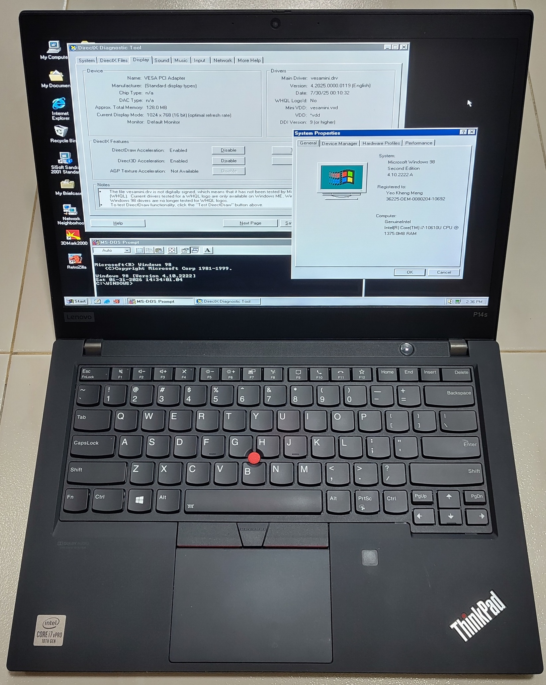

The machine is configured to boot from Windows 98 SE from the internal NVME drive.

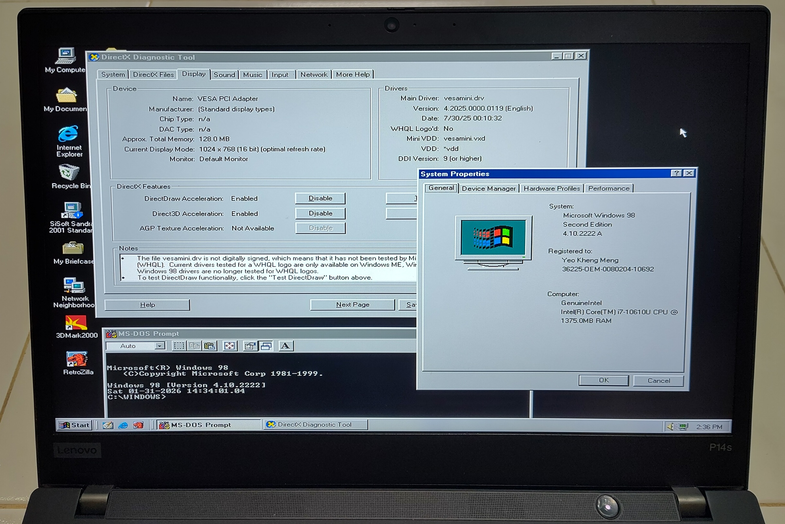

Some third-party video and sound drivers have been installed.

Demo video with 3DMark2000 from boot to shutdown.

## Specifications

These are the specifications specific to the Thinkpad I have:

* Intel Core i7-10610U 1.80Ghz (8M Cache, up to 4.90 GHz)
* Graphics:
   * Intel UHD Graphics
   * Nvidia Quadro P520 2GB DDR5
* 32GB RAM: 16GB soldered and 16GB on stick
* High Definition (HD) Audio with Realtek ALC3287 codec
* 14.0" IPS display with 1920x1080 resolution Multi-touch
* uSD card slot
* 512GB SK hynix Gold P31 PCIe 3.0 NVME
* Intel Gigabit I219-LM
* Intel Wi-Fi 6 AX201, 802.11ax 2x2 Wi-Fi + Bluetooth 5.1 (soldered in)
* Ports
    * 1x USB 3.2 Gen 1
    * 1x USB 3.2 Gen 1 (Always On)
    * 1x USB-C 3.2 Gen 1
    * 1x USB-C 3.2 Gen 2 / Thunderbolt 3
    * 1x HDMI 1.4b
    * 1x Ethernet RJ45
    * 1x Headphone / microphone combo jack (3.5mm)

### Thunderbolt eGPU dock

I used a PCI-e eGPU Thunderbolt dock to connect a PCI USB 2.0 EHCI card. The existing USB ports on the laptop are based on xHCI which are not supported by Win 98.

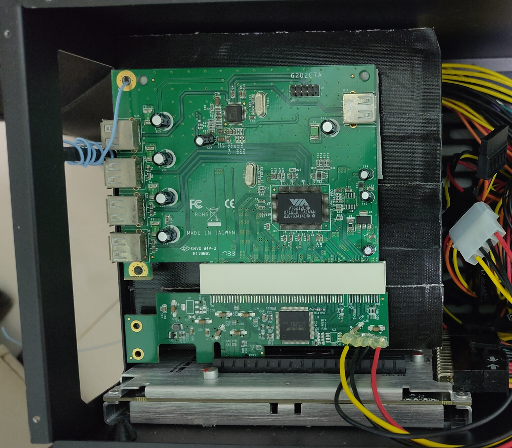

I'm using a StarTech PCI Express to PCI Adapter Card with a VIA VT6212L USB 2.0 controller.

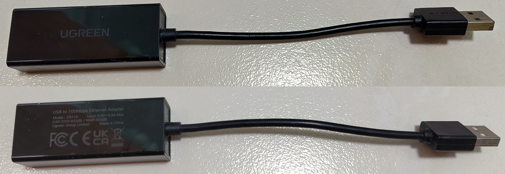

One of the functions of the USB card is to use a USB 2.0 100Mbps Ethernet adapter. The adapter is Ugreen CR110 based on ASIX AX88772 chip which has Win 98 drivers.

## BIOS setup

BIOS settings such as to enable UEFI-CSM and others are exactly the same as the X13 Gen 1.

## Win 98 setup

The system is setup to triple-boot Windows 98 SE, Windows 11 and Linux. Win

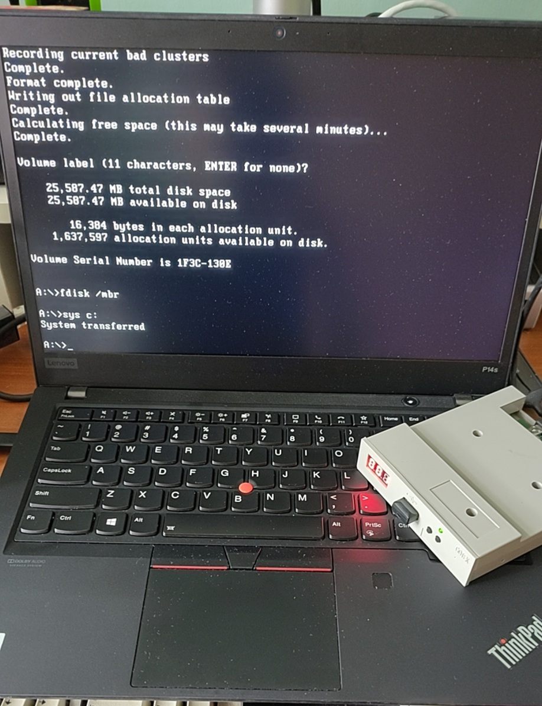

The goal here is to get Win 98 setup to start from the native disk drive.

I used a USB floppy emulator to launch fdisk to create the partition and set the MBR `fdisk /mbr`. Then make it bootable by copying Win 98 system files over `sys c:`.

After this connect the disk to a modern machine, to inject the Win 98 setup files. Put in a `config.sys` to load `DEVICE=C:\HIMEM.SYS /M:1 /V` to avoid issues where Scandisk and Win 98 Setup will not start.

This is a good time to align the fdisk-created partition with a tool like MiniTool Partition Wizard to optimise modern SSD operations.

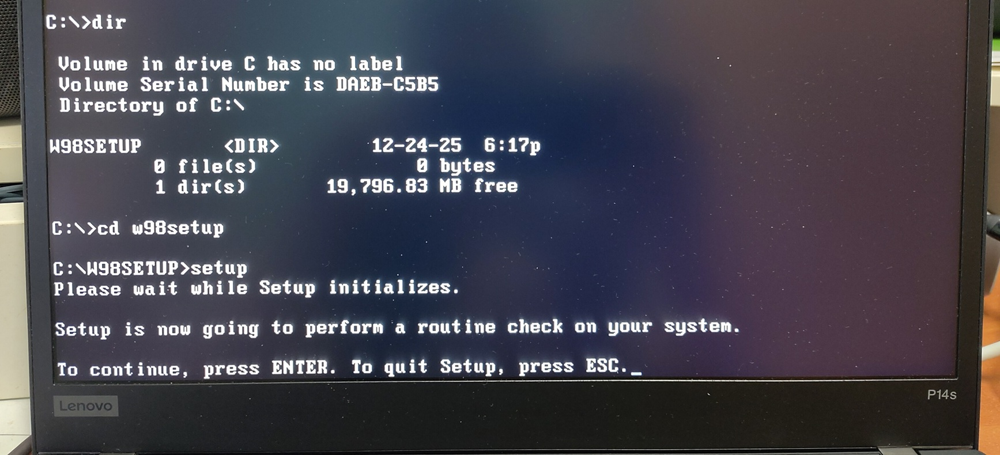

Boot from the disk natively and start Windows 98 Setup which will first start Scandisk.

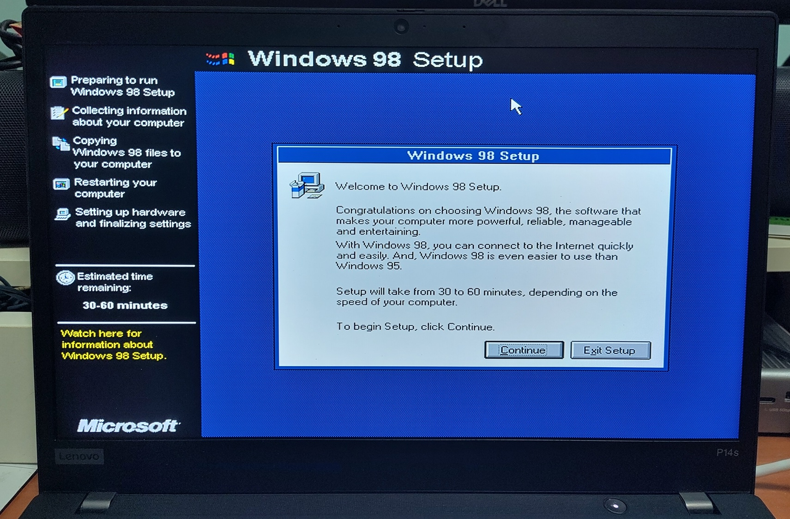

If Scandisk clears, the GUI setup portion begins.

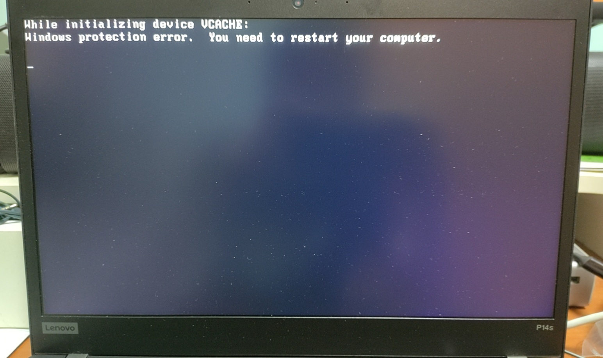

During the setup process, we may encounter this error due to problems with UEFI-CSM implementations on modern systems as explained [here](https://github.com/mintsuki/cregfix). 

We can either use either of these 2 solutions:

1. Put `DEVICE=C:\CREGFIX.SYS` in `CONFIG.SYS`.
2. Put `CREGFIX.VXD` into `C:\WINDOWS\SYSTEM`. Edit `%windir%\SYSTEM.INI` and  `%windir%\SYSTEM.CB` and add `DEVICE=CREGFIX.VXD` into `[386Enh]` section.

I opt for option 2 as that will still work even if Windows 98 starts in Safe Mode.

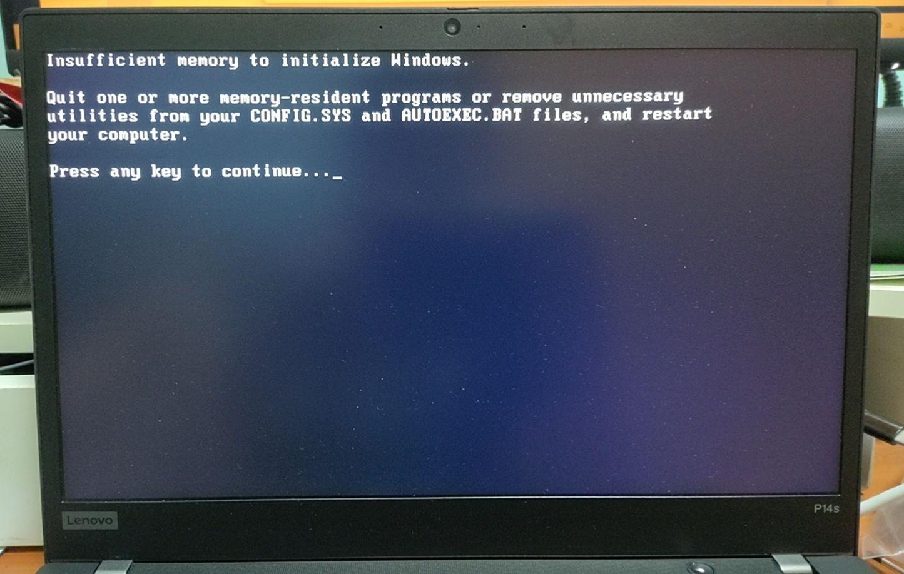

Another error will come up which is due to too much memory usually >512MB detected.

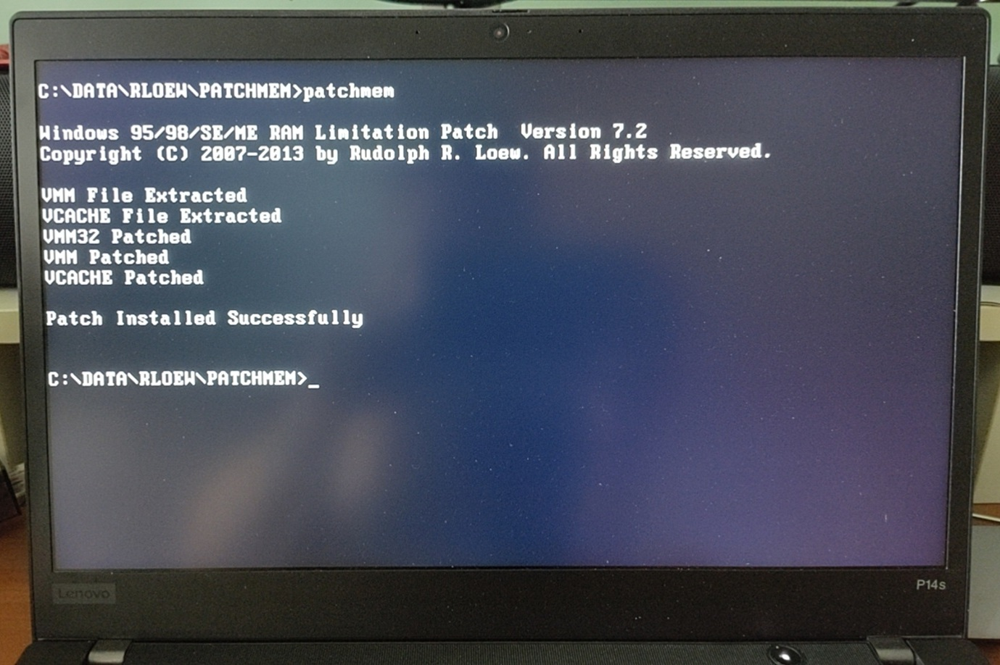

We can use `PATCHMEM` by Rudolph Loew to allow Win 98 to address more than 512MB RAM.

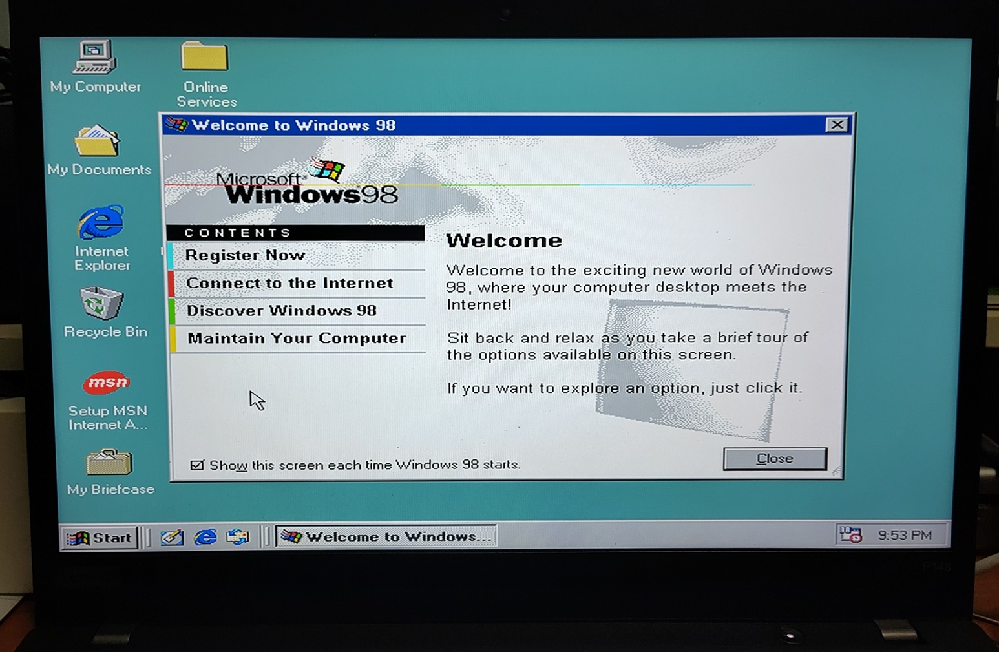

And Windows 98 booted!

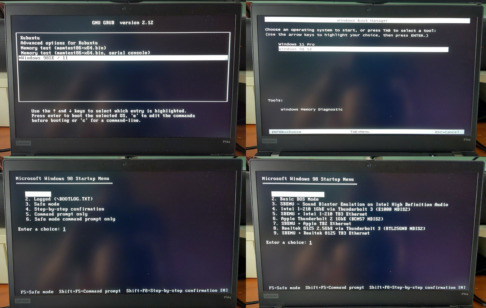

I have setup the system with several bootloader setups to allow for different boot OS.

1. Grub to boot Linux. Set `GRUB_TERMINAL=console` in Grub configuration to permit Windows bootloader to start in text mode.
2. Text-mode Win 11 bootloader configured by [EasyBCD](https://neosmart.net/EasyBCD/) to allow booting of Win 98 SE and Win 11. Text-mode is configured for faster start and avoid another reboot when selecting Win 98 SE.
3. Windows 98 Startup Menu.
4. Windows 98 DOS Multi-menu configuration to allow for multiple DOS boot configurations.

## Post installation steps

### Rudolph Loew Patches

I installed this modern patches/tools to boost disk stability.

* PATCHATA: Allows Windows 9x to use hard drives larger than 137GB
* PATACPAR: Patch IO.SYS to avoid ghost partitions
* NOFLOPPY: Remove phantom floppy drives 

### Win 98 Device drivers

Given this modern system, there are no modern video and sound drivers. I used the following generic drivers:

* [SoftGPU](https://github.com/SoftGPU/SoftGPU): Modern GPU driver actually meant for virtual machines. Will not have hardware acceleration on actual hardware.
* [WDMHDA](https://github.com/andrew-hoffman/WDMHDA): Modern Win 98 Sound Driver for HDA.

## Miscellaneous

### Disk Performance

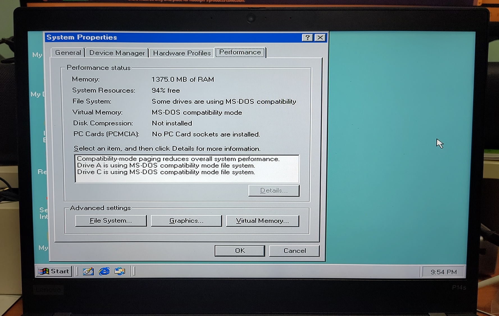

As there is no native NVME driver loaded, Win 98 uses traditional BIOS access to read the disks which does incur some performance penalty.

I gave nvme9x a short but it did not work on this system.

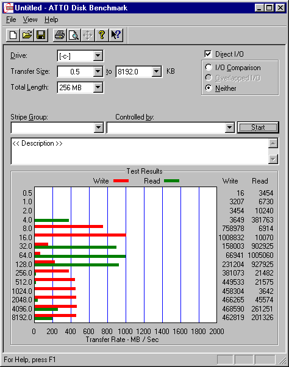

Disk performance benchmarks using ATTO Disk. Not too bad actually if we are using large transfer sizes.

### Safe Shutdown

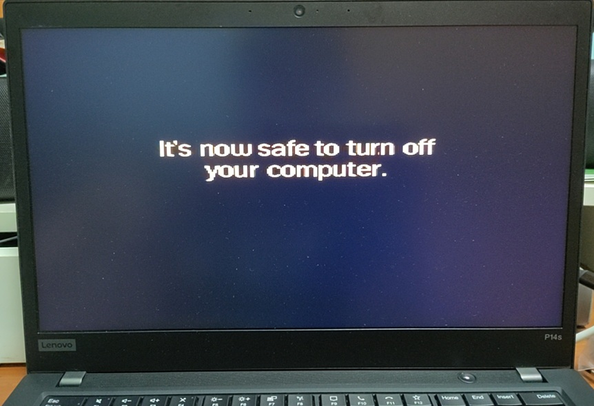

The ACPI on this system is not recognised by Windows 98. Hence this Safe Shutdown screen appears.

Windows 98 is also not able to restart the system.

### Power State

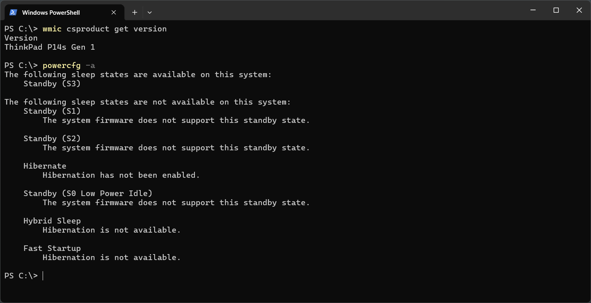

I configured the BIOS to Linux Power state thus enabling the traditional S3 Power state.

### Charge Threshold

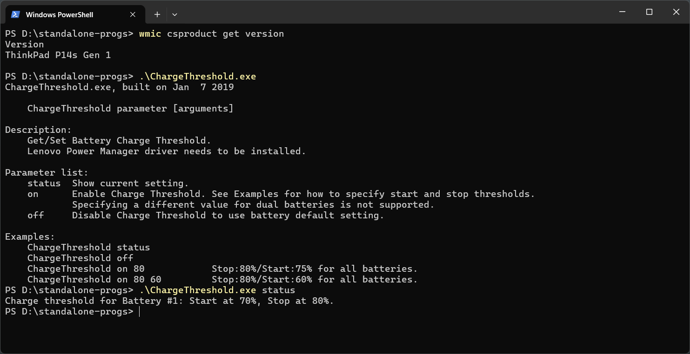

This modern Windows tool [Charge Threshold](https://forums.lenovo.com/t5/Lenovo-Vantage-Knowledge-Base/Q-amp-A-setting-a-ThinkPad-battery-charge-threshold-by-script/ta-p/4345631) can be used to limit the battery charge to maximise long-term battery life.

## Sources

1. [P14s Gen 1 Hardware Maintenance Manual](https://download.lenovo.com/pccbbs/mobiles_pdf/t14_gen1_p14s_gen1_hmm_en.pdf)
2. [SoftGPU](https://github.com/SoftGPU/SoftGPU)
3. [WDMHDA](https://github.com/andrew-hoffman/WDMHDA)
4. [AX88772](https://driverscollection.com/?H=AX88772&By=ASIX&SS=Windows%2098%20SE)
