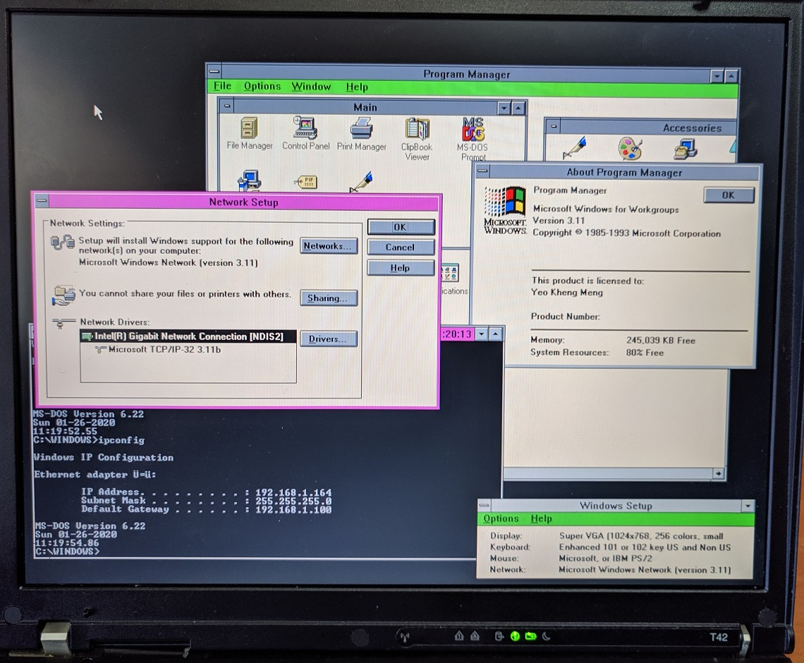

# Thinkpad T42

The Thinkpad T42-2373 is a laptop released in 2004 by IBM. It is from the last Thinkpad series with Windows 98 support.


The machine is configured to dual-boot to DOS 6.22/Windows for Workgroups (WFW) 3.11 and Windows 98SE.

## Specifications

These are the specifications specific to the Thinkpad I have:

* 1.7 Ghz Pentium M 735 CPU
* ATI Mobility Radeon 7500 with 32MB
* 2x1024MB DDR PC2700 RAM (512MB usable in Win98)
* Intel AC'97 2.2 Audio with a SoundMax AD1981B codec
* 14.1" TFT display with 1024x768 resolution (XGA)
* 32GB Sandisk Compactflash card
* Intel Gigabit PRO/1000 MT Ethernet
* Thinkpad 802.11b/g Mini-PCI (I disabled in BIOS)
* 1x ECP capable parallel port
* HL-DT-ST GCC-4242N DVD/CD-RW Ultrabay Slim
* 2x Type II Cardbus slots
* Infrared Communication
* Linksys WPC54Gv3 Cardbus 802.11g Wifi

## BIOS

The BIOS set in this machine is 3.21 which is not the latest version 3.23.


This is with response to this release notes.

```text
<3.23 (1RETDRWW)>
Note:
  This BIOS version will only work with Embedded Controller Program
  Version 3.04 (or higher).

 - (Fix) ThinkPad will not resume after undock from a docking station 
         while a system is in hibernation mode.
 - (New) USB storage drive letter handling modified.
 - (New) Support for a new video memory for certain AMD video chips.

   Note: The 3.21 and previous release of the BIOS handles USB drive
         letter well on the Windows 98, 98SE.
         Please use 3.21 BIOS for the Windows 98, 98SE.
```

## Boot Configuration

The machine is configured to dual-boot into the primary partitions containing DOS 6.22/WFW 3.11 or Windows 98SE using the GRUB4DOS bootloader. Within DOS6.22/WFW 3.11, I have separate boot configurations for either DOS 6.22 or WFW 3.11 configured in `CONFIG.SYS` and `AUTOEXEC.BAT`. This is to facilitate clean separation of configuration and software between the 2 OSes.

### Partition 1 (DOS 6.22 and WFW 3.11)


The drivers required to support the Intel networking are heavy on memory so a choice is provided on whether to load them.

#### WFW 3.11



* Windows 32-bit file system manager
* Start WFW network

#### DOS 6.22


* JEMMEX combined XMS and EMS driver that is required for SBEMU
* Intel ODI drivers
* ODI to Packet shim
* MTCP environment variables
* Cutemouse

The IBM PC card drivers have been REMed out for reference.


Sound Blaster and OPL3 support is provided by the [SBEMU](https://github.com/crazii/SBEMU) driver. 

A strange quirk that I found of this current driver with respect to using [Dr Sbaitso TTS](https://en.wikipedia.org/wiki/Dr._Sbaitso) is that the TTS will hang if this is the first app that is launched. Some other app needs to use the virtual Sound Blaster hardware first then we quit that and launch the TTS then the TTS will work.

#### GRUB options


Starts Grub to enable rebooting into Windows 98

### Partition 2 (Win 98SE)

#### Grub options on partition start


* Boot Menu
* No logo

### Grub rebooting into another OS

DOS 6.22 and Win98SE only supports booting from the first primary partition which is assigned the drive letter `C`. They however have to be booted from separate partitions to avoid clashing configurations.

To enable dual-booting from separate partitions, [GRUBFORDOS](https://sourceforge.net/projects/grub4dos/files/GRUB4DOS/) was used to dynamically adjust the `Active` flag using `makeactive` before switching.

## Dual Boot install procedure

1. Use DOS 6.22 `fdisk` tool to create the first primary partition
2. Install DOS 6.22/WFW 3.11 on that partition
3. Create a second primary partition for Win98SE using a tool like eg. `FDOS fdisk` which enable creation of multiple primary partitions.
4. Boot from the Win98 floppy/CD and format the second primary partition with Fat32.
5. Reboot back to DOS 6.22 on the hard disk. Hide the first primary partition to prevent Win98SE installer from failing. The installer suspects it's an existing Windows installation and refuse to upgrade unless you are using the Win 98 Upgrade disk. Use the following `GRUBFORDOS` commands using a bootable floppy disk

```bash
# In MENU.LST
title Commandline
commandline
```

```bash
hide (hd0,0)
root (hd0,1)
makeactive
```

6. Start from the Windows 98 install CD and install Win 98SE as usual. If the amount of RAM is large >512MiB, the installer may fail initially. Boot using a DOS boot disk or Linux live CD, modify `C:\Windows\system.ini` with the following.

```
[386Enh]
MaxPhysPage=1FFFF

[vcache]
MaxFileCache=393216
```
7. After install completes, unhide the first primary partition. 

```bash
unhide (hd0,0)
```

It is not necessary to hide partition when booting between DOS6.22 and Win 98SE. Drive C is assigned only to the first active primary partition.

## Sources
1. [Official T42 drivers](https://thinkpads.com/support/Thinkpad-Drivers/download.lenovo.com/lenovo/content/ddfm/T42.html)
2. [DOS Ethernet drivers taken from T400 website](https://support.lenovo.com/mn/en/downloads/ds001865)
3. [Win 3.1 AC97 drivers](http://turkeys4me.byethost4.com/programs/index.htm)
4. [Linksys WPC54Gv3 drivers](https://www.wireless-driver.com/linksys-wpc54g-wireless-windows-me-2000-xp-drivers-utility/)
5. Dualbooting DOS and Win95: [Just setting active](http://retropcbuilder.blogspot.com/2016/11/dual-booting-dos-and-windows-95-follow.html) and [Hiding partitions](http://retropcbuilder.blogspot.com/2016/11/dual-booting-ms-dos-622windows-31-and.html).
6. [SBEMU](https://github.com/crazii/SBEMU)
7. [JEMMEX](https://github.com/Baron-von-Riedesel/Jemm)
