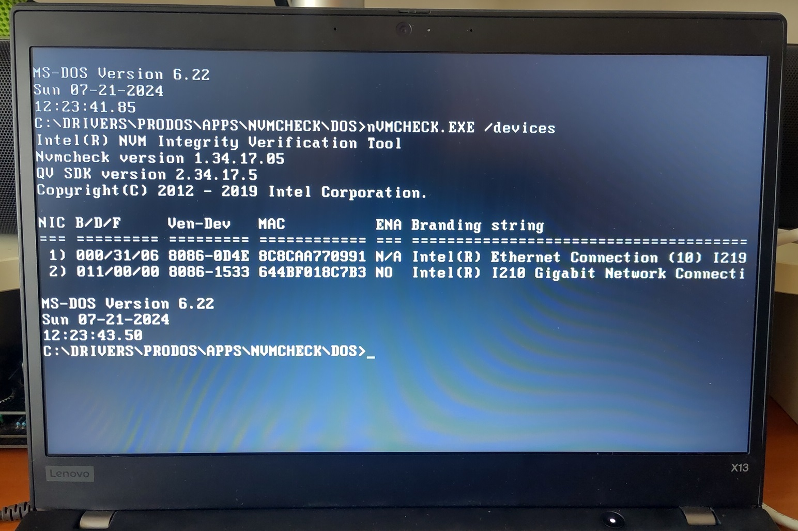

# Thinkpad X13 Gen 1 (Intel)

The Thinkpad X13 Gen 1 (Intel) is a modern laptop released in 2020. I believe it is of the last Thinkpad generation to support UEFI-CSM to have legacy 16-bit OS-support and S3 sleep state.


The machine is configured to boot to DOS 6.22 from a USB flash drive.

[](https://youtu.be/-mTmZqoNeFA)

Demo video of CPUID, Descent, Doom, Planet X3, ChatGPT, Checkit

[](https://youtu.be/eUb_hN1R-no)

Demo video running 8088 Domination.

## Specifications

These are the specifications specific to the Thinkpad I have:

* Intel Core i5-10310U 1.7Ghz (6M Cache, up to 4.40 GHz)
* Intel UHD Graphics
* 16GB RAM (soldered in)
* High Definition (HD) Audio with Realtek ALC3287 codec
* 13.3" IPS display with 1920x1080 resolution
* uSD card slot
* 512GB SK hynix Gold P31 PCIe 3.0 NVME (for booting modern OS)
* 4GB USB 2.0 Sandisk Cruzer Titanium (for DOS boot)
* Intel Gigabit PRO/1000
* Intel Wi-Fi 6 AX201, 802.11ax 2x2 Wi-Fi + Bluetooth 5.1 (soldered in)
* Ports
    * 1x USB 3.2 Gen 1
    * 1x USB 3.2 Gen 1 (Always On)
    * 1x USB-C 3.2 Gen 1
    * 1x USB-C 3.2 Gen 2 / Thunderbolt 3
    * 1x HDMI 1.4b
    * 1x Ethernet extension connector
    * 1x Headphone / microphone combo jack (3.5mm)

## BIOS setup

To enable the system to boot DOS, the following settings have to be set:


UEFI-CSM legacy enabled. For this option to be set, Secure Boot and Kernel DMA has to be disabled.


Secure Boot disabled


Kernel DMA protection disabled

## DOS setup

I opted to have the DOS installed on an external USB flash drive as it requires a legacy MBR partition table. I do not want it to intefere with the internal NVME drive containing my modern operating systems with the GPT partition table.


A USB floppy drive/emulator can be used to do the installation as the BIOS recognises the drive and assigns it the `A:` drive letter.

## DOS Configuration

The `config.sys` and `autoexec.bat` configuration has been customised by me to load the appropriate menu option depending on my needs.

* JEMMEX combined XMS and EMS driver that is required for SBEMU
* * HIMEM.SYS does not work
* MTCP environment variables
* MS LAN Manager to load NDIS driver
* NDIS to Packet Driver Shim.


The first option that is not legible is `Basic DOS Mode` to not load memory, sound and network drivers for a relatively clean start. The other options load a combination of different sound and network drivers.

## Audio configuration


Sound Blaster and OPL3 support is provided by the [SBEMU](https://github.com/crazii/SBEMU) driver which can utilise modern sound hardware.

## Network Configuration


The internal I-219 Gigabit ethernet adapter could not be initialised despite loading the latest DOS drivers from Intel.



Intel's own NVMcheck tool can pick it up though. Shown here is including the I-210 in my Caldigit TS3 Plus dock.

To get network connectivity, the other option is to go through the onboard Thunderbolt 3 port.

All the 3 network adapters I tried requires NDIS 2 drivers provided by the manufacturer to be loaded by MS LAN Manager and a NDIS to Packet Driver Shim.

### Realtek 8125 2.5GbE via Thunderbolt eGPU dock


A 2.5GBE link can actually be negotiated as shown by the driver if the cable and the other end is capable of it. In practice though, the pratical speed is nowhere near.

### Apple Thunderbolt 2 1GbE with TB3-TB2 adapter (Broadcom)


The Apple Thunderbolt (2) to Gigabit Ethernet Adapter can be used in conjuction with an also Apple Thunderbolt 3 (USB-C) to Thunderbolt 2 Adapter. 

The Ethernet adapter is based on the Broadcom BCM57762 chip. Hence I used a B57 NDIS2 driver.

I noticed the B57 driver introduces an unexplained slowdown in my system such that games are unplayable.

### Caldigit TS3 Plus 1GbE via Thunderbolt 3 (Intel I210)


This adapter generally works okay.

I-210 has unexplained random JEMMEX exception crashes together if run together with SBEMU.

### Network speed test

I did a short study of the performance and memory usage of the 3 adapters. I used a similar [test procedure detailed](https://www.brutman.com/mTCP/mTCP_Performance.html) by Michael Brutman (creator of DOS MTCP network tools). 


I did a point-to-point connection between the DOS machine and my Framework running Kubuntu with a 2.5GbE Ethernet Expansion Card of RTL8156 chipset.

```bash
# Linux command to create empty 64MiB file
fallocate -l 64M 64MiB.img

# Receiving
# DOS system: 
spdtest -receive -listen 2000
# Linux side: 
time nc -N 192.168.1.71 2000 < bogus.bin

# Sending
# DOS system: 
spdtest -send -listen 2000 -mb 64
# Linux side: 
time nc -d 192.168.1.71 2000 > bogus.bin
```

#### Network speed test and memory results

|              | Send Rate (KB/s) | Recv Rate (KB/s) | protman | driver | disk_pkt |
|--------------|------------------|------------------|---------|--------|----------|
| Realtek 8125 | 16440.1          | 29135.7          | 128     | 42288  | 2736     |
| BCM57        | 7960.4           | 14791.4          | 128     | 53168  | 2736     |
| Intel I210   | 26698.5          | 19793.4          | 128     | 56336  | 2736     |

The last 3 columns show the memory usage of the different driver components in bytes. 

We can see the transfer speeds do not even come close to the 1 Gbit/s or 125 Mb/s or 128000 KB/s.

## Sources

1. [X13 Hardware Maintenance Manual](https://pcsupport.lenovo.com/us/en/products/laptops-and-netbooks/thinkpad-x-series-laptops/thinkpad-x13-type-20t2-20t3)
2. [Microsoft Network Client 3.0](https://archive.org/details/MSCLIENT30)
3. [Vogons forum guide on DOS networking](https://www.vogons.org/viewtopic.php?f=61&t=61823&p=691154#p691154)
4. [Realtek NDIS2 driver](https://www.realtek.com/Download/List?cate_id=584)
5. [MTCP speed test guide](https://www.brutman.com/mTCP/mTCP_Performance.html)
6. [Packet drivers](https://packetdriversdos.net/)
7. [Intel DOS](https://www.intel.com/content/www/us/en/download/2595/intel-ethernet-adapter-drivers-for-ms-dos-final-release.html)
