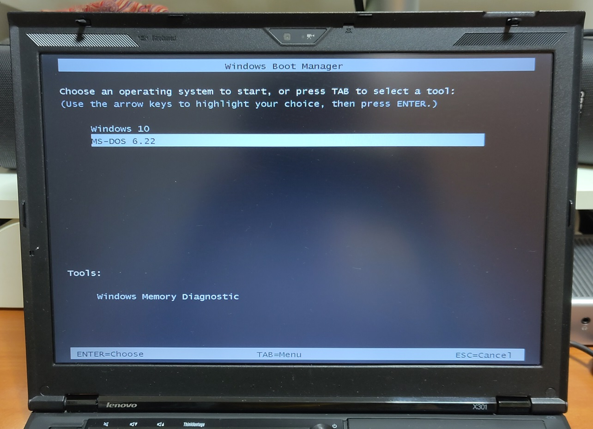

# Thinkpad X301

The Thinkpad X301 is a laptop released in 2008 by Lenovo as a technical update to the famously thin X300 (Kodachi).

The machine is configured to multi-boot to DOS 6.22, Windows 10 64-bit and Lubuntu. 

I wrote a book review that is based on this machine: https://yeokhengmeng.com/2024/09/book-review-the-race-for-perfect/

## Specifications

These are the specifications specific to the Thinkpad I have:

* Intel Core 2 Duo processor SU9400 (1.4 GHz),
* Intel Graphics Media Accelerator 4500MHD
* 2x4096MB DDR3 memory
* Intel HD audio
* 13.3" TFT display with 1440x900 resolution
* 512GB Kingston KC600 mSATA SSD with 1.8" adapter
* Intel Gigabit PRO/1000
* Intel Dual Band 802.11ac 7260 (BIOS whitelist removed)

## SSD

This laptop uses an uncommon 1.8" micro SATA form factor.

To update it with a more modern drive, an mSATA SSD was used with an adapter.

## BIOS

To use third-party Wifi cards like the modern Intel 7260 outside of the default wifi whitelist, the BIOS must be modified. 

A third-party modified BIOS was obtained from [here](https://x301.mcdonnelltech.com/) disables Wifi whitelist among other changes.

## Boot Configuration setup

To boot between DOS and Windows 10, [EasyBCD](https://neosmart.net/EasyBCD/) was used to configure Windows boot loader.

## DOS setup

* JEMMEX combined XMS and EMS driver that is required for SBEMU
* Intel ODI drivers
* ODI to Packet shim
* MTCP environment variables
* Cutemouse

This setup is similar to my [Thinkpad T42](../thinkpad-t42) and [Thinkpad X61](../thinkpad-x61)

Sound Blaster and OPL3 support is provided by the [SBEMU](https://github.com/crazii/SBEMU) driver. 

ODI Network drivers and Packet driver shim loaded successfully.

## Windows 10 Drivers

Windows 10 can be installed properly on the system however some drivers have to be installed manually to fully clear all Device Manager errors.

1. Power Management Driver: http://download.lenovo.com/ibmdl/pub/pc/pccbbs/mobiles/gtku09ww.exe
2. Power Manager: http://download.lenovo.com/ibmdl/pub/pc/pccbbs/mobiles/guu403ww.exe
3. Hotkey Integration: http://download.lenovo.com/ibmdl/pub/pc/pccbbs/mobiles/8jvu42ww.exe
4. Ultranav: http://download.lenovo.com/ibmdl/pub/pc/pccbbs/mobiles/6egy02ww.exe
5. Intel AMT Management Interface: http://download.lenovo.com/ibmdl/pub/pc/pccbbs/mobiles/7vr308ww.exe
6. Fingerprint: http://www.dell.com/support/home/us/en/04/Drivers/DriversDetails?driverId=DFDJ9

Ericsson F3507g Mobile Broadband can be disabled by disabling Wireless WAN in BIOS.

## Sources

1. [X301 Hardware Maintenance Manual](https://download.lenovo.com/pccbbs/mobiles_pdf/43y9441_03.pdf)
2. [Modified BIOS](https://x301.mcdonnelltech.com/)
