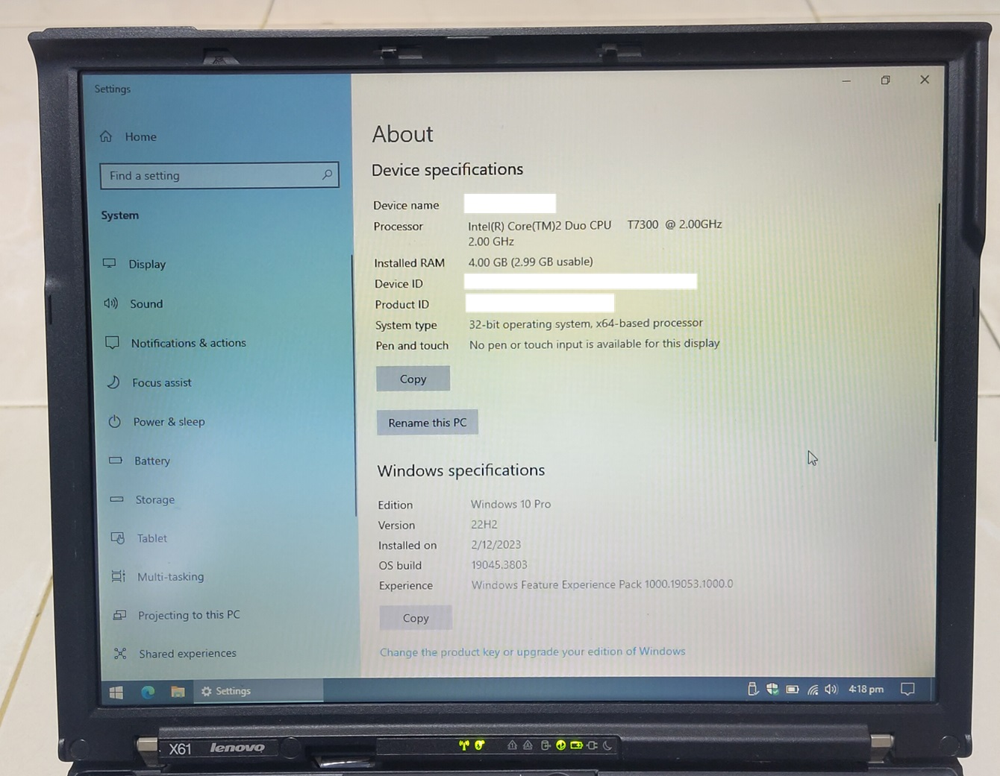
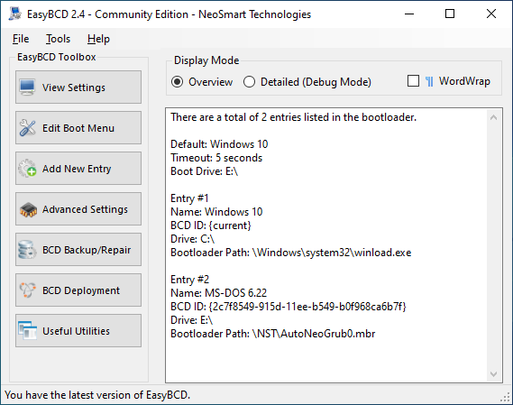
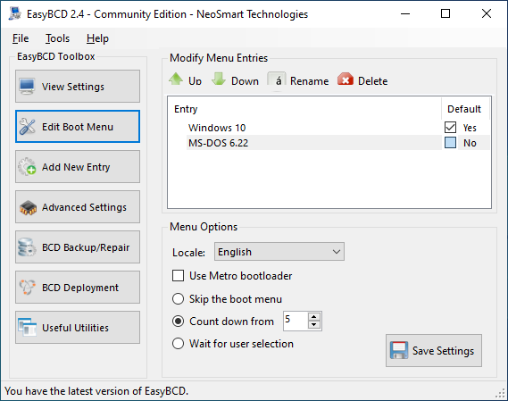
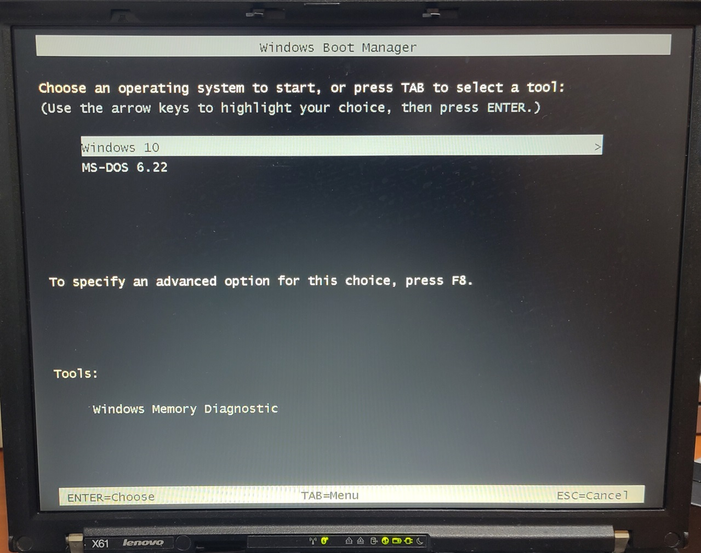
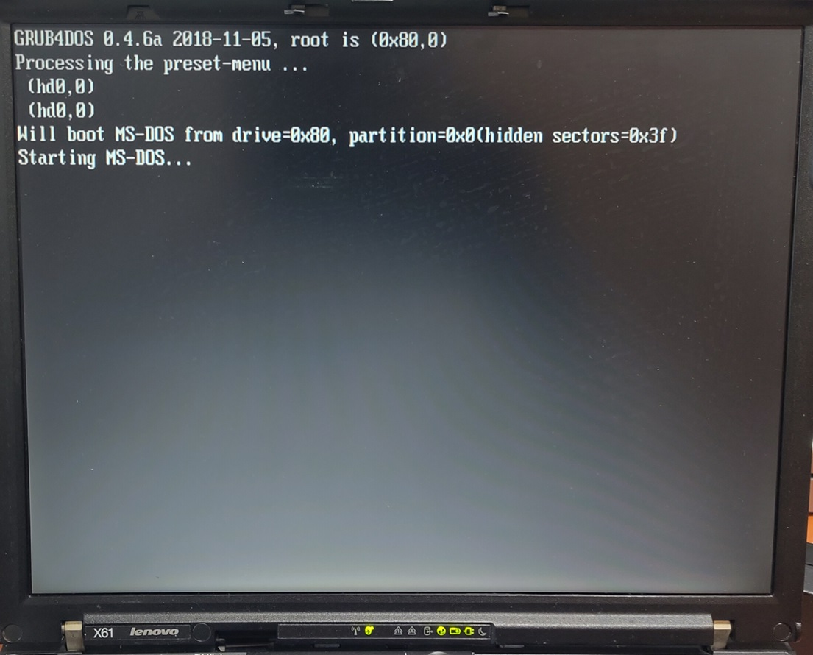
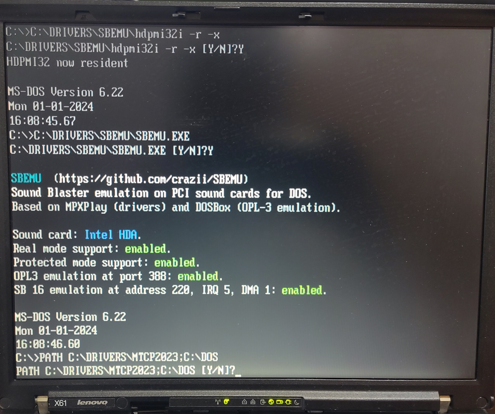

# Thinkpad T42

The Thinkpad X61 is a laptop released in 2007 by IBM. 

The machine is configured to multi-boot to DOS 6.22, Windows 10 32-bit and Xubuntu. The photo includes the laptop mounted on a [X6 Ultrabase](https://www.thinkwiki.org/wiki/ThinkPad_X6_UltraBase).

Windows 10 can boot with DOS with some help from a third-party tool [EasyBCD](https://neosmart.net/EasyBCD/).

## Specifications

These are the specifications specific to the Thinkpad I have:

* Intel Core 2 Duo T7300 2.00Ghz
* Intel X3100 graphics
* 2x2024MB DDR2 memory
* Intel HD audio
* 12.1" TFT display with 1024x768 resolution (XGA)
* 1x Type I or one Type II PCMCIA cardbus slot
* SD card slot
* 250GB Samsung 850 Evo
* Intel Gigabit PRO/1000
* Intel Dual Band 802.11ac 7260 (BIOS whitelist removed)

On the X6 Ultrabase Docking station:

* Matsushita DVD-RAM UJ-842
* 1x ECP capable parallel port
* 1x RS232 port
* etc...

## BIOS

To use third-party Wifi cards like the modern Intel 7260 outside of the default wifi whitelist, the BIOS must be modified. 

A third-party modified BIOS from [Middleton](https://www.thinkwiki.org/wiki/Middleton%27s_BIOS) enables SATA 2, disables whitelist, FN-Ctrl swap and includes SLIC 2.1 for Win 7 activation.

To use the 32-bit BIOS upgrade tool, KB3138612-x86 upgrade has to be installed.

## Boot Configuration setup

To boot between DOS and Windows 10, [EasyBCD](https://neosmart.net/EasyBCD/) was used to configure Windows boot loader.

EasyBCD configuration

Metro bootloader is disabled in favour of the traditional but faster interface.

As the Windows bootloader by default cannot start DOS, EasyBCD loads Grub4DOS which in turn starts DOS.

## DOS setup

* JEMMEX combined XMS and EMS driver that is required for SBEMU
* Intel ODI drivers
* ODI to Packet shim
* MTCP environment variables
* Cutemouse

This networking setup is similar to my [Thinkpad T42](../thinkpad-t42).

Sound Blaster and OPL3 support is provided by the [SBEMU](https://github.com/crazii/SBEMU) driver. 

A strange quirk that I found of this current driver with respect to using [Dr Sbaitso TTS](https://en.wikipedia.org/wiki/Dr._Sbaitso) is that the TTS will hang if this is the first app that is launched. Some other app needs to use the virtual Sound Blaster hardware first then we quit that and launch the TTS then the TTS will work.

## Sources

1. [X61 Hardware Maintenance Manual](https://thinkpads.com/support/hmm/hmm_pdf/42x3550_04.pdf)
2. [Middleton modified BIOS](https://www.thinkwiki.org/wiki/Middleton%27s_BIOS)
3. [SLIC intructions](https://dellwindowsreinstallationguide.com/windows-7-oem-slp/)
4. [KB3138612](https://www.microsoft.com/en-us/download/details.aspx?id=51208)
