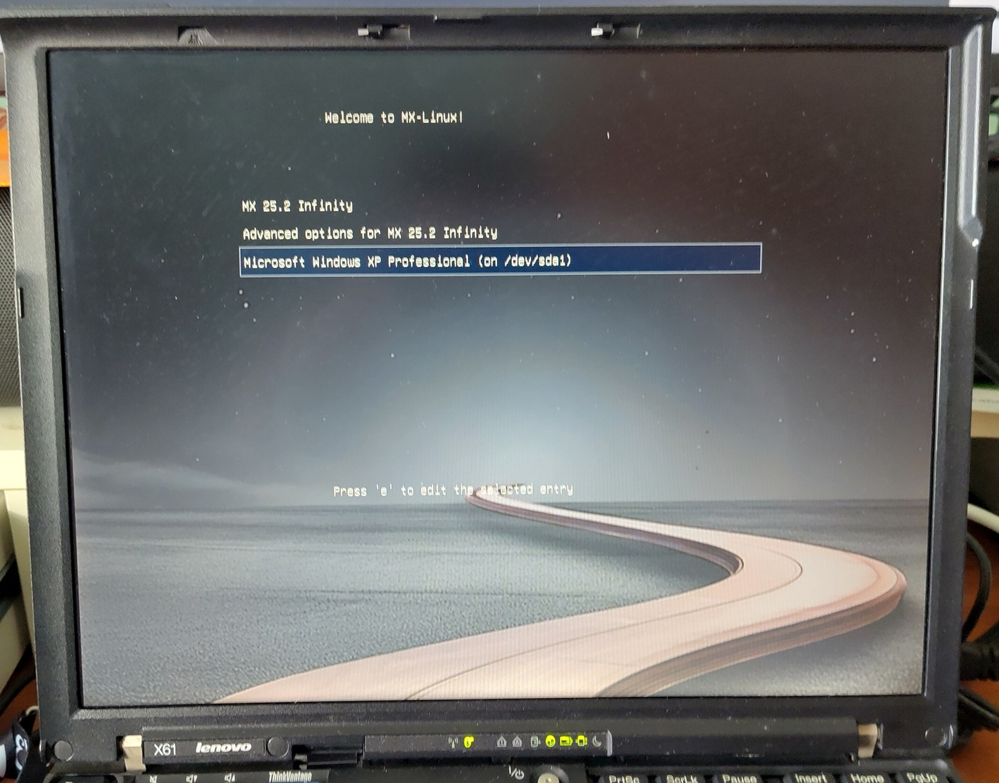
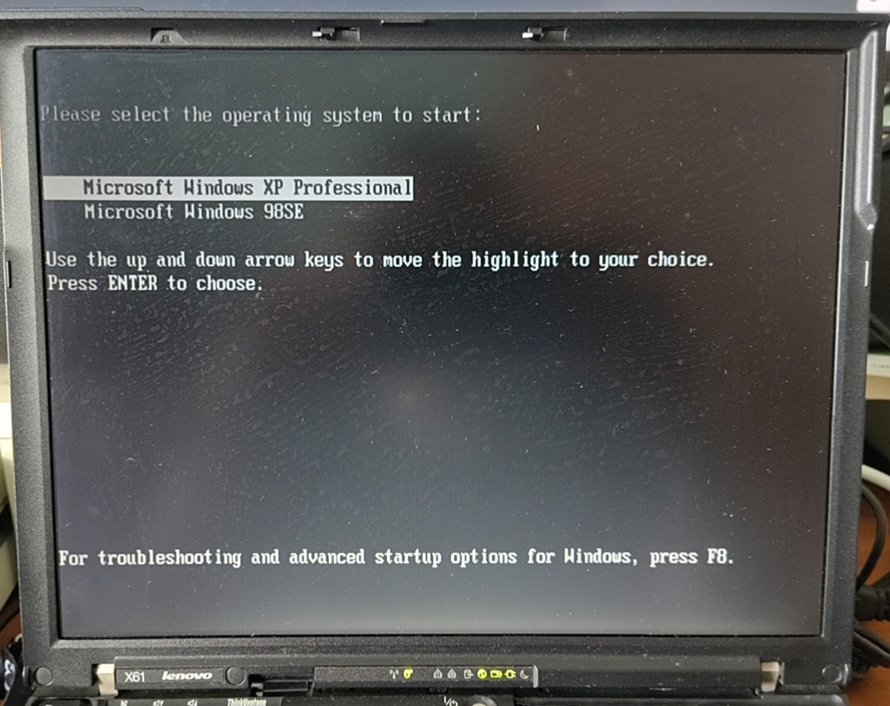
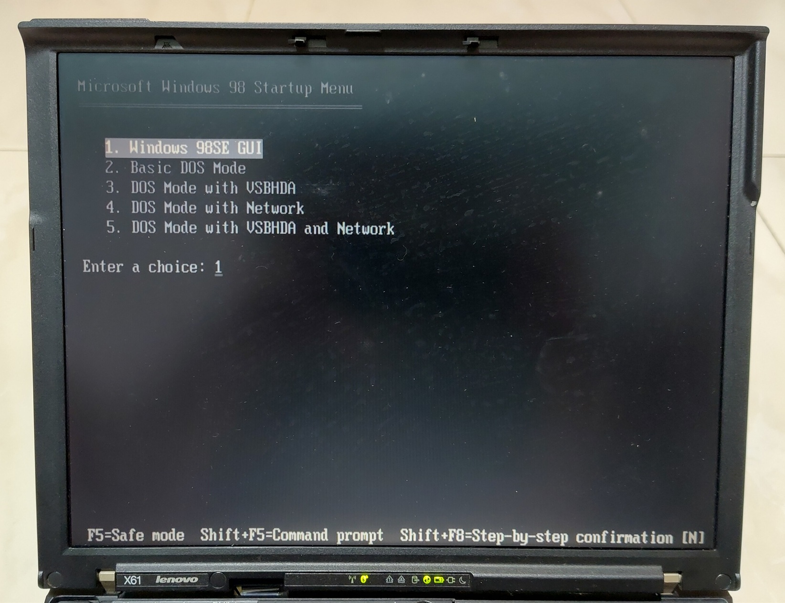
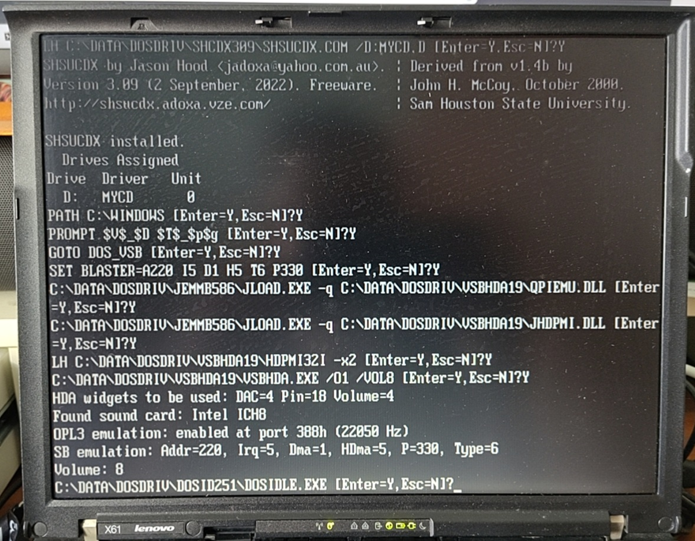

# Thinkpad X61

The Thinkpad X61 is a laptop released in 2007 by IBM. 

The machine is configured to multi-boot to Win 98 SE, Win XP Pro and MX Linux. The photo includes the laptop mounted on a [X6 Ultrabase](https://www.thinkwiki.org/wiki/ThinkPad_X6_UltraBase).

## Specifications

These are the specifications specific to the Thinkpad I have:

* Intel Core 2 Duo T7300 2.00Ghz
* Intel X3100 graphics
* 2x2024MB DDR2 memory
* Intel HD audio
* 12.1" TFT display with 1024x768 resolution (XGA)
* 1x Type I or one Type II PCMCIA cardbus slot
* SD card slot
* 250GB Samsung 850 Evo
* Intel Gigabit PRO/1000
* Killer Wireless-N 1103 (based on Atheros AR9380)

On the X6 Ultrabase Docking station:

* Matsushita DVD-RAM UJ-842
* 1x ECP capable parallel port
* 1x RS232 port
* etc...

## BIOS

To use third-party Wifi cards outside of the default wifi whitelist, the BIOS must be modified. 

A third-party modified BIOS from [Middleton](https://www.thinkwiki.org/wiki/Middleton%27s_BIOS) enables SATA 2, disables whitelist, FN-Ctrl swap and includes SLIC 2.1 for Win 7 activation.

To use the 32-bit BIOS upgrade tool, KB3138612-x86 upgrade has to be installed.

## Boot Configuration setup

To boot between these OSes, there is a chain of bootloaders

Grub is loaded allowing a choice between MX Linux and Win XP (with Win 98).

Selecting the Win XP option goes to the XP bootloader which allows to select between Win XP and Win 98 SE.

I have configured the Windows 98 boot menu to select between various DOS options.

## Driver configuration

### Win 98 drivers

Win 98 SE is not officially supported by this machine hence many drivers are not available like graphics, sound and networking.

To get higher resolutions, Universal VBE Video Display Driver 2019.12.01 is used but has no hardware acceleration.

### Win 98 DOS mode setup

* JEMMEX that is required for VDMHDA
* Intel ODI drivers
* ODI to Packet shim
* MTCP environment variables
* Cutemouse

This networking setup is similar to my [Thinkpad T42](../thinkpad-t42).

Sound Blaster and OPL3 support is provided by the [VSBHDA](https://github.com/Baron-von-Riedesel/VSBHDA) driver. 

## Sources

1. [X61 Hardware Maintenance Manual](https://thinkpads.com/support/hmm/hmm_pdf/42x3550_04.pdf)
2. [Middleton modified BIOS](https://www.thinkwiki.org/wiki/Middleton%27s_BIOS)
3. [SLIC intructions](https://dellwindowsreinstallationguide.com/windows-7-oem-slp/)
4. [KB3138612](https://www.microsoft.com/en-us/download/details.aspx?id=51208)
5. [Atheros AR9380 Win XP](https://drivers.softpedia.com/get/NETWORK-CARD/Atheros/Atheros-WLAN-Driver-1000260-for-XP.shtml)
