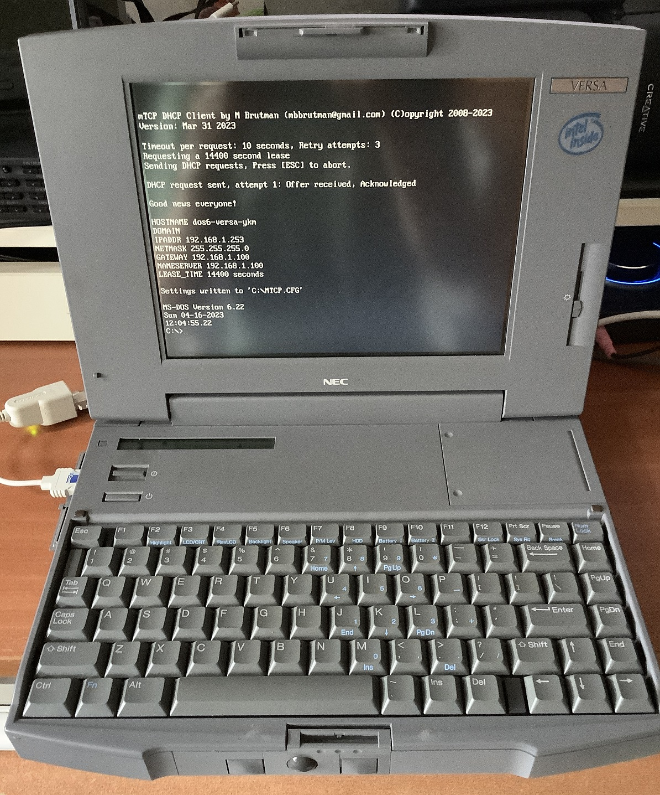
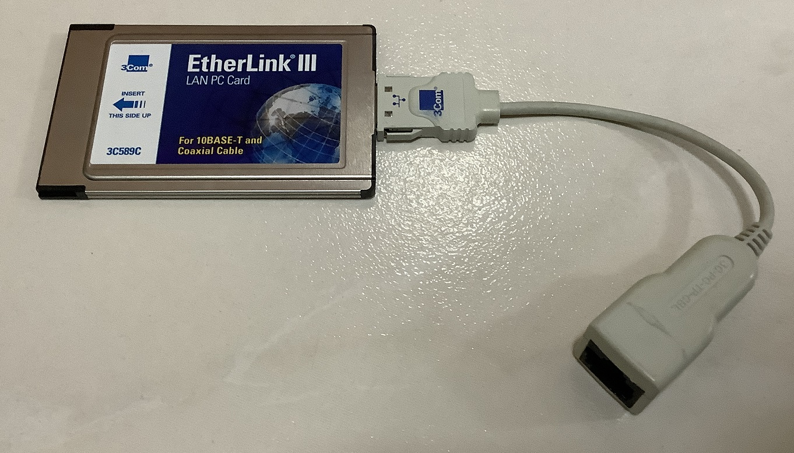
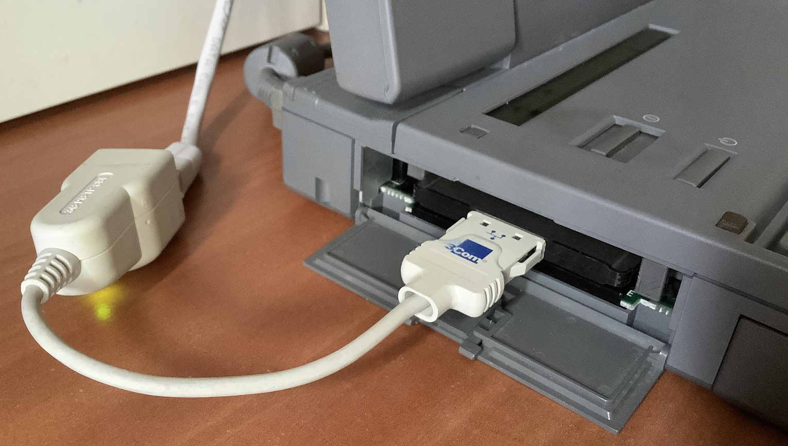
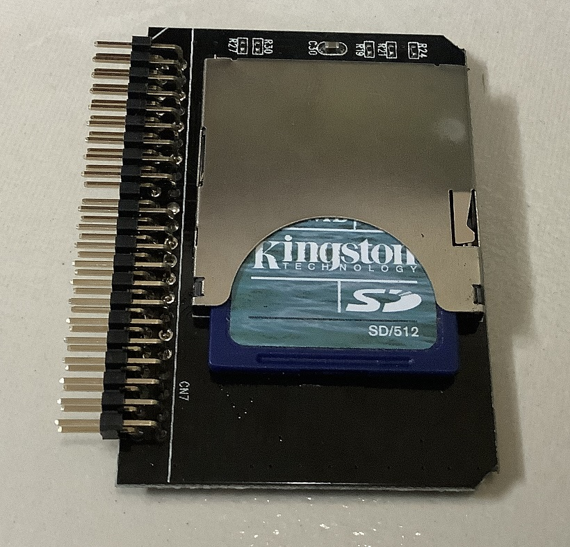
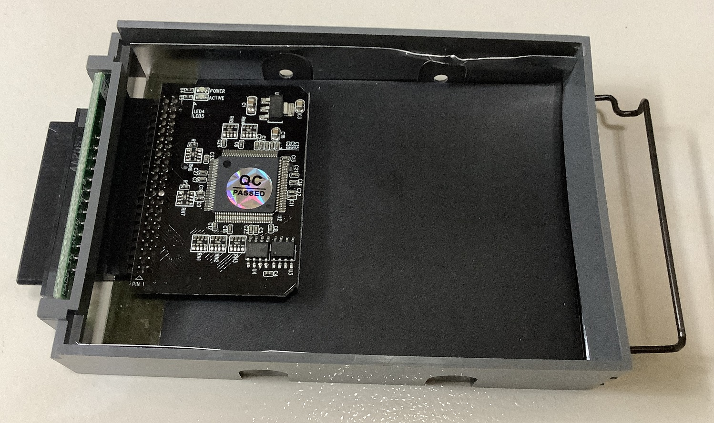
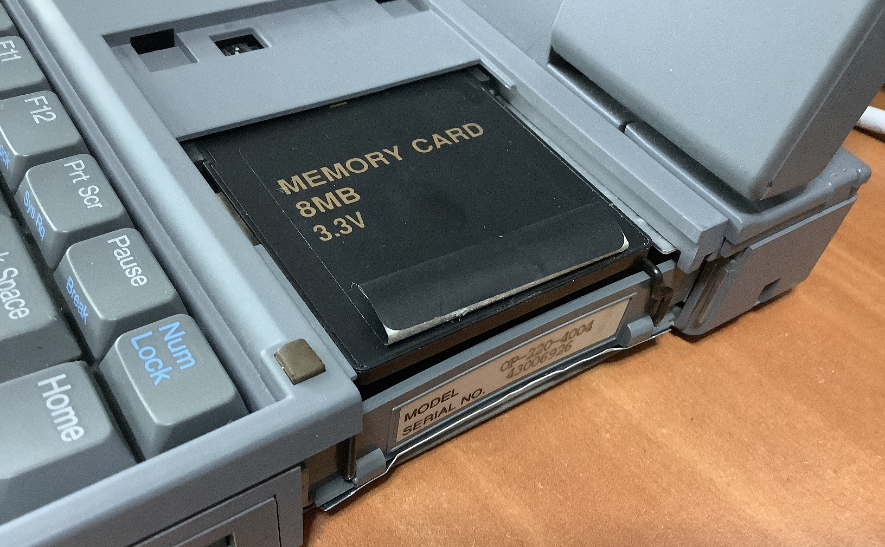
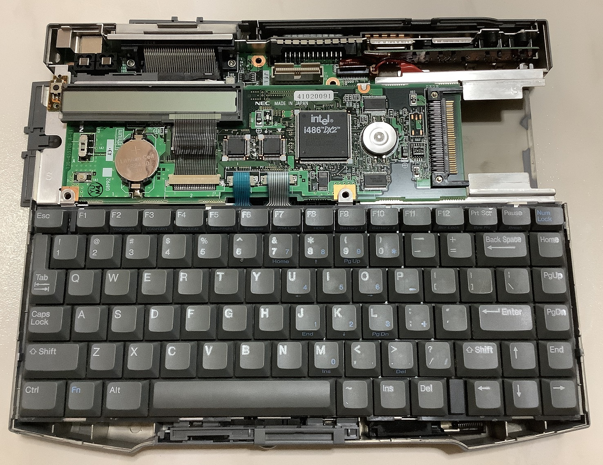
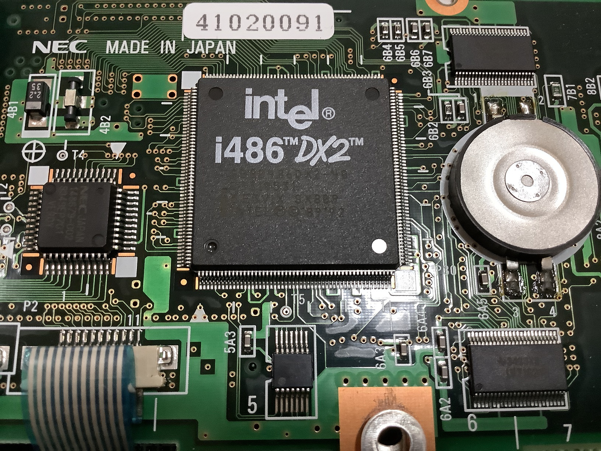

# NEC Versa 40EC (1994)

The NEC Versa 40EC is a model that was released in 1994.

Only DOS 6.22 is configured for it.

## Specifications

* Intel 80486 DX2 SL 40MHz CPU
* Western Digital Paradise 1MB Super VGA
* 12MB: 4MB onboard, 8MB RAM Card
* 9.4" Active Matrix TFT with 640x480 resolution
* 512MB Kingston SD card with IDE adapter
* 1.44MB 3.5" Floppy Drive

### Connectivity

* Serial
* Parallel
* VGA
* 2x PS/2 for mouse and keyboard 
* 2x PC card slots

### PC card

As the system lacks connectivity options, I add the a 3COM 3C583C PC card to the system.

Card slot is on the left of the machine.

For the PC card drivers, I only used the Packet Driver for DOS. The Packet driver works without the need to use the Cardsoft PCMCIA drivers which helps to save memory.

To install Cardsoft for DOS, run `install.exe`. For Cardview for Windows, run `setup.exe`. Cardview requires Cardsoft to be installed first.

### Disk and Memory

A 512MB SD card is placed into an SD-IDE adapter.

SD-IDE adapter is then placed into the disk tray.

Disk tray and 8MB upgradeable memory attached to the right of the system.

### Internals

Extremely modular design. Top card is the main processor board.

Close up of the CPU

# Sources

1. [Cardsoft PCMCIA drivers](https://archive.org/details/simpletechnology_pcmcia21cardsocket_systemsoftcardsoftv31_cardview)
