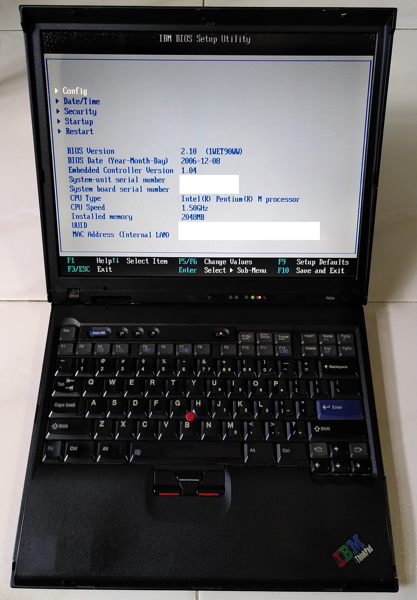
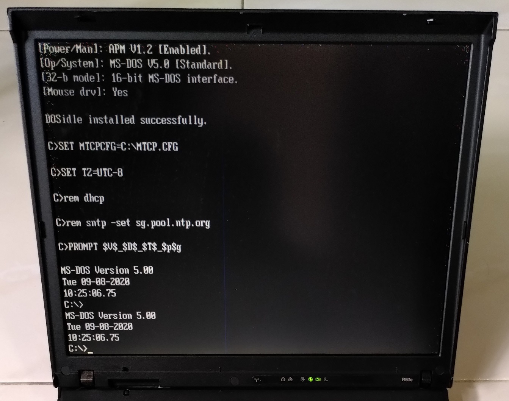

# Thinkpad T42

The Thinkpad R50E-1834 is a laptop released in 2005 by IBM. 

The machine is configured to boot only DOS 5.0. This machine is solely for experimental purposes to try a slightly older DOS version.

## Specifications

These are the specifications specific to the Thinkpad I have:

* 1.5 Ghz Pentium M 735 CPU
* Intel Extreme Graphics 2 (64MB shared)
* 2x1024MB DDR PC2700 RAM
* Intel AC'97 Audio with a SoundMax AD1981B codec
* 14.1" TFT display with 1024x768 resolution (XGA)
* 8GB Kingston Compactflash card
* Intel Fast Ethernet
* Intel PRO/Wireless LAN 2100 3B Mini PCI (I disabled in BIOS)
* 1x ECP capable parallel port
* DVD/CD-RW Ultrabay Slim
* 2x Type II Cardbus slots
* Infrared Communication

## Boot Configuration

* CDROMDRV drivers
* MTCP environment variables
* Cutemouse
* DOS Idle

The IBM PC card drivers have been REMed out for reference. Intel E1000 drivers don't seem to work with DOS 5.00, requiring DOS 6 and up.