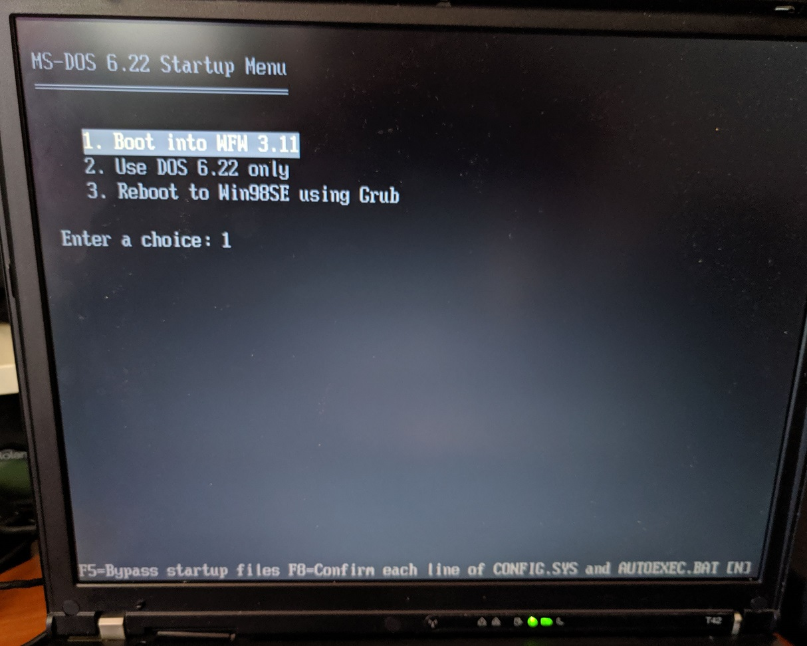
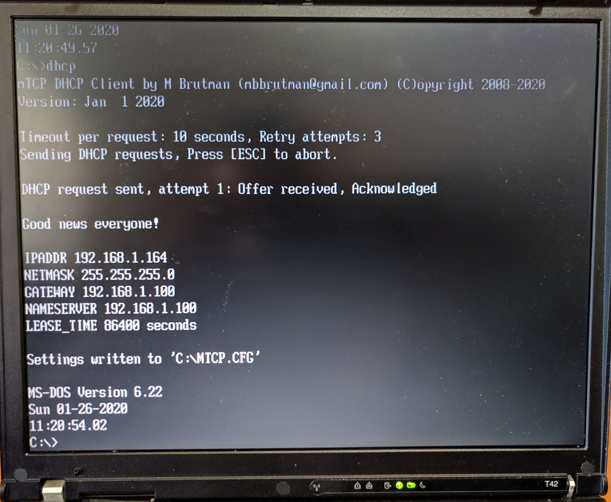
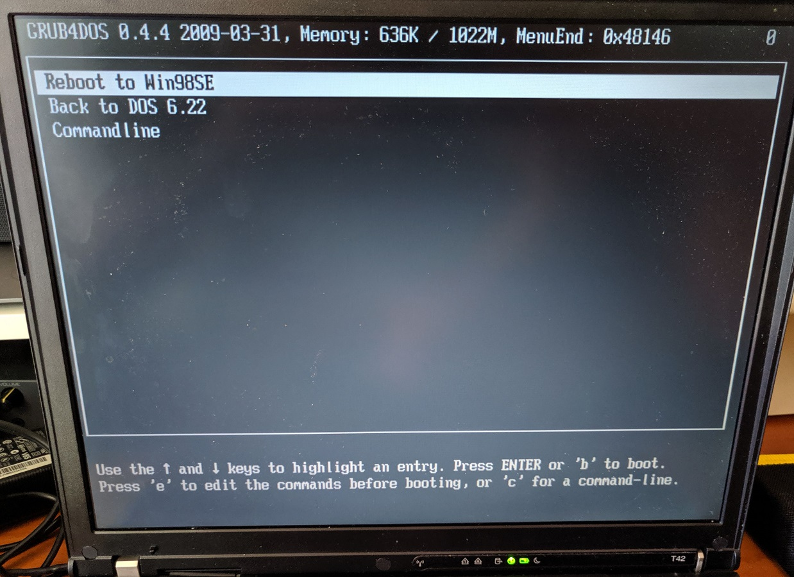
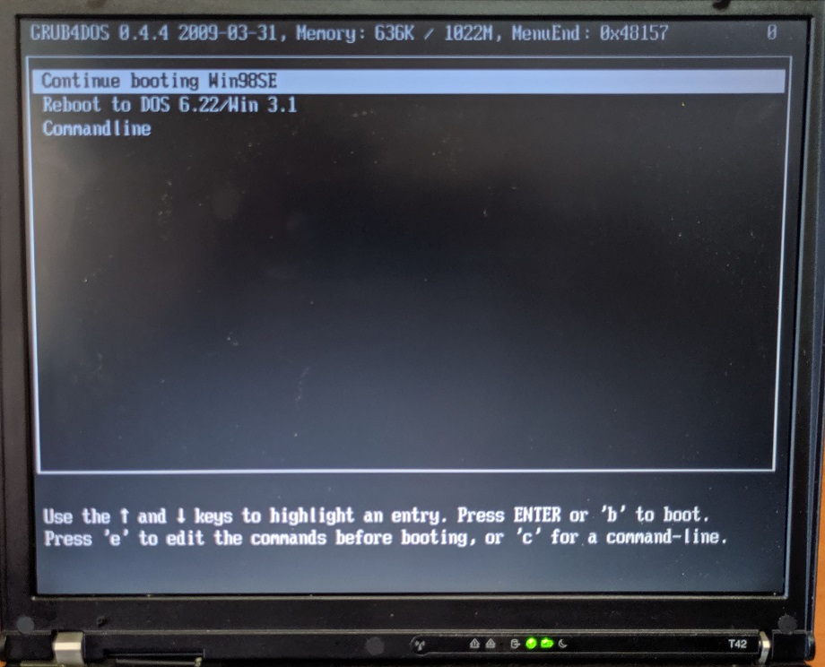
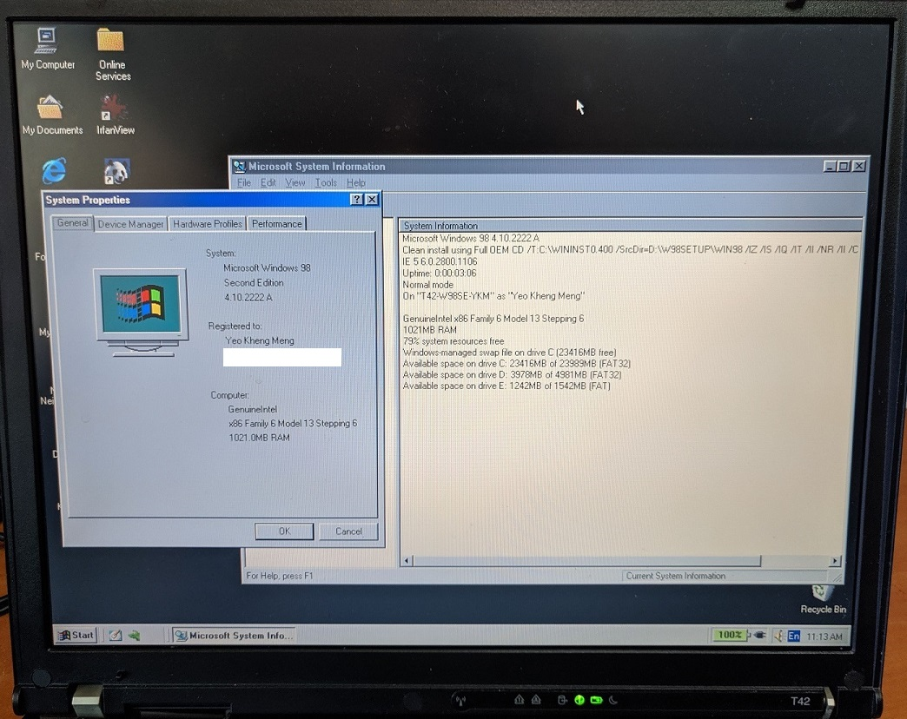

# Thinkpad T42

The Thinkpad T42-2373 is a laptop released in 2004 by IBM. It is from the last Thinkpad series with Windows 98 support.


The machine is configured to dual-boot to DOS 6.22/Windows for Workgroups (WFW) 3.11 and Windows 98SE.

## Specifications

These are the specifications specific to the Thinkpad I have:

* 1.7 Ghz Pentium M 735 CPU
* ATI Mobility Radeon 7500 with 32MB
* 1x1GB DDR PC2700 RAM
* Intel AC'97 2.2 Audio with a SoundMax AD1981B codec
* 14.1" TFT display with 1024x768 resolution (XGA)
* 32GB Sandisk Compactflash card
* Intel Gigabit PRO/1000 MT Ethernet
* Intel PRO/Wireless LAN 2100 3B Mini PCI (I disabled in BIOS)
* 1x ECP capable parallel port
* Matsushita UJDA765 DVD/CD-RW Ultrabay Slim
* 2x Type II Cardbus slots
* Infrared Communication

## Boot Configuration

The machine is configured to dual-boot into the primary partitions containing DOS 6.22/WFW 3.11 or Windows 98SE. Within DOS6.22/WFW 3.11, I have separate boot configurations for either DOS 6.22 or WFW 3.11 configured in `CONFIG.SYS` and `AUTOEXEC.BAT`. This is to facilitate clean separation of configuration and software between the 2 OSes.

### Partition 1 (DOS 6.22 and WFW 3.11)



#### WFW 3.11


* Windows 32-bit file system manager
* Start WFW network

#### DOS 6.22



* EMM386 NOEMS configuration to enable `devicehigh` and `loadhigh`
* Intel ODI drivers
* ODI to Packet shim
* MTCP environment variables
* Cutemouse

The IBM PC card drivers have been REMed out for reference.

#### GRUB options



Starts Grub to enable rebooting into Windows 98

### Partition 2 (Win 98SE)

#### Grub options on partition start



* Boot Menu
* No logo




### Grub rebooting into another OS

DOS 6.22 and Win98SE only supports booting from the first primary partition which is assigned the drive letter `C`. They however have to be booted from separate partitions to avoid clashing configurations.

To enable dual-booting from separate partitions, [GRUBFORDOS](https://sourceforge.net/projects/grub4dos/files/GRUB4DOS/) was used to dynamically adjust the `Active` flag using `makeactive` before switching.

## Dual Boot install procedure

1. Use DOS 6.22 `fdisk` tool to create the first primary partition
2. Install DOS 6.22/WFW 3.11 on that partition
3. Create a second primary partition for Win98SE using a tool like eg. `gdisk` which enable creation of multiple primary partitions.
4. Hide the first primary partition to prevent Win98SE installer from failing. The installer suspects it's an existing Windows installation and refuse to upgrade unless you are using the Win 98 Upgrade disk. Use the following `GRUBFORDOS` commands using a bootable floppy disk

```bash
# In MENU.LST
title Commandline
commandline
```

```bash
hide (hd0, 0)
root (hd0, 1)
makeactive
```

5. Install Win 98SE as usual
6. After install completes, unhide the first primary partition. 

```bash
unhide (hd0, 0)
```

It is not necessary to hide partition when booting between DOS6.22 and Win 98SE. Drive C is assigned only to the first active primary partition.

## Sources
1. [Official T42 drivers](https://thinkpads.com/support/Thinkpad-Drivers/download.lenovo.com/lenovo/content/ddfm/T42.html)
2. [DOS Ethernet drivers taken from T400 website](https://support.lenovo.com/mn/en/downloads/ds001865)
3. [Win 3.1 AC97 drivers](http://turkeys4me.byethost4.com/programs/index.htm)
4. Dualbooting DOS and Win95: [Just setting active](http://retropcbuilder.blogspot.com/2016/11/dual-booting-dos-and-windows-95-follow.html) and [Hiding partitions](http://retropcbuilder.blogspot.com/2016/11/dual-booting-ms-dos-622windows-31-and.html).

