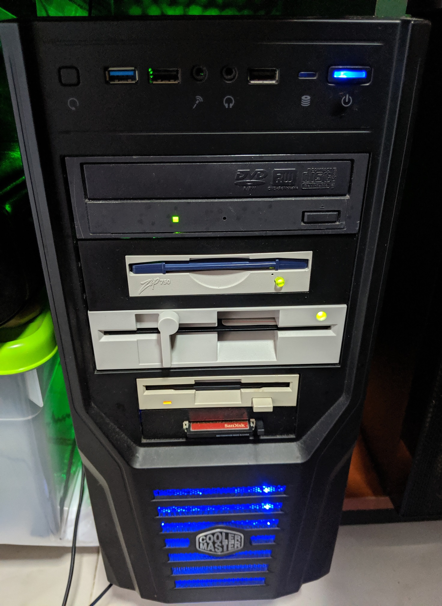
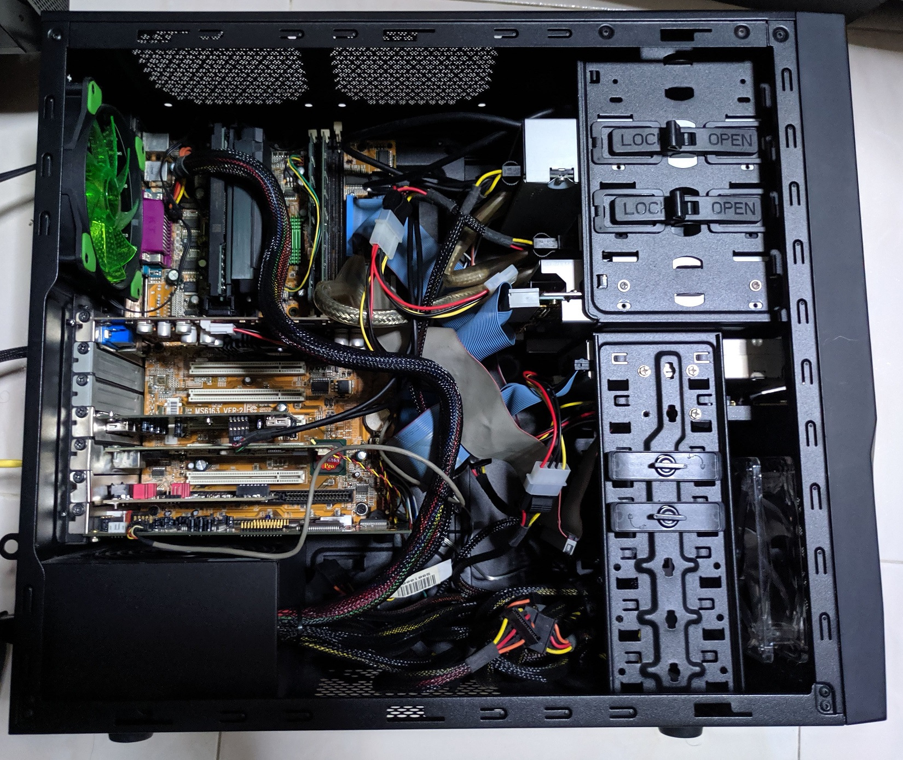
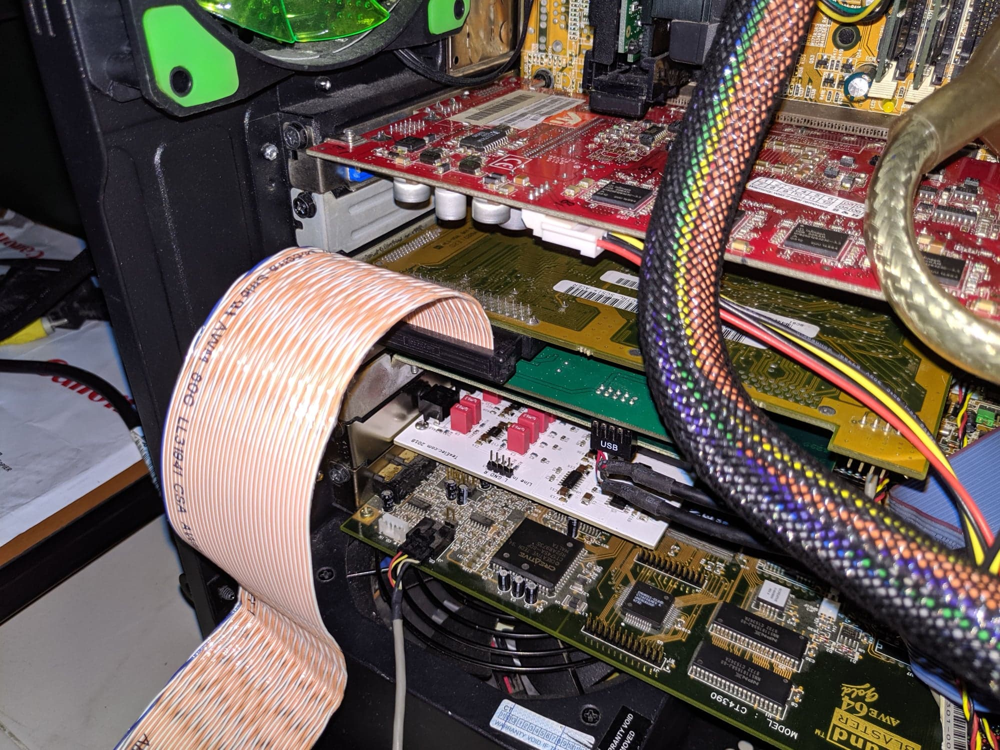
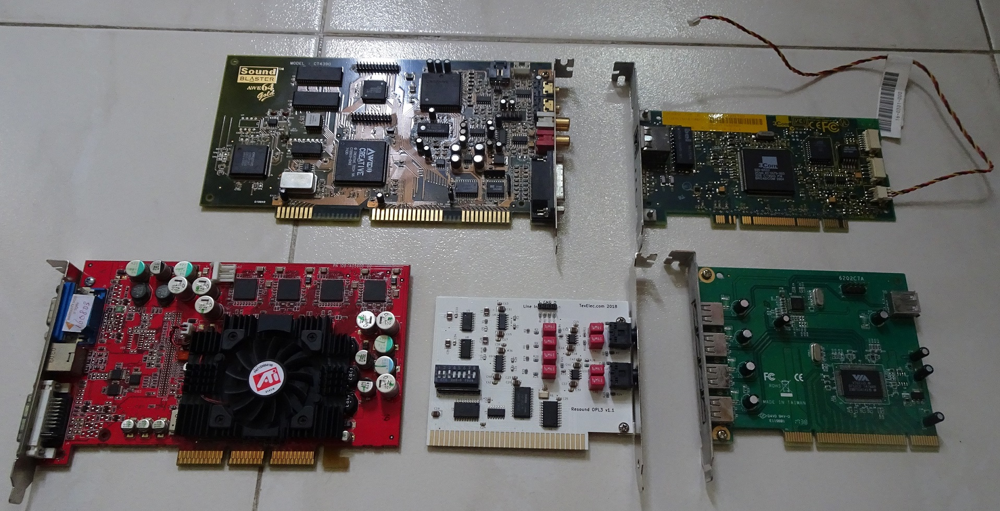
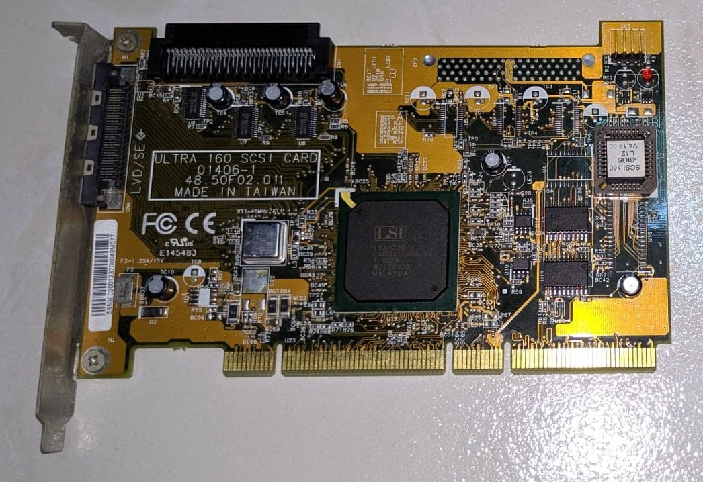
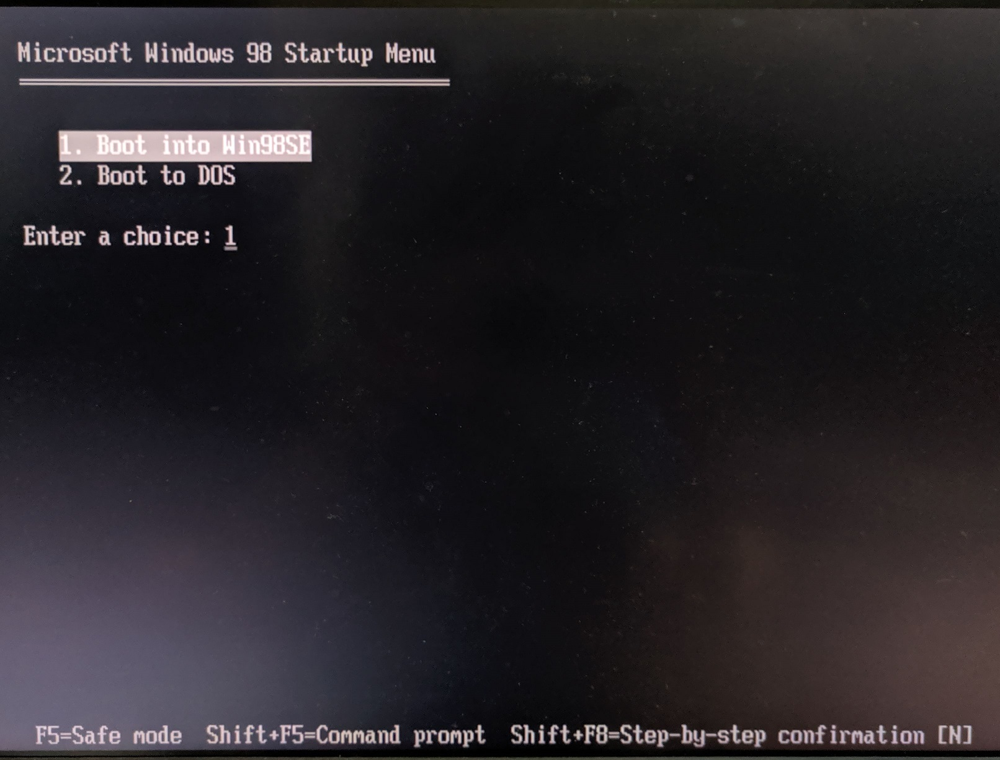
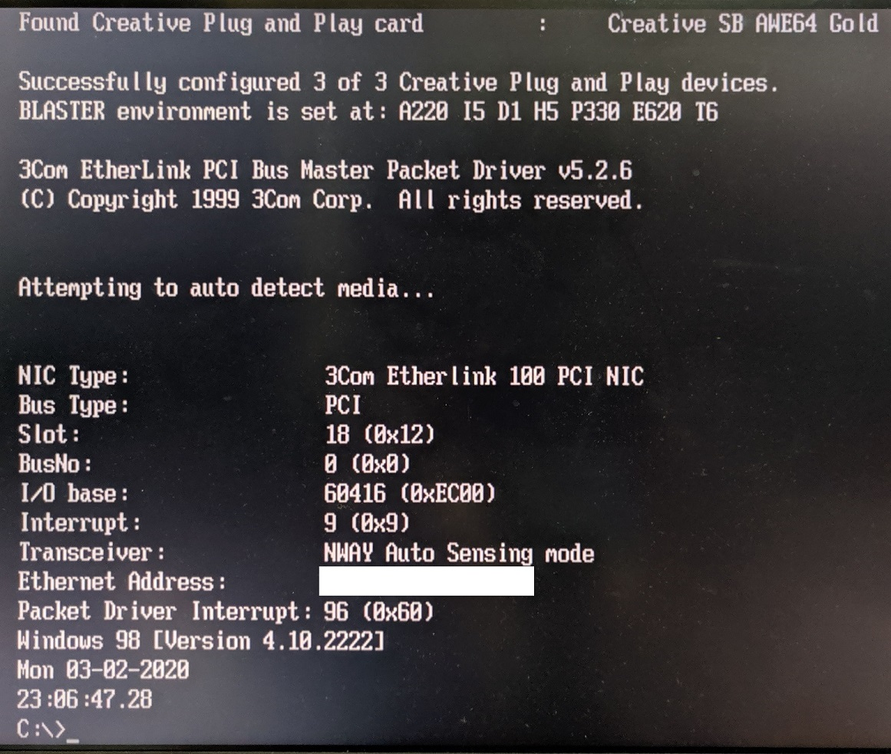
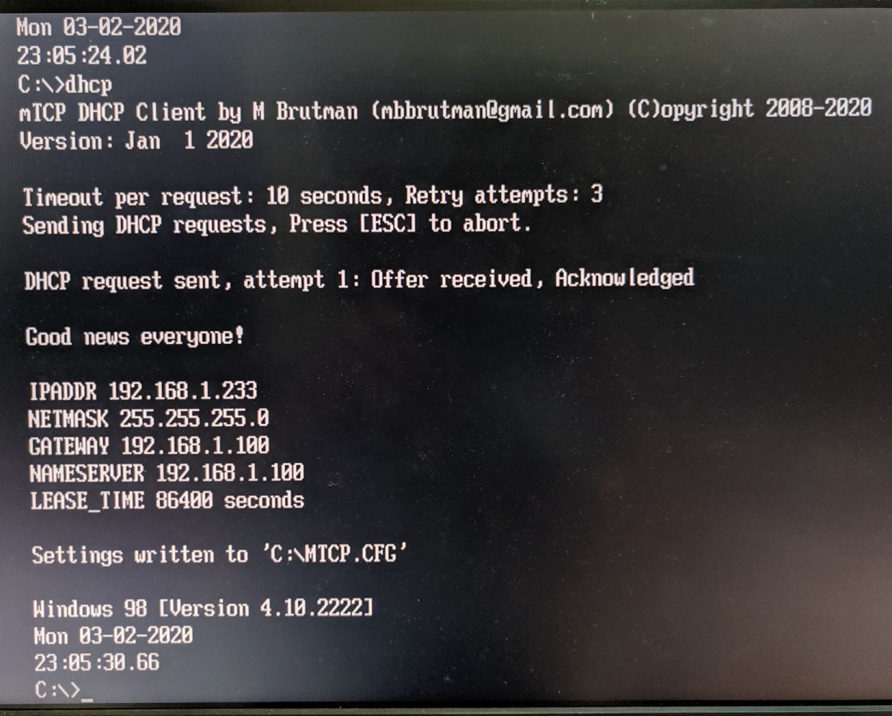

# Tweener PC

My "Tweener PC" is affectionately called that as it contains a healthy mix of new and old technologies. From ISA, floppy drives to modern Ethernet and USB.

Front of the PC with DVD-RW, ZIP-750, 1.2MB 5.25", 1.44MB Floppy, CompactFlash as hard disk.

With all trays open.

AWE64 and Resound OPL3. CD-In, USB Header and Wake-on-LAN cables are used. Adhoc uses of the SCSI card.

## Specifications

* Intel Pentium III 550Mhz 100Mhz FSB
* MSI MS6163 Pro Intel 440BX motherboard
* 2x256MB PC133 SDRAM
* 32GB Sandisk Compactflash card
* NEC ND-3530A DVD-RW IDE
* ZIP-750 IDE
* 1.2MB 5.25" Floppy
* 1.44MB 3.5" Floppy

Expansion cards from top left

* Creative Sound Blaster AWE64 Gold ISA
* 3Com 3C905 PCI 10/100 Mbps
* VIA VT6212 USB 2.0 PCI Controller
* Resound OPL3 ISA
* ATI Radeon 9500 Pro 128MB DDR AGP 8X

### Optional cards
I added drivers of these cards as I occasionally may use them for ad-hoc testing.

* Nvidia FX5500

* LSI 53C1010

## Boot Configuration

The machine is configured for single-boot Windows 98SE with a bootup option to enter pure DOS configuration only. I have separate boot configurations for DOS and Windows configured in `CONFIG.SYS` and `AUTOEXEC.BAT`. The Windows version will not load the DOS specific drivers.

### Windows Mode

Only the ATI and 3Com drivers are needed. Win 98SE already has the latest AWE64 drivers.

### DOS Mode

* EMM386 NOEMS configuration to enable `devicehigh` and `loadhigh`
* 3Com Packet drivers
* MTCP environment variables
* Cutemouse
* Creative PnP manager to configure AWE64
* CDROM drivers

After loading 3c905 packet drivers.

Loading MTCP to prove packet drivers work.

## Sources
1. [3C905 drivers](https://lost-contact.mit.edu/afs/sur5r.net/service/drivers+doc/3com/3c905/support.3com.com/infodeli/tools/nic/3c905.htm)
2. [AWE64 PnP](https://support.creative.com/Products/ProductDetails.aspx?prodID=1848&prodName=Sound%20Blaster%20AWE64)
3. [ATI Radeon 9xxx drivers](https://www.amd.com/en/support/graphics/legacy-graphics/ati-radeon-9xxx-series/ati-radeon-9500-series5)
4. [Nvidia Forceware 80 81.98](https://www.nvidia.com/Download/Find.aspx)
5. [LSI 53C1010 x86 drivers](ftp://ftp.tyan.com/SCSI/LSI1010/111700/LSI1010.exe)
6. [LSI 53C1010 x64 drivers](http://www.edugeek.net/forums/windows-7/96515-windows-7-x64-drivers-lsi-20160-scsi-adaptor.html)
