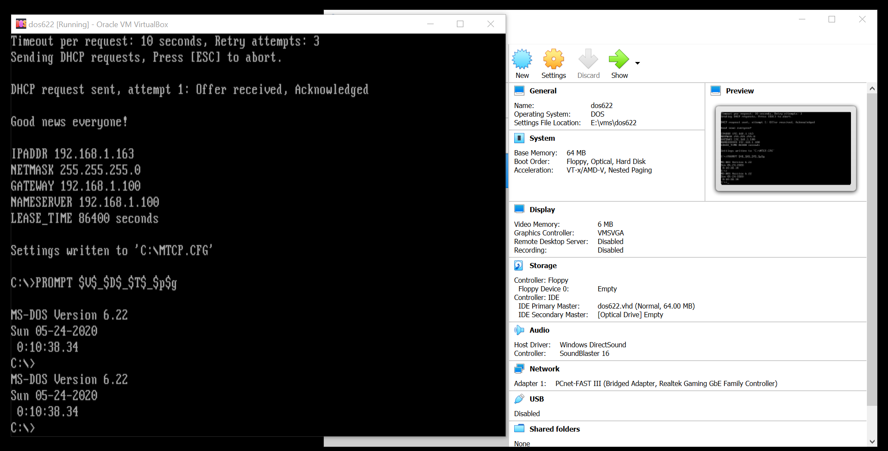

# Virtualbox (DOS 6.22)

Not exactly a retro PC but I just wanted to store the settings I use for my virtual DOS background. This is typically for me to do quick and dirty testing without powering up my actual retro-PCs.

## Specifications

* 64MB RAM
* 6MB video RAM
* AMD PCnet-FAST III (AM79C973) LAN
* 64MB Fixed VHD storage

## Sources
1. [AMD PCNet Packet driver](http://wiki.freedos.org/wiki/index.php/VirtualBox_-_Two_Network_Adapters)
2. [Mount VHD images easily on Windows](https://www.howtogeek.com/51174/mount-and-unmount-a-vhd-file-in-windows-explorer-via-a-right-click/)
