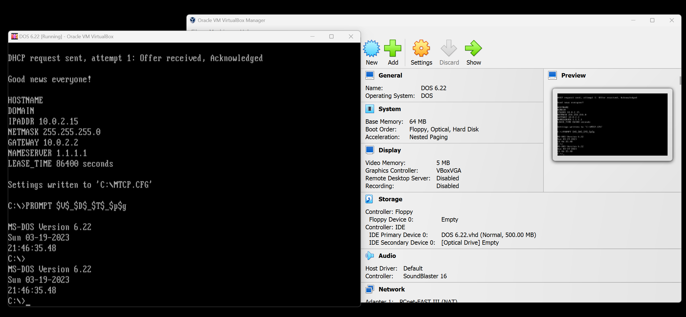

# Virtualbox (DOS 6.22)

Not exactly a retro PC but I just wanted to store the settings I use for my virtual DOS playground. This is typically for me to do quick and dirty testing without powering up my actual retro-PCs.

I used VHD instead of VDI disk images so it can be mounted easily.

## Specifications

* 64MB RAM
* 5MB video RAM
* AMD PCnet-FAST III (AM79C973) LAN
* 500MB VHD storage

## Sources
1. [AMD PCNet Packet driver](http://wiki.freedos.org/wiki/index.php/VirtualBox_-_Two_Network_Adapters)
