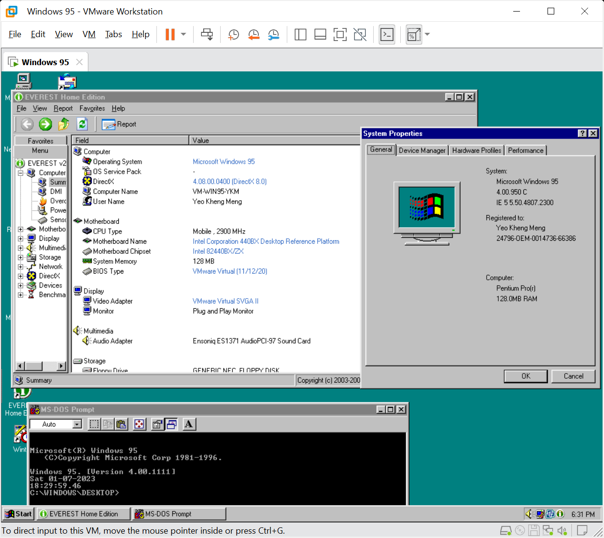

# VMware Workstation (Win 95 OSR 2.5 Plus)

Not exactly a retro PC but I just wanted to store the settings I use for my virtual Win 95 playground. This is typically for me to do quick and dirty testing without powering up my actual retro-PCs.

## Fix95cpu

Due to the high CPU speeds of the VM, you may get a "Window Protection Error..." after the first reboot during the installation.

Some files will have to be updated before the installation process can proceed. A bootable tool the Fix95CPU can be used.

Simply boot from the floppy image, execute the updates, reboot the system and continue the Win95 installation.

## Sound

The initial installation will cause Win 95 to BSOD. Just continue on and let the system to reboot a few times to finish installing all the drivers.

In my VM setup, the sounds are actually ok.

## Unofficial SP1 update

I used an unofficial SP1 to install DirectX 8.0a and other updates.

Selecting the first option somehow causes a boot failure after restart hence I did not use it.

## USB 1.1

USB driver installation using the OSR 2 USB Supplement did not seem to work on this VM even though Win 95 OSR 2 suuports USB 1.1 in theory. The USB 1.1 Controller was thus not connected in this VM.

## Sources
1. [SSBPCI128Setupus_w9x.exe](https://support.creative.com/downloads/download.aspx?nDownloadId=257)
2. [FIX95CPU](http://lonecrusader.x10host.com/fix95cpu.html)
3. [OSR2SP1.05](https://msfn.org/board/topic/129504-unofficial-windows-95-osr2x-service-pack-10x-final-release/)
